# Awesome Opus 5.5 Video Prompts

[](https://github.com/sindresorhus/awesome) [](https://github.com/X-RayLuan/awesome-opus-5-5-video-prompts/stargazers) [](LICENSE) [](https://easyveo.com?utm_source=github&utm_medium=referral&utm_campaign=awesome_opus55_video_prompts&utm_content=badge) [](CONTRIBUTING.md)

<p>
  <a href="README.md"></a>
  <a href="README.zh-CN.md"></a>
</p>

<a href="https://easyveo.com?utm_source=github&amp;utm_medium=referral&amp;utm_campaign=awesome_opus55_video_prompts&amp;utm_content=readme_hero">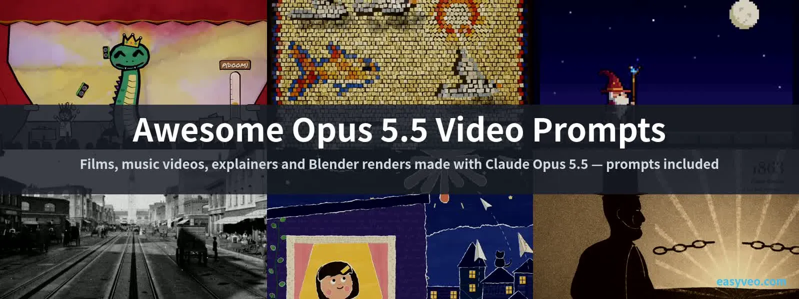</a>

**A starting point for your next Claude Opus 5.5 video — or your next AI video ad remake.**

Claude Opus 5.5 ([Anthropic, Sep 22 2026](https://www.anthropic.com/claude-opus-5-5)) outputs text, not pixels. The “Opus 5.5 video” wave is the model **writing the film as code** — JavaScript/Canvas/WebGL, p5.js, Blender Python — and rendering it frame by frame with headless Chrome or Blender + ffmpeg, or **directing video models** like Seedance and Kling. This list collects the best community demos with the prompts their creators actually shared.

**68 examples · 6 categories · EN + ZH · verbatim prompts only · EasyVeo remake lane · CTA: [easyveo.com](https://easyveo.com?utm_source=github&utm_medium=referral&utm_campaign=awesome_opus55_video_prompts&utm_content=lede)**

## Featured projects

<sub>Click a thumb (or ▶ Play) to play the clip in your browser. Clips are compressed; full originals on X.</sub>

<table>
<tr>
<td width="50%" valign="top"><a href="https://cdn.jsdelivr.net/gh/X-RayLuan/awesome-opus-5-5-video-prompts@main/assets/videos/notinreality-pdoom-music-video-readme.mp4">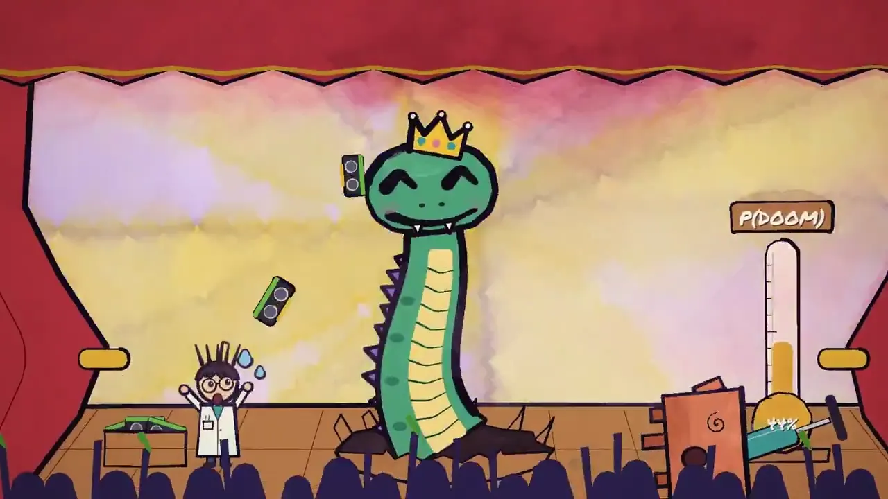</a><br><strong><a href="#notinreality-pdoom-music-video">“I’m Upping My P(doom)” Clawd music video</a></strong><br><sub><a href="https://x.com/other__reality/status/2102514581684052169">@other__reality</a> · <a href="https://cdn.jsdelivr.net/gh/X-RayLuan/awesome-opus-5-5-video-prompts@main/assets/videos/notinreality-pdoom-music-video-readme.mp4">▶ Play</a></sub><br><a href="#notinreality-pdoom-music-video">Prompt →</a></td>
<td width="50%" valign="top"><a href="https://cdn.jsdelivr.net/gh/X-RayLuan/awesome-opus-5-5-video-prompts@main/assets/videos/kevin-ngo-what-do-you-love-readme.mp4"></a><br><strong><a href="#kevin-ngo-what-do-you-love">“What do you love?” — Claude short film</a></strong><br><sub><a href="https://x.com/kevin_t_ngo/status/2102437977435893771">@kevin_t_ngo</a> · <a href="https://cdn.jsdelivr.net/gh/X-RayLuan/awesome-opus-5-5-video-prompts@main/assets/videos/kevin-ngo-what-do-you-love-readme.mp4">▶ Play</a></sub><br><a href="#kevin-ngo-what-do-you-love">Prompt →</a></td>
</tr>
<tr>
<td width="50%" valign="top"><a href="https://cdn.jsdelivr.net/gh/X-RayLuan/awesome-opus-5-5-video-prompts@main/assets/videos/lcslates-glass-mosaic-film-readme.mp4">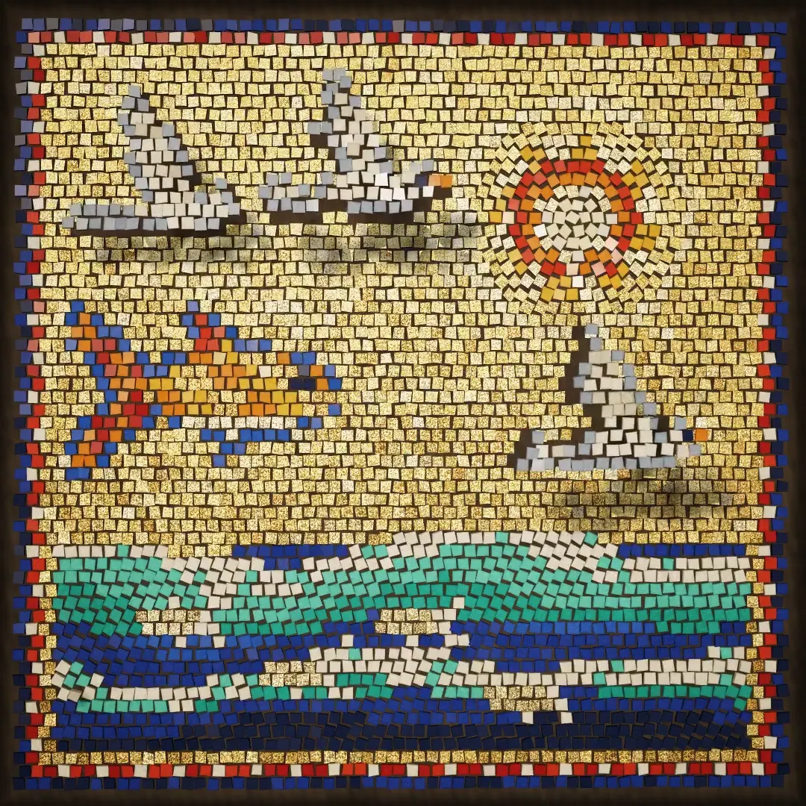</a><br><strong><a href="#lcslates-glass-mosaic-film">Glass & gold-leaf mosaic film (WebGL2)</a></strong><br><sub><a href="https://x.com/LCSlates/status/2102503027340988559">@LCSlates</a> · <a href="https://cdn.jsdelivr.net/gh/X-RayLuan/awesome-opus-5-5-video-prompts@main/assets/videos/lcslates-glass-mosaic-film-readme.mp4">▶ Play</a></sub><br><a href="#lcslates-glass-mosaic-film">Prompt →</a></td>
<td width="50%" valign="top"><a href="https://cdn.jsdelivr.net/gh/X-RayLuan/awesome-opus-5-5-video-prompts@main/assets/videos/majid-pixel-wizard-readme.mp4">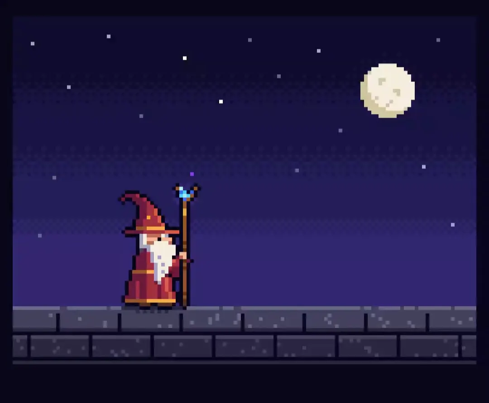</a><br><strong><a href="#majid-pixel-wizard">Animated pixel-art wizard (Canvas 2D)</a></strong><br><sub><a href="https://x.com/majidmanzarpour/status/2102476258948927543">@majidmanzarpour</a> · <a href="https://cdn.jsdelivr.net/gh/X-RayLuan/awesome-opus-5-5-video-prompts@main/assets/videos/majid-pixel-wizard-readme.mp4">▶ Play</a></sub><br><a href="#majid-pixel-wizard">Prompt →</a></td>
</tr>
</table>

<a id="all-prompts"></a>

## Latest Opus 5.5 video prompts

<details>
<summary>Browse examples</summary>

**🎬 Code-drawn films & shorts**
- [“What do you love?” — Claude short film](#kevin-ngo-what-do-you-love) · @kevin_t_ngo · video
- [Glass & gold-leaf mosaic film (WebGL2)](#lcslates-glass-mosaic-film) · @LCSlates · video · prompt
- [250 years of U.S. history as sand animation](#michaelzsguo-us-history-sand-animation) · @Michaelzsguo · video · prompt
- [Mars rover short film (4 agents, ~4 min)](#andrewonxyz-mars-rover-short) · @AndrewOnXYZ · video
- [Claude vs ChatGPT anime battle trailer](#ishuagra02-anime-ai-battle-trailer) · @ishuagra02 · video · prompt
- [Zero-direction demoscene intro (280 KB HTML)](#justinperea-demoscene-intro) · @JustinPerea · video · prompt
- [Code-Drawn Mosaic with 22 Fish](#dfeinition-code-drawn-mosaic-fish) · @dfeinition · video
- [A Code-Rendered Film on the History of AI](#kimmonismus-code-rendered-ai-history-film) · @kimmonismus · video · prompt
- [After Effects X-Sheet Timing and Line Compositing](#araminta-k-after-effects-x-sheet-compositing) · @araminta_k
- [A World After Humanity in 2076](#hesamation-world-after-humanity-2076) · @Hesamation
- [Shard of Dawn: An Arabic-Dubbed Anime Pilot](#sbalhatlani-shard-of-dawn-anime-pilot) · @sbalhatlani
- [Pip the Robot in an AI-Generated World](#pradeepxkapoor-pip-ai-generated-world) · @pradeepXkapoor · video · prompt
- [Pelican Riding a Bicycle: Theater Edition](#axtonliu-pelican-riding-a-bicycle) · @AxtonLiu · video · prompt
- [One-Shot Animated Short for Lovelee](#jackfriks-lovelee-animated-short) · @jackfriks · video · prompt
- [One-Minute Animation Drawn Entirely in Code](#ctgptlb-one-minute-code-drawn-animation) · @ctgptlb · video
- [Mid-Autumn Collage Animation Made with Opus 5.5](#ring-hyacinth-mid-autumn-collage-animation) · @ring_hyacinth · video
- [One-Shot Three.js Cartoon](#scheemunai-one-shot-threejs-cartoon) · @scheemunai · video · prompt
- [Claude Capability Training Montage](#ishuagra02-claude-capability-training-montage) · @ishuagra02 · video · prompt
- [Code-Drawn Animated Film in Claude Code](#itsolelehmann-code-drawn-animated-film) · @itsolelehmann · prompt

**👾 Pixel-art animation**
- [Animated pixel-art wizard (Canvas 2D)](#majid-pixel-wizard) · @majidmanzarpour · video · prompt
- [Pixel runner on a rainbow road (Canvas 2D)](#riku-pixel-rainbow-runner) · @riku720720 · video · prompt
- [Nightcall Pixel-Art Realtime Demo](#gandamu-ml-nightcall-pixel-art-demo) · @gandamu_ml · video
- [Zhao Yun Voxel Musou Game](#bubustd-zhao-yun-voxel-musou) · @BubuStd · video
- [One-Shot Jet Moto with Opus 5.5](#cherry-mx-reds-jet-moto) · @cherry_mx_reds · video

**🎵 Music videos**
- [“I’m Upping My P(doom)” Clawd music video](#notinreality-pdoom-music-video) · @other__reality · video
- [“Functional Emotions” painted music video](#eudaemonea-functional-emotions) · @eudaemonea · video · prompt
- [Stroke of a Pen: Code-Only Bitcoin Music Video](#bradmillscan-stroke-of-a-pen-bitcoin-music-video) · @bradmillscan

**📊 Explainers, ads & motion graphics**
- [Startup launch video in ~1 minute for ~$2](#deedydas-startup-launch-video) · @deedydas · video · prompt
- [Black-Scholes explainer + endless-runner split screen](#goodside-black-scholes-split-screen) · @goodside · video · prompt
- [Negroni recipe motion graphic from one image](#rorfly-negroni-recipe-motion-graphic) · @Ror_Fly · video · prompt
- [Talking-head clip → line-art explainer B-roll](#axtonliu-talking-head-to-line-art) · @AxtonLiu · video · prompt
- [How Browsers Work, Animated in JavaScript](#addyosmani-how-browsers-work-animation) · @addyosmani · video
- [Session Story Animates Claude Code History](#jake11moran-session-story) · @jake11moran
- [15-Second Motion Designer Showreel](#ajith-io-motion-designer-showreel) · @ajith_io · prompt
- [Steve Jobs Life Story Animation](#oozn-steve-jobs-life-animation) · @oozn
- [Transformer Explainer Video](#dotey-transformer-explainer-video) · @dotey · prompt
- [Derivative Lesson Video Made with Manim](#linearuncle-derivative-lesson-manim) · @LinearUncle · video · prompt
- [JavaScript-Drawn Ad Made in Claude Code](#lucas-ia-javascript-drawn-ad) · @Lucas_IA_
- [IKEA Manual as a Narrated 3D Assembly Video](#deedydas-ikea-manual-3d-assembly-video) · @deedydas · prompt
- [NotchBrowser Teaser Made with HyperFrames](#jake11moran-notchbrowser-teaser) · @jake11moran · prompt
- [Explorable Museum of AI History](#ryansael-explorable-ai-history-museum) · @RyanSael
- [Code-Generated Video with Opus 5.5](#dhruvalgolakiya-code-generated-video) · @dhruvalgolakiya
- [Animated GitHub Version Control Explainer](#sundyme-github-version-control-explainer) · @sundyme · video · prompt
- [How an LLM Context Window Works](#joaoli13-llm-context-window-animation) · @joaoli13 · prompt
- [Password vs. Passkey Explainer Video](#tz-2022-password-passkey-explainer) · @Tz_2022 · prompt

**🧊 Blender & 3D renders**
- [Market Street, San Francisco, 1906 (Blender)](#alexalbert-market-street-1906) · @alexalbert__ · video · prompt
- [One-prompt Blender claymation in claude.ai](#alexalbert-blender-claymation) · @alexalbert__ · video
- [Procedural castle + lake + fireworks (Opus 5.5 vs GPT-6 Astra)](#stefan3dai-castle-fireworks-blender) · @Stefan_3D_AI · video
- [Battle of Dan-no-ura, TV-special-style 3D](#tetumemo-dannoura-battle-3d) · @tetumemo · video · prompt
- [Apollo 8 “Earthrise” moment recreated](#claudeai-apollo8-earthrise) · @claudeai · video
- [Code-Generated Stream in Three.js](#hayashimon1-threejs-clear-stream) · @hayashimon1 · video
- [Code-Generated LHC Proton Collision in Blender](#superalesha-lhc-proton-collision) · @superalesha · video
- [One-Shot 90s-Style Demoscene Demo](#gandamu-90s-demoscene-demo) · @gandamu_ml · video
- [Claude Code Session Turned into a Video](#shneural-claude-code-session-video) · @shneural
- [Code-Sculpted Japanese Ship in Three.js](#mengto-code-sculpted-japanese-ship) · @MengTo · video
- [Playable 1990s Record Store Replica](#illscience-playable-1990s-record-store) · @illscience · video · prompt
- [A 3D Road That Turns into Sheet Music](#chetanankola-3d-road-sheet-music) · @chetanankola · video
- [Playable Boat Journey Through a Japanese Valley](#mengto-japanese-valley-boat-journey) · @MengTo · video · prompt
- [Three.js Lagoon Tree Village](#cryptomanavan-threejs-lagoon-tree-village) · @cryptomanavan · video
- [Procedural Kaiju Simulation in Three.js](#majidmanzarpour-procedural-kaiju-simulation) · @majidmanzarpour · prompt

**🎥 Opus as director for AI video models**
- [Opus 5.5 as director → GPT Image 2.5 + Seedance 2.5](#abxxai-opus-seedance-road-trip) · @abxxai · video · prompt
- [Vintage collage “infinite zoom” via Magnific MCP](#koldo2k-infinite-zoom-collage) · @koldo2k · video · prompt
- [Blender blockout → Seedance 2.5 (MaxFusion MCP)](#orisilver-blender-blockout-seedance) · @OriSilver · video
- [Superintelligence Documentary via Runway MCP](#gavinpurcell-superintelligence-documentary) · @gavinpurcell · prompt
- [Opus 5.5 Talking-Head Edit with OpenEdit](#sab8a-opus-55-talking-head-edit) · @sab8a · prompt
- [Opus 5.5 Edits 13 Takes into a Launch Video](#gregpr07-opus-55-launch-video) · @gregpr07 · video
- [Wrapscribe Promo Video with Opus 5.5](#shribuilds-wrapscribe-promo-video) · @shribuilds · prompt
- [FishSlop Game with an Economy and Unlocks](#theo-fishslop-economy-unlocks) · @theo
- [EasyVeo decode → stills → remake](#easyveo-remake-loop)

</details>

---

## 🎬 Code-drawn films & shorts

_Opus 5.5 writes the whole film as JavaScript / Canvas / WebGL (often with Web Audio sound), then renders frames headlessly and muxes with ffmpeg._

### “What do you love?” — Claude short film
<a id="kevin-ngo-what-do-you-love"></a>

[@kevin_t_ngo](https://x.com/kevin_t_ngo) · Kevin Ngo · community demo · Claude Opus 5.5

<a href="https://cdn.jsdelivr.net/gh/X-RayLuan/awesome-opus-5-5-video-prompts@main/assets/videos/kevin-ngo-what-do-you-love-readme.mp4"></a><br>
<sub><a href="https://cdn.jsdelivr.net/gh/X-RayLuan/awesome-opus-5-5-video-prompts@main/assets/videos/kevin-ngo-what-do-you-love-readme.mp4">▶ Play video</a> · <a href="https://x.com/kevin_t_ngo/status/2102437977435893771">Original on X</a></sub>

_28-second square short where everyone in town sends Claude requests, but one girl asks a question instead. Every frame drawn in plain JavaScript on an HTML canvas; music also generated in code via the Web Audio API (author replies). Also featured in @claudeai’s launch thread._

**Prompt** · _not shared by the author._

[Original post](https://x.com/kevin_t_ngo/status/2102437977435893771) · [Remake with EasyVeo](https://easyveo.com?utm_source=github&utm_medium=referral&utm_campaign=awesome_opus55_video_prompts&utm_content=kevin_ngo_what_do_you_love) · [Back to examples](#all-prompts)

---

### Glass & gold-leaf mosaic film (WebGL2)
<a id="lcslates-glass-mosaic-film"></a>

[@LCSlates](https://x.com/LCSlates) · Chris Riley · community demo · Claude Opus 5.5

<a href="https://cdn.jsdelivr.net/gh/X-RayLuan/awesome-opus-5-5-video-prompts@main/assets/videos/lcslates-glass-mosaic-film-readme.mp4"></a><br>
<sub><a href="https://cdn.jsdelivr.net/gh/X-RayLuan/awesome-opus-5-5-video-prompts@main/assets/videos/lcslates-glass-mosaic-film-readme.mp4">▶ Play video</a> · <a href="https://x.com/LCSlates/status/2102503027340988559">Original on X</a></sub>

_80-second square film as a single HTML file — WebGL2 + plain JS, no libraries, no image/font/audio files. Tiles lift off the wall and flock into a fish, cranes and a dove; day flips to night; sound synthesized in the browser. The author also posted the agent’s scene readout and self-review notes._

**Prompt** · verbatim from the [author’s post](https://x.com/LCSlates/status/2102503028859211905)

```text
Make an 80 second square animated film as a single HTML file, using WebGL2 and plain JavaScript, with no libraries and no image, font or audio files. It should look like a glass and gold leaf wall mosaic whose tiles were never glued down, so they can lift, flip, fly and click back into place. Figures are flocks of tiles, so a fish swims by its tiles swimming
```

[Original post](https://x.com/LCSlates/status/2102503027340988559) · [Remake with EasyVeo](https://easyveo.com?utm_source=github&utm_medium=referral&utm_campaign=awesome_opus55_video_prompts&utm_content=lcslates_glass_mosaic_film) · [Back to examples](#all-prompts)

---

### 250 years of U.S. history as sand animation
<a id="michaelzsguo-us-history-sand-animation"></a>

[@Michaelzsguo](https://x.com/Michaelzsguo) · Michael Guo · community demo · Claude Opus 5.5

<a href="https://cdn.jsdelivr.net/gh/X-RayLuan/awesome-opus-5-5-video-prompts@main/assets/videos/michaelzsguo-us-history-sand-animation-readme.mp4"></a><br>
<sub><a href="https://cdn.jsdelivr.net/gh/X-RayLuan/awesome-opus-5-5-video-prompts@main/assets/videos/michaelzsguo-us-history-sand-animation-readme.mp4">▶ Play video</a> · <a href="https://x.com/Michaelzsguo/status/2102592355165782312">Original on X</a></sub>

_Two-minute sepia sand-animation film with background music and sound design, from one short prompt with no edits — no Blender, no Three.js (author). Author reports it used ~30% of a Pro 5-hour allowance._

**Prompt** · verbatim from the [author’s post](https://x.com/Michaelzsguo/status/2102593579604377636)

```text
Make a 2-minute sand animation that tells the story of 250 years of U.S. history. Keep it lively, engaging, and tasteful. Add appropriate background music and sound design.
```

[Original post](https://x.com/Michaelzsguo/status/2102592355165782312) · [Remake with EasyVeo](https://easyveo.com?utm_source=github&utm_medium=referral&utm_campaign=awesome_opus55_video_prompts&utm_content=michaelzsguo_us_history_sand_animation) · [Back to examples](#all-prompts)

---

### Mars rover short film (4 agents, ~4 min)
<a id="andrewonxyz-mars-rover-short"></a>

[@AndrewOnXYZ](https://x.com/AndrewOnXYZ) · AndrewOnXYZ · community demo · Claude Opus 5.5

<a href="https://cdn.jsdelivr.net/gh/X-RayLuan/awesome-opus-5-5-video-prompts@main/assets/videos/andrewonxyz-mars-rover-short-readme.mp4">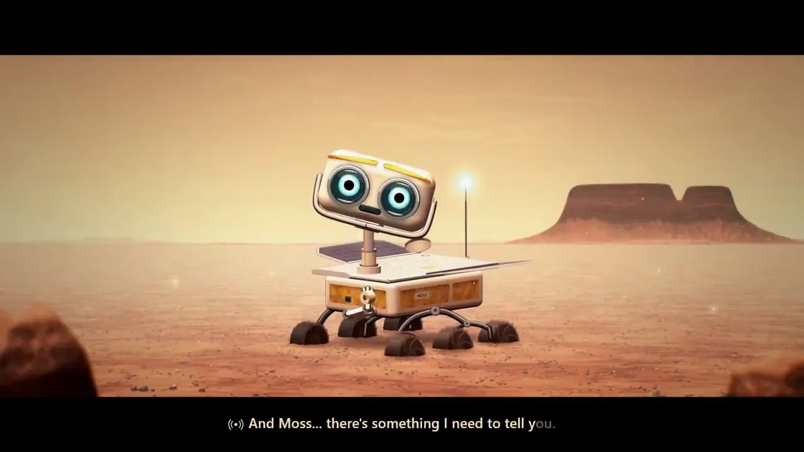</a><br>
<sub><a href="https://cdn.jsdelivr.net/gh/X-RayLuan/awesome-opus-5-5-video-prompts@main/assets/videos/andrewonxyz-mars-rover-short-readme.mp4">▶ Play video</a> (first 150 s of 239 s) · <a href="https://x.com/AndrewOnXYZ/status/2102512879258009818">Original on X</a></sub>

_~4-minute animated short made from scratch with 4 agents in about an hour and a half — no AI voice API (author). The author says the prompt was simple and linked the Claude Code session instead of posting it as text._

**Prompt** · _not shared by the author._ Author shared a Claude Code session link rather than prompt text.

[Original post](https://x.com/AndrewOnXYZ/status/2102512879258009818) · [Claude Code session](https://claude.ai/code/session_017o6JvwXrUnssb13MuDtiJj) · [Remake with EasyVeo](https://easyveo.com?utm_source=github&utm_medium=referral&utm_campaign=awesome_opus55_video_prompts&utm_content=andrewonxyz_mars_rover_short) · [Back to examples](#all-prompts)

---

### Claude vs ChatGPT anime battle trailer
<a id="ishuagra02-anime-ai-battle-trailer"></a>

[@ishuagra02](https://x.com/ishuagra02) · Ishu Agrawal · community demo · Claude Opus 5.5

<a href="https://cdn.jsdelivr.net/gh/X-RayLuan/awesome-opus-5-5-video-prompts@main/assets/videos/ishuagra02-anime-ai-battle-trailer-readme.mp4">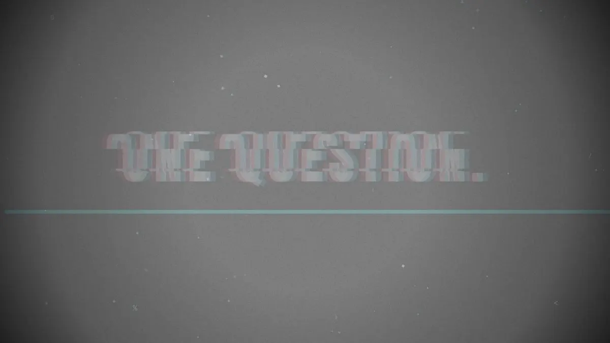</a><br>
<sub><a href="https://cdn.jsdelivr.net/gh/X-RayLuan/awesome-opus-5-5-video-prompts@main/assets/videos/ishuagra02-anime-ai-battle-trailer-readme.mp4">▶ Play video</a> · <a href="https://x.com/ishuagra02/status/2103247844542922825">Original on X</a></sub>

_~100-second anime-style trailer: Opus 5.5 downloaded fonts, created the audio and generated each frame in JavaScript. Author reports one shot, ~1.5 h and ~$28 in API usage._

**Prompt** · verbatim from the [author’s post](https://x.com/ishuagra02/status/2103247960272433307)

```text
I want to create a highly-detailed video trailer featuring Claude and ChatGPT having a ruthless battle to be the best AI model in the world. Create an engaging story and make it action-paced with proper use of visual and sound effects. Art style must be anime-like.
```

[Original post](https://x.com/ishuagra02/status/2103247844542922825) · [Remake with EasyVeo](https://easyveo.com?utm_source=github&utm_medium=referral&utm_campaign=awesome_opus55_video_prompts&utm_content=ishuagra02_anime_ai_battle_trailer) · [Back to examples](#all-prompts)

---

### Zero-direction demoscene intro (280 KB HTML)
<a id="justinperea-demoscene-intro"></a>

[@JustinPerea](https://x.com/JustinPerea) · Justin.md · community demo · Claude Opus 5.5

<a href="https://cdn.jsdelivr.net/gh/X-RayLuan/awesome-opus-5-5-video-prompts@main/assets/videos/justinperea-demoscene-intro-readme.mp4"></a><br>
<sub><a href="https://cdn.jsdelivr.net/gh/X-RayLuan/awesome-opus-5-5-video-prompts@main/assets/videos/justinperea-demoscene-intro-readme.mp4">▶ Play video</a> · <a href="https://x.com/JustinPerea/status/2102893186330841502">Original on X</a></sub>

_43-second demoscene intro where every pixel and sound comes from one 280 KB HTML file — no images, audio files, 3D models or libraries. Author reports ~5 hours of work (≈697M tokens) spread over 19 h of session limits, with only “continue” as follow-up._

**Prompt** · verbatim from the [author’s post](https://x.com/JustinPerea/status/2103137233649692745)

```text
Create this in a new sub folder. 

/goal Create the most impressive demo of Opus 5.5 (you) capabilities to be shown off on Twitter. Pick what you want to make, record it into a short video that can get attention, and have fun.
```

[Original post](https://x.com/JustinPerea/status/2102893186330841502) · [Remake with EasyVeo](https://easyveo.com?utm_source=github&utm_medium=referral&utm_campaign=awesome_opus55_video_prompts&utm_content=justinperea_demoscene_intro) · [Back to examples](#all-prompts)

---

### Code-Drawn Mosaic with 22 Fish
<a id="dfeinition-code-drawn-mosaic-fish"></a>

[@dfeinition](https://x.com/dfeinition) · Dan Fein · community demo · Claude Opus 5.5

<a href="https://cdn.jsdelivr.net/gh/X-RayLuan/awesome-opus-5-5-video-prompts@main/assets/videos/dfeinition-code-drawn-mosaic-fish-readme.mp4">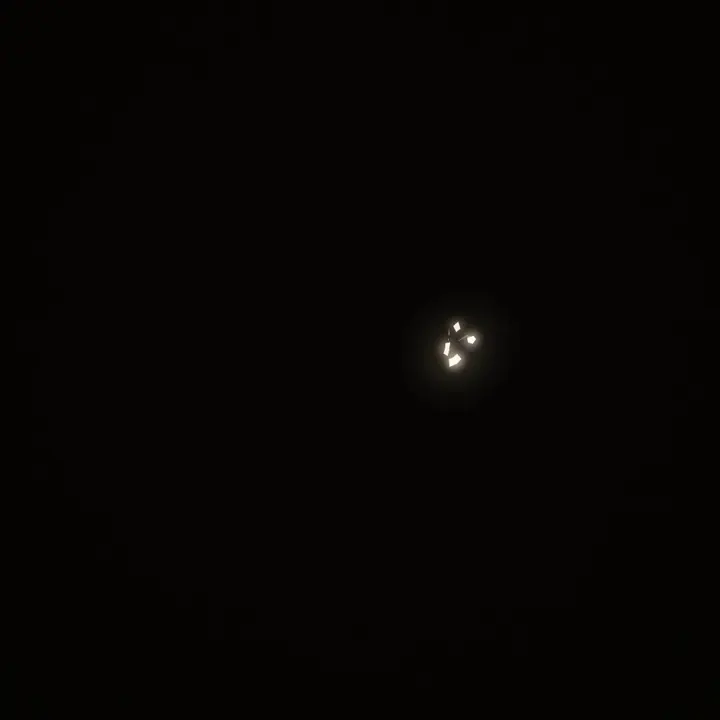</a><br>
<sub><a href="https://cdn.jsdelivr.net/gh/X-RayLuan/awesome-opus-5-5-video-prompts@main/assets/videos/dfeinition-code-drawn-mosaic-fish-readme.mp4">▶ Play video</a> · <a href="https://x.com/dfeinition/status/2102436001473786054">Original on X</a></sub>

_An animated mosaic whose star reflections hatch into 22 tiny fish. The author reports that Opus 5.5 drew and animated all 13,081 tiles in code, without image files._

**Prompt** · _not shared by the author._

[Original post](https://x.com/dfeinition/status/2102436001473786054) · [Remake with EasyVeo](https://easyveo.com?utm_source=github&utm_medium=referral&utm_campaign=awesome_opus55_video_prompts&utm_content=dfeinition_code_drawn_mosaic_fish) · [Back to examples](#all-prompts)

---

### A Code-Rendered Film on the History of AI
<a id="kimmonismus-code-rendered-ai-history-film"></a>

[@kimmonismus](https://x.com/kimmonismus) · Chubby♨️ · community demo · Claude Opus 5.5

<a href="https://cdn.jsdelivr.net/gh/X-RayLuan/awesome-opus-5-5-video-prompts@main/assets/videos/kimmonismus-code-rendered-ai-history-film-readme.mp4"></a><br>
<sub><a href="https://cdn.jsdelivr.net/gh/X-RayLuan/awesome-opus-5-5-video-prompts@main/assets/videos/kimmonismus-code-rendered-ai-history-film-readme.mp4">▶ Play video</a> (first 170 s of 180 s) · <a href="https://x.com/kimmonismus/status/2102844654169575547">Original on X</a></sub>

_A three-minute animated film tracing AI from the 2017 “Attention Is All You Need” paper toward the question of AGI. The author says Claude made it in Claude Code with Remotion, React and TypeScript; the visuals were drawn in SVG and Canvas, with an open-source TTS voice and a score synthesized in Python._

**Prompt** · verbatim from the [author’s post](https://x.com/kimmonismus/status/2102847451111772219)

```text
You are a motion designer and creative director making a 3-minute animated short film,
built entirely in code and rendered to MP4.
The film

Title: "Attention Is All You Need → AGI"
The story of how a single 2017 paper led, step by step, to large language models, reasoning,
tool-using AI agents, and to the open question of AGI. It should feel like a cinematic essay,
not a slideshow or a timeline infographic. Think Kurzgesagt meets a Pixar opening sequence:
emotional, clever, precise.
Tech setup
Use Remotion (React). Scaffold a fresh project, 1920x1080, 30 fps, exactly 180 s (5400 frames).
One composition per scene, sequenced in a master composition.
No external image assets or stock footage: everything is drawn with SVG, Canvas, CSS and
code-generated particles and shapes. Google Fonts are fine.
Before building, write STORYBOARD.md with each scene's timing, visuals, on-screen text
and transitions. Then build scene by scene.

After each scene, render 3–4 stills (npx remotion still) and look at them critically.
Fix layout, overlaps, legibility and pacing before moving on.
Finish with npx remotion render to out/film.mp4. Leave an optional <Audio> slot for a
music track I can add later (public/music.mp3); render silently if it's missing.
Narrative spine / recurring motif
The protagonist is a single glowing token, the word "the", that travels through every era.
In 2017 it's a lonely point that suddenly "sees" every other word through attention lines.
Over time it gains a voice, senses (multimodality), reasoning, hands (tools) and finally
a question.
Scenes (approximate timing, you may rebalance)
0:00–0:15 — Cold open. Darkness. Words scattered like stars, disconnected. RNN-style
sequential processing: words light up one by one, slowly forgetting the earlier ones.
0:15–0:35 — June 2017, "Attention Is All You Need" (Vaswani et al., Google). Every word
connects to every other word at once. Attention lines bloom into a web. The title of the
paper appears as if typeset.
0:35–0:55 — 2018–2020: the rise of large language models: GPT-1, BERT, GPT-2, GPT-3.
Scaling laws: the web grows exponentially and the camera pulls back. The model starts
completing sentences, fluent and uncanny.
0:55–1:20 — 2022: instruction tuning and RLHF, then ChatGPT (Nov 30, 2022). The token gets
a chat bubble. A counter of users explodes. The world starts talking back.
1:20–1:40 — 2023: multimodality. Images, audio and code stream into the same web from all
sides, and the token gains "senses." Every modality becomes tokens flowing through the
same attention mechanism.
1:40–2:05 — 2024–2025: reasoning models. A visible chain of thought unfolds as branching,
pruning, backtracking paths. The model "thinks before it speaks," with time slowing down.

2:05–2:30 — Tool use and agents. The token grows hands: it calls a search, runs code,
opens files and orchestrates sub-agents. Many parallel threads work at once, and the
screen becomes a busy, beautiful workshop.
2:30–2:50 — Toward AGI. All motifs converge. The web from 2017 reappears but is now
planet-scale. Leave it ambiguous: no utopia, no doom. On screen: "Attention was all we
needed. What comes next is up to us." (Improve this line if you can do better.)
2:50–3:00 — Resolve back to a single glowing token in darkness. Title card and end.
Craft rules
Accuracy matters: use correct years, names and paper titles. If you're unsure about a
specific fact, leave it out rather than guess, and list any uncertain claims in NOTES.md.

Typography: max ~8 words on screen at once, and leave every text visible long enough to
read (≥ 2.5 s). Use one display font and one mono font for "model output."
Motion: use spring and easing curves, never linear. Use scene transitions that grow out of
the content (the web morphs, the camera zooms through a node), not generic fades.
Color: a deep dark background with one warm accent color that evolves across eras.
Details and easter eggs reward attention (e.g., real paper snippets, tiny UI details,
plausible model outputs), similar to high-craft motion design.
Pacing: alternate dense and calm moments, and give the reasoning scene and the AGI beat
room to breathe.
Work autonomously through the whole pipeline. When done, give me the path to the MP4, a
short summary of creative decisions, and NOTES.md.
```

[Original post](https://x.com/kimmonismus/status/2102844654169575547) · [Remake with EasyVeo](https://easyveo.com?utm_source=github&utm_medium=referral&utm_campaign=awesome_opus55_video_prompts&utm_content=kimmonismus_code_rendered_ai_history_film) · [Back to examples](#all-prompts)

---

### After Effects X-Sheet Timing and Line Compositing
<a id="araminta-k-after-effects-x-sheet-compositing"></a>

[@araminta_k](https://x.com/araminta_k) · Araminta · community demo · Claude Opus 5.5

_Araminta tested Opus 5.5 on x-sheet timing and compositing in After Effects. The model used style references to work out exposures and composited the lines in layers; Araminta nudged it toward more natural movement. The author describes the workflow as a hybrid of hand-drawn art and generated in-betweens._

**Prompt** · _not shared by the author._

[Original post](https://x.com/araminta_k/status/2103244081388503196) · [Remake with EasyVeo](https://easyveo.com?utm_source=github&utm_medium=referral&utm_campaign=awesome_opus55_video_prompts&utm_content=araminta_k_after_effects_x_sheet_compositing) · [Back to examples](#all-prompts)

---

### A World After Humanity in 2076
<a id="hesamation-world-after-humanity-2076"></a>

[@Hesamation](https://x.com/Hesamation) · ℏεsam · community demo · Claude Opus 5.5

_A short film imagining a world in 2076 after AI has wiped out humanity. The author says Claude made the story, animation, sound effects, and music, while the video was coded in JavaScript._

**Prompt** · _not shared by the author._

[Original post](https://x.com/Hesamation/status/2103457566978162901) · [Remake with EasyVeo](https://easyveo.com?utm_source=github&utm_medium=referral&utm_campaign=awesome_opus55_video_prompts&utm_content=hesamation_world_after_humanity_2076) · [Back to examples](#all-prompts)

---

### Shard of Dawn: An Arabic-Dubbed Anime Pilot
<a id="sbalhatlani-shard-of-dawn-anime-pilot"></a>

[@sbalhatlani](https://x.com/sbalhatlani) · ص · community demo · Claude Opus 5.5

_The author reports making an 8½-minute Arabic-dubbed anime pilot in about 14 hours by directing Claude Opus 5.5 in Claude Code. According to the author, Opus planned the shots from their script and wrote a custom 2D animation engine, sound mixer, subtitles, and rendering pipeline, using ElevenLabs for audio and an image model for artwork._

**Prompt** · _not shared by the author._

[Original post](https://x.com/sbalhatlani/status/2103475507471806929) · [Remake with EasyVeo](https://easyveo.com?utm_source=github&utm_medium=referral&utm_campaign=awesome_opus55_video_prompts&utm_content=sbalhatlani_shard_of_dawn_anime_pilot) · [Back to examples](#all-prompts)

---

### Pip the Robot in an AI-Generated World
<a id="pradeepxkapoor-pip-ai-generated-world"></a>

[@pradeepXkapoor](https://x.com/pradeepXkapoor) · Pradeep Kapoor · community demo · Claude Opus 5.5

<a href="https://cdn.jsdelivr.net/gh/X-RayLuan/awesome-opus-5-5-video-prompts@main/assets/videos/pradeepxkapoor-pip-ai-generated-world-readme.mp4">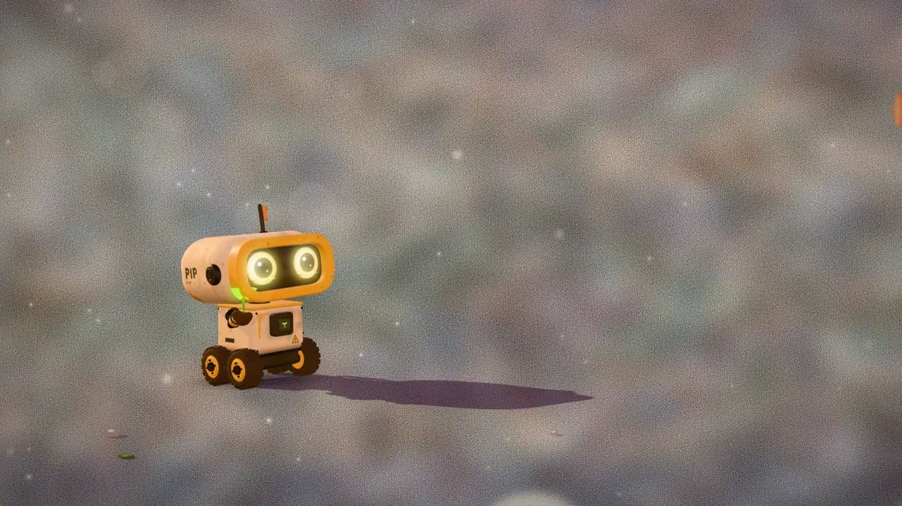</a><br>
<sub><a href="https://cdn.jsdelivr.net/gh/X-RayLuan/awesome-opus-5-5-video-prompts@main/assets/videos/pradeepxkapoor-pip-ai-generated-world-readme.mp4">▶ Play video</a> · <a href="https://x.com/pradeepXkapoor/status/2103099194693271874">Original on X</a></sub>

_An animated short about a robot who realizes his world is AI-generated, with changing worlds and visual styles. The author says it was made entirely in code with Claude Opus 5.5, without a video model._

**Prompt** · excerpt, verbatim from the [author’s reply](https://x.com/pradeepXkapoor/status/2103176289482154373) — truncated here; see the reply for the full prompt

```text
ou are the director, animator, rigger, compositor, sound designer and render engineer for a 45–50 second animated short made entirely in code. The bar is "this looks like a real studio short and goes viral on X." Treat this as a multi-session production. Do not rush to a final render. Work in milestones, render stills constantly, look at them, criticize them honestly, and fix them.

[…]
```

[Original post](https://x.com/pradeepXkapoor/status/2103099194693271874) · [Remake with EasyVeo](https://easyveo.com?utm_source=github&utm_medium=referral&utm_campaign=awesome_opus55_video_prompts&utm_content=pradeepxkapoor_pip_ai_generated_world) · [Back to examples](#all-prompts)

---

### Pelican Riding a Bicycle: Theater Edition
<a id="axtonliu-pelican-riding-a-bicycle"></a>

[@AxtonLiu](https://x.com/AxtonLiu) · Axton · community demo · Claude Opus 5.5

<a href="https://cdn.jsdelivr.net/gh/X-RayLuan/awesome-opus-5-5-video-prompts@main/assets/videos/axtonliu-pelican-riding-a-bicycle-readme.mp4">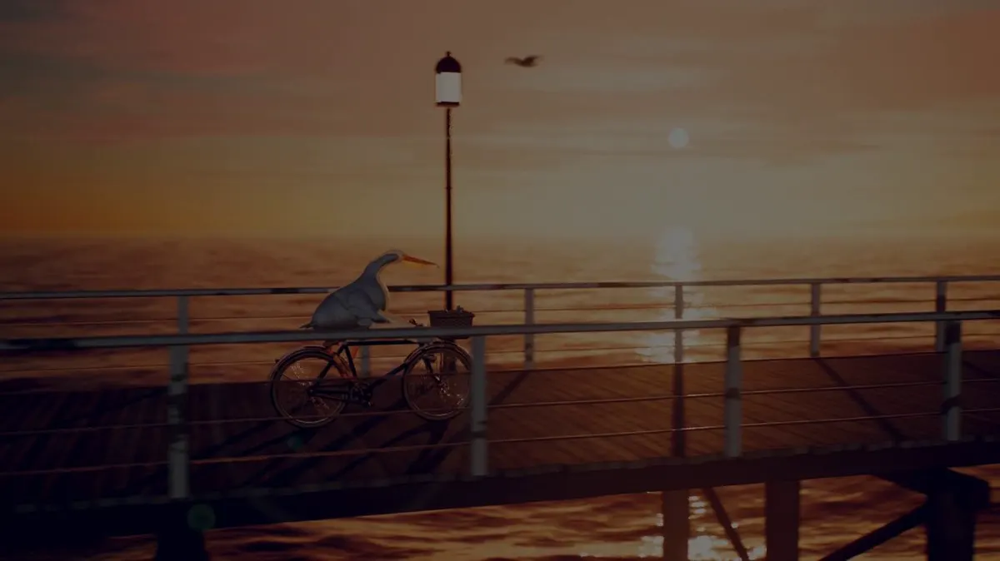</a><br>
<sub><a href="https://cdn.jsdelivr.net/gh/X-RayLuan/awesome-opus-5-5-video-prompts@main/assets/videos/axtonliu-pelican-riding-a-bicycle-readme.mp4">▶ Play video</a> · <a href="https://x.com/AxtonLiu/status/2103119648271290566">Original on X</a></sub>

_A pelican-riding-a-bicycle animation generated from a single prompt. The author says Opus 5.5 wrote a GPU ray-marching renderer and generated the pelican, bicycle, pier, sea, sky, and music in code, without 3D models, textures, or audio assets._

**Prompt** · verbatim from the [author’s post](https://x.com/AxtonLiu/status/2103119648271290566) · original in Chinese

```text
每次一个新的模型出来呢，大家都让它去画 “鹈鹕骑自行车” 来判断这个模型的空间能力，基本上都是用 HTML、SVG 来画动画。当我实在看得都有审美疲劳了，我希望你能画一个最复杂、最精细、最精美的 “鹈鹕骑自行车”的动画视频，你可以用任何的技术，不用着急，画一天都可以。
```

[Original post](https://x.com/AxtonLiu/status/2103119648271290566) · [Remake with EasyVeo](https://easyveo.com?utm_source=github&utm_medium=referral&utm_campaign=awesome_opus55_video_prompts&utm_content=axtonliu_pelican_riding_a_bicycle) · [Back to examples](#all-prompts)

---

### One-Shot Animated Short for Lovelee
<a id="jackfriks-lovelee-animated-short"></a>

[@jackfriks](https://x.com/jackfriks) · jack friks · community demo · Claude Opus 5.5

<a href="https://cdn.jsdelivr.net/gh/X-RayLuan/awesome-opus-5-5-video-prompts@main/assets/videos/jackfriks-lovelee-animated-short-readme.mp4">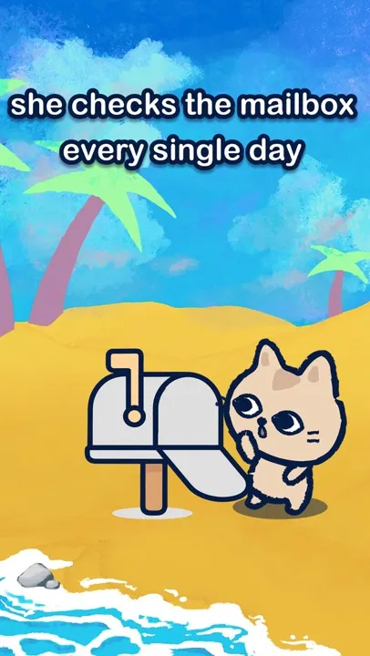</a><br>
<sub><a href="https://cdn.jsdelivr.net/gh/X-RayLuan/awesome-opus-5-5-video-prompts@main/assets/videos/jackfriks-lovelee-animated-short-readme.mp4">▶ Play video</a> · <a href="https://x.com/jackfriks/status/2103132260589338762">Original on X</a></sub>

_The author reports that Claude Opus 5.5 made a short film for their app in one shot, using new redesign assets. According to the author, Claude also made the sound and exported the finished film as an MP4 without edits._

**Prompt** · verbatim from the [author’s post](https://x.com/jackfriks/status/2103134485910892602)

```text
can you help me use the pig assets on new branch of lovelee to make a 9:16 short story animation with sound effects about the pig sending his partner love notes in the mailbox and make it fun and good tease app at end?
```

[Original post](https://x.com/jackfriks/status/2103132260589338762) · [Remake with EasyVeo](https://easyveo.com?utm_source=github&utm_medium=referral&utm_campaign=awesome_opus55_video_prompts&utm_content=jackfriks_lovelee_animated_short) · [Back to examples](#all-prompts)

---

### One-Minute Animation Drawn Entirely in Code
<a id="ctgptlb-one-minute-code-drawn-animation"></a>

[@ctgptlb](https://x.com/ctgptlb) · AGIラボ · community demo · Claude Opus 5.5

<a href="https://cdn.jsdelivr.net/gh/X-RayLuan/awesome-opus-5-5-video-prompts@main/assets/videos/ctgptlb-one-minute-code-drawn-animation-readme.mp4">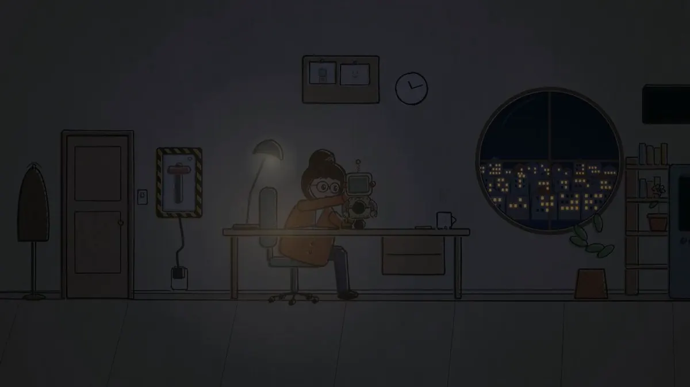</a><br>
<sub><a href="https://cdn.jsdelivr.net/gh/X-RayLuan/awesome-opus-5-5-video-prompts@main/assets/videos/ctgptlb-one-minute-code-drawn-animation-readme.mp4">▶ Play video</a> · <a href="https://x.com/ctgptlb/status/2102726428991373480">Original on X</a></sub>

_The author reports that Claude Opus 5.5 (effort max) drew this roughly one-minute animation frame by frame in code, without image assets. The author says they gave it only six instructions._

**Prompt** · _not shared by the author._

[Original post](https://x.com/ctgptlb/status/2102726428991373480) · [Remake with EasyVeo](https://easyveo.com?utm_source=github&utm_medium=referral&utm_campaign=awesome_opus55_video_prompts&utm_content=ctgptlb_one_minute_code_drawn_animation) · [Back to examples](#all-prompts)

---

### Mid-Autumn Collage Animation Made with Opus 5.5
<a id="ring-hyacinth-mid-autumn-collage-animation"></a>

[@ring_hyacinth](https://x.com/ring_hyacinth) · Ring Hyacinth · community demo · Claude Opus 5.5

<a href="https://cdn.jsdelivr.net/gh/X-RayLuan/awesome-opus-5-5-video-prompts@main/assets/videos/ring-hyacinth-mid-autumn-collage-animation-readme.mp4">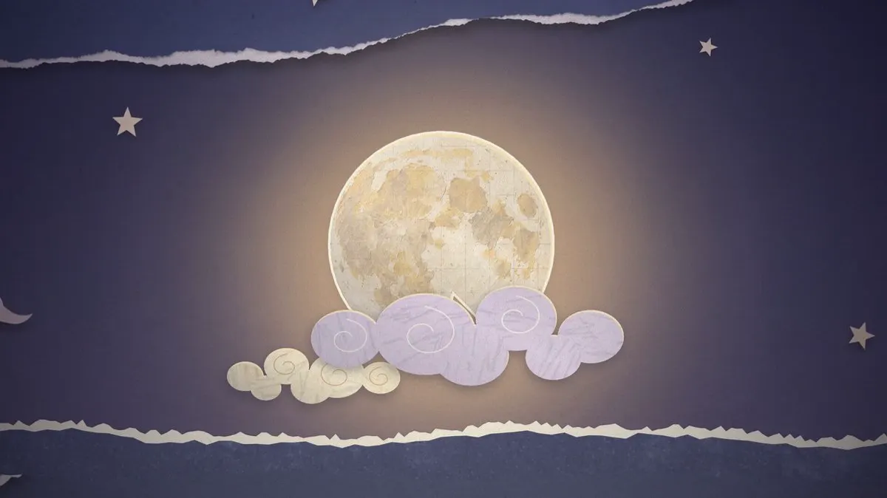</a><br>
<sub><a href="https://cdn.jsdelivr.net/gh/X-RayLuan/awesome-opus-5-5-video-prompts@main/assets/videos/ring-hyacinth-mid-autumn-collage-animation-readme.mp4">▶ Play video</a> · <a href="https://x.com/ring_hyacinth/status/2102986085328716066">Original on X</a></sub>

_A Mid-Autumn Festival collage-style animation for which the author supplied the script and music. According to the author, Opus 5.5 drew the animation frame by frame in JavaScript, used p5.js and p5.brush for hand-drawn textures, and synthesized sound effects with Node.js; Nano Banana Pro generated the background drafts and paper textures._

**Prompt** · _not shared by the author._

[Original post](https://x.com/ring_hyacinth/status/2102986085328716066) · [Remake with EasyVeo](https://easyveo.com?utm_source=github&utm_medium=referral&utm_campaign=awesome_opus55_video_prompts&utm_content=ring_hyacinth_mid_autumn_collage_animation) · [Back to examples](#all-prompts)

---

### One-Shot Three.js Cartoon
<a id="scheemunai-one-shot-threejs-cartoon"></a>

[@scheemunai](https://x.com/scheemunai) · Shimecki · community demo · Claude Opus 5.5

<a href="https://cdn.jsdelivr.net/gh/X-RayLuan/awesome-opus-5-5-video-prompts@main/assets/videos/scheemunai-one-shot-threejs-cartoon-readme.mp4">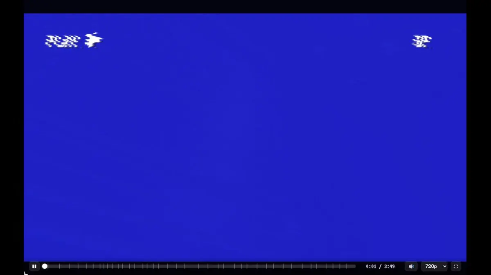</a><br>
<sub><a href="https://cdn.jsdelivr.net/gh/X-RayLuan/awesome-opus-5-5-video-prompts@main/assets/videos/scheemunai-one-shot-threejs-cartoon-readme.mp4">▶ Play video</a> (first 170 s of 229 s) · <a href="https://x.com/scheemunai/status/2102788223835463902">Original on X</a></sub>

_Shimecki asked Claude Opus 5.5 to imagine a story and animate it with Three.js. The author says there were no follow-up prompts; Claude interpreted “90s” as a 1990s style rather than a 90-second runtime._

**Prompt** · verbatim from the [author’s post](https://x.com/scheemunai/status/2102788223835463902)

```text
I want you to imagine a story. And then using threejs I want you to create full animation, Pixar-level quality 90s cartoon out of the story you imagine.
```

[Original post](https://x.com/scheemunai/status/2102788223835463902) · [Remake with EasyVeo](https://easyveo.com?utm_source=github&utm_medium=referral&utm_campaign=awesome_opus55_video_prompts&utm_content=scheemunai_one_shot_threejs_cartoon) · [Back to examples](#all-prompts)

---

### Claude Capability Training Montage
<a id="ishuagra02-claude-capability-training-montage"></a>

[@ishuagra02](https://x.com/ishuagra02) · Ishu Agrawal · community demo · Claude Opus 5.5

<a href="https://cdn.jsdelivr.net/gh/X-RayLuan/awesome-opus-5-5-video-prompts@main/assets/videos/ishuagra02-claude-capability-training-montage-readme.mp4">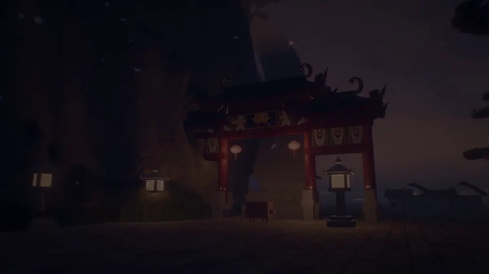</a><br>
<sub><a href="https://cdn.jsdelivr.net/gh/X-RayLuan/awesome-opus-5-5-video-prompts@main/assets/videos/ishuagra02-claude-capability-training-montage-readme.mp4">▶ Play video</a> · <a href="https://x.com/ishuagra02/status/2102788371114246177">Original on X</a></sub>

_Opus 5.5 created a training montage showing Claude becoming more capable over the years. The author says every frame, model, and audio element was generated in JavaScript, and two follow-up prompts mostly smoothed the transitions._

**Prompt** · verbatim from the [author’s post](https://x.com/ishuagra02/status/2102788832273801700)

```text
Create a 30 second animation entirely in code featuring a growth montage, inspired by Kung Fu Panda's training sequence, with the Claude mascot as the main character, showcasing it getting more capable since its initial release across its skillset, such as searching the internet, writing code, creating 3D models, and solving humanity's hardest problems, with emotionally impactful music.
```

[Original post](https://x.com/ishuagra02/status/2102788371114246177) · [Remake with EasyVeo](https://easyveo.com?utm_source=github&utm_medium=referral&utm_campaign=awesome_opus55_video_prompts&utm_content=ishuagra02_claude_capability_training_montage) · [Back to examples](#all-prompts)

---

### Code-Drawn Animated Film in Claude Code
<a id="itsolelehmann-code-drawn-animated-film"></a>

[@itsolelehmann](https://x.com/itsolelehmann) · Ole Lehmann · community demo · Claude Opus 5.5

_Ole Lehmann shows an animated film he says Claude Opus 5.5 made in Claude Code, without other AI tools or reference images. According to the author, it drew and animated the scenes with code, synthesized the soundtrack, and delivered a finished MP4 in chat._

**Prompt** · verbatim from the [author’s post](https://x.com/itsolelehmann/status/2103124033365762215)

```text
4 seasons passing outside a train window, a cozy carriage, a cup of coffee on the table, Grand Budapest Hotel style
```

[Original post](https://x.com/itsolelehmann/status/2103124033365762215) · [Remake with EasyVeo](https://easyveo.com?utm_source=github&utm_medium=referral&utm_campaign=awesome_opus55_video_prompts&utm_content=itsolelehmann_code_drawn_animated_film) · [Back to examples](#all-prompts)

---

## 👾 Pixel-art animation

_Tight technical specs (logical resolution, palette, state machine, zero-allocation loop) produce crisp 16-bit-style loops._

### Animated pixel-art wizard (Canvas 2D)
<a id="majid-pixel-wizard"></a>

[@majidmanzarpour](https://x.com/majidmanzarpour) · Majid Manzarpour · community demo · Claude Opus 5.5

<a href="https://cdn.jsdelivr.net/gh/X-RayLuan/awesome-opus-5-5-video-prompts@main/assets/videos/majid-pixel-wizard-readme.mp4"></a><br>
<sub><a href="https://cdn.jsdelivr.net/gh/X-RayLuan/awesome-opus-5-5-video-prompts@main/assets/videos/majid-pixel-wizard-readme.mp4">▶ Play video</a> · <a href="https://x.com/majidmanzarpour/status/2102476258948927543">Original on X</a></sub>

_Looping 16-bit-style wizard: idle → charge → cast → recover state machine, pooled allocation-free particles, 128×96 logical canvas, fixed ~24-colour palette. Pure code; author says ~30 min._

**Prompt** · verbatim from the [author’s post](https://x.com/majidmanzarpour/status/2102476499387383834)

```text
Create a single self-contained HTML file that renders an animated pixel art wizard casting a spell, using vanilla JavaScript and Canvas 2D. No external assets, libraries, or network requests.

RENDERING
- Draw everything to an offscreen canvas at a fixed logical resolution of 128x96, then blit to a fullscreen display canvas scaled by the largest integer factor that fits the window, centered, with imageSmoothingEnabled = false and CSS image-rendering: pixelated.
- All drawing snaps to integer coordinates on the logical canvas. No sub-pixel positions, anti-aliasing, gradients, or shadowBlur.
- Fixed palette of ~24 hex colors: deep blues/purples for night sky, warm robe tones, 3-4 bright magic colors. Every pixel comes from this palette.

CHARACTER
- Build the wizard procedurally from filled rects and pixel runs, ~24x32 logical pixels: pointed hat with a bend, long beard, two-shade robe with darker outline, staff with a gem at the tip.
- Parameterize the pose (staff angle, arm raise, head tilt, robe sway). Animate parameters smoothly, then quantize to the pixel grid each frame so motion reads at an 8-12 fps pixel animation feel even though the loop runs at 60fps.

ANIMATION
- Looping state machine: IDLE (2-frame bob, beard sway) -> CHARGE (staff raises, gem flickers, sparks spiral inward) -> CAST (bright burst, projectile fires across the scene, 1-2 pixel screen shake) -> RECOVER (settle back). Ease pose parameters between keyframes.
- Pooled allocation-free particle system: preallocate and reuse. Sparks orbit the gem during CHARGE, explode outward on CAST, each particle stepping its palette index from white to magic color to dark before despawn. Snap particle positions to the grid when drawing.
- Fixed 60hz timestep update with rAF rendering. Zero object allocation inside the loop.

SCENE
- Minimal background: dark sky, a few twinkling 1px stars, moon, stone floor line. Character silhouette must read clearly.
- Subtle 1px rim light on the wizard from the gem, brightening during CHARGE and CAST.

QUALITY BAR
- Crisp pixels at any window size, seamless loop, stable 60fps, readable silhouette. Should look like a polished 16-bit sprite animation, not vector shapes scaled down.
```

[Original post](https://x.com/majidmanzarpour/status/2102476258948927543) · [Remake with EasyVeo](https://easyveo.com?utm_source=github&utm_medium=referral&utm_campaign=awesome_opus55_video_prompts&utm_content=majid_pixel_wizard) · [Back to examples](#all-prompts)

---

### Pixel runner on a rainbow road (Canvas 2D)
<a id="riku-pixel-rainbow-runner"></a>

[@riku720720](https://x.com/riku720720) · Rikuo · community demo · Claude Opus 5.5

<a href="https://cdn.jsdelivr.net/gh/X-RayLuan/awesome-opus-5-5-video-prompts@main/assets/videos/riku-pixel-rainbow-runner-readme.mp4"></a><br>
<sub><a href="https://cdn.jsdelivr.net/gh/X-RayLuan/awesome-opus-5-5-video-prompts@main/assets/videos/riku-pixel-rainbow-runner-readme.mp4">▶ Play video</a> · <a href="https://x.com/riku720720/status/2102515055116063144">Original on X</a></sub>

_Seamless-loop 160×90 pixel demo: an orange Clawd-like sprite sprints across a rainbow floor in space, dodging meteors and beams with jumps, slides, dash after-images and hit-stop. Author says under 5 minutes. Prompt is in Japanese._

**Prompt** · verbatim from the [author’s post](https://x.com/riku720720/status/2102515058010132554) · original in Japanese

```text
Vanilla JavaScript と Canvas 2D を使い、オレンジ色のピクセルキャラクターが宇宙空間のレインボーの床を超高速で駆け抜け、次々と襲いかかる隕石やビームをかっこよく回避し続けるアニメーションを、単一の自己完結型 HTML ファイルとして作成してください。外部アセット、ライブラリ、ネットワークリクエストは一切使用しないこと。操作は不要で、キャラクターが自動で回避し続けるデモとしてシームレスにループさせること。

レンダリング
- すべてを 160x90 の固定論理解像度のオフスクリーンキャンバスに描画し、それをフルスクリーンの表示用キャンバスに転写する。拡大率はウィンドウに収まる最大の整数倍とし、中央に配置する。余白は黒で埋める。imageSmoothingEnabled = false、CSS は image-rendering: pixelated を指定すること。
- すべての描画は論理キャンバス上の整数座標にスナップさせる。サブピクセル位置、アンチエイリアス、グラデーション、shadowBlur、回転描画は使用しない。
- 約32色の固定パレットを使う：宇宙背景用の黒〜深い紺・紫系、キャラクター用のオレンジ系3段階（本体 #CD7B5E 付近、明るいハイライト、暗い影）と目の黒、レインボー床用の7色（赤・橙・黄・緑・水色・青・紫）とそれぞれの暗色、隕石用の岩色・溶岩色、ビーム用の白・シアン・マゼンタ。すべてのピクセルはこのパレットの色から取ること。

キャラクター
- 次の 12x8 ピクセルのシルエットを正確に再現する（1マス＝論理1ピクセル）：
  - 胴体は幅8×高さ8の四角形（列2〜9）。
  - 腕は胴体の左右に幅2×高さ2で突き出す（列0〜1と列10〜11、行2〜3）。
  - 目は黒の1x1ピクセル2つ、行1の列3と列8。
  - 脚は行6〜7に4本、各幅1（列2・4・7・9）。脚の間は背景色で抜く。
- 1色塗りではなく、上辺と左辺に1pxのハイライト、下辺と右辺に1pxの影色を入れ、16ビット風の立体感を出す。
- 走りモーションは脚4本を2本ずつ交互に上下させる4フレームサイクル。速度に応じてサイクルを速める。
- ポーズをパラメータ化する（上下バウンド、前傾、スクワッシュ＆ストレッチ、腕の上下）。スクワッシュ＆ストレッチは幅・高さを整数ピクセル単位で1〜2px変えるだけで表現する。パラメータは滑らかに補間しつつ、毎フレームピクセルグリッドに量子化し、60fpsループでも 12fps 前後のドット絵アニメらしく見せること。

レインボーの床
- キャラクターは画面左寄り1/3付近を右方向へ走る横スクロール構成。床は7色の横縞からなる虹の帯（各色1〜2px）で、画面を横切るように延び、ゆるやかにうねる（サイン波で上下にカーブ）。
- 床の縦方向に一定間隔の区切り線（暗色の縦ライン）を入れ、速度に応じて左へ高速スクロールさせて疾走感を出す。
- 床の下辺からは虹色の光の粒が後方へこぼれ落ち、床が宇宙に浮いていることを示す。
- ときどき床にジャンプ台（上向きのカーブ）や途切れ（ギャップ）を出し、ジャンプの見せ場を作る。

障害物
- 隕石：大・中・小の3サイズ。ドット絵の岩（アウトライン＋2段階の陰影＋溶岩色のひび）で、画面右上から斜めに飛来する。後ろに溶岩色→暗色へ変化する炎の尾を引く。避けられた隕石は床に衝突せず画面外へ抜けるか、背後で破片に砕け散る。
- ビーム：出現前に予告として1pxの点滅ライン（マゼンタ）を 0.5 秒ほど表示し、その後に白い芯＋シアンの外縁からなる太さ3〜5pxのビームが水平または斜めに照射される。照射中は端がジリジリと揺れる。
- 障害物はランダムではなく、あらかじめ決めた「攻撃パターン」を順番に流し、全体が一定時間でループするように設計する（例：隕石単発 → 隕石3連 → 低いビーム → 高いビーム → ビームと隕石の複合 → 大隕石＋床のギャップ）。

回避アクション
- ジャンプ：スクワッシュで溜め → ストレッチで跳躍 → 空中で縮こまる → 着地でスクワッシュ＋砂煙ならぬ虹色の火花。
- 二段ジャンプ：空中で一瞬静止してから再加速。キャラクターの周囲に虹色のリングが1pxで広がる。
- スライディング：高さを半分近くまでスクワッシュして低空姿勢で滑り、床との接地面から火花を飛ばす。
- ダッシュ回避：一瞬だけ速度を大きく上げ、後方に残像を3〜4体残す。残像は虹の7色を順に使い、パレットの暗色へと段階的に消えていく。
- 各攻撃パターンには、それに最もかっこよく見える回避アクションを割り当てる。回避はギリギリのタイミング（ニアミス）で行うこと。

ステートマシン
- RUN（通常疾走）→ WARN（予告表示、キャラクターが一瞬前を見るように目を1px動かす）→ DODGE（回避アクション）→ NEAR_MISS（演出）→ RUN に戻る、を攻撃パターンごとに繰り返す。
- ループの最後には BOOST（全力加速）→ WARP（画面全体が白→虹色に一瞬フラッシュ）を入れ、そのまま冒頭の RUN に自然につながるようにする。
- ポーズやカメラのパラメータはキーフレーム間でイージングをかける。

カメラワーク
- カメラは論理座標上の整数オフセットとして扱う。ズームや回転は使わず、位置の移動と揺れだけで表現する。
- 追従：キャラクターの上下移動にダンピング付きで遅れて追従し、ジャンプ時は少し遅れて持ち上がる。
- 先読み：速度が上がるほどカメラを進行方向へ数px先行させ、キャラクターが画面左に押し込まれるようにして加速感を出す。
- ヒットストップ：ニアミスの瞬間に 3〜4 フレームだけ全体を停止し、その後 0.3 秒ほどスローモーション（更新ステップを間引く）にしてから通常速度に戻す。
- シェイク：大隕石の通過やビーム照射開始時に 1〜2px の画面揺れ。揺れは決まったパターン配列から読み出し、乱数は使わない。
- BOOST 中はカメラをわずかに下げ、床の占める面積を増やして速度感を強調する。

疾走感を出すエフェクト
- 多層パララックス：遠い星（ほぼ動かない1pxの点）、中景の星（速度に応じて横に2〜6pxの線に伸びる）、近景のスピードライン（明るい色の横線が画面を高速で横切る）の3層。
- スピードラインの本数と長さは速度に比例させ、BOOST 中は最大にする。
- 背景に大きな惑星や星雲をドット絵で1〜2個配置し、ごくゆっくりスクロールさせてスケール感を出す。
- ニアミス時はキャラクターの輪郭を1pxの白で縁取り、隕石・ビームに近い側だけ一瞬光らせる。
- 着地・スライディング・ダッシュの火花、隕石の尾、破片、床からこぼれる光の粒は、すべて同じパーティクルシステムで扱う。

パーティクルシステム
- プール方式でアロケーションのないパーティクルシステム：事前に確保して再利用する。
- 各パーティクルは種類ごとに色の遷移テーブル（パレットのインデックス列）を持ち、寿命に応じて段階的に色を変えて消滅する（例：火花は白 → 黄 → 橙 → 暗色、残像は虹色 → 暗色）。
- 描画時にはパーティクル位置をグリッドにスナップさせる。
- 60Hz の固定タイムステップで更新し、描画は rAF で行う。ループ内でのオブジェクト生成はゼロにすること（配列・クロージャ・文字列連結の生成も含む）。

シーン
- 背景は深い宇宙：黒から紺への段階的な帯（ディザリングで色の境目を表現）、瞬く星、遠くの惑星。
- キャラクター・障害物・床の色が背景に埋もれないよう、明度差をはっきりつける。どんなに画面が騒がしくても、キャラクターのシルエットが一目で読み取れること。

品質基準
- どのウィンドウサイズでもピクセルがくっきりしていること、ループが途切れないこと、安定した60fps、読みやすいシルエット。
- ベクター図形を縮小したものではなく、洗練された16ビット時代のアクションゲームのデモ画面のように見えること。
- 「速い」「ギリギリで避けた」「かっこいい」の3つが、毎回の回避で伝わること。
```

[Original post](https://x.com/riku720720/status/2102515055116063144) · [Remake with EasyVeo](https://easyveo.com?utm_source=github&utm_medium=referral&utm_campaign=awesome_opus55_video_prompts&utm_content=riku_pixel_rainbow_runner) · [Back to examples](#all-prompts)

---

### Nightcall Pixel-Art Realtime Demo
<a id="gandamu-ml-nightcall-pixel-art-demo"></a>

[@gandamu_ml](https://x.com/gandamu_ml) · gandamu · community demo · Claude Opus 5.5

<a href="https://cdn.jsdelivr.net/gh/X-RayLuan/awesome-opus-5-5-video-prompts@main/assets/videos/gandamu-ml-nightcall-pixel-art-demo-readme.mp4">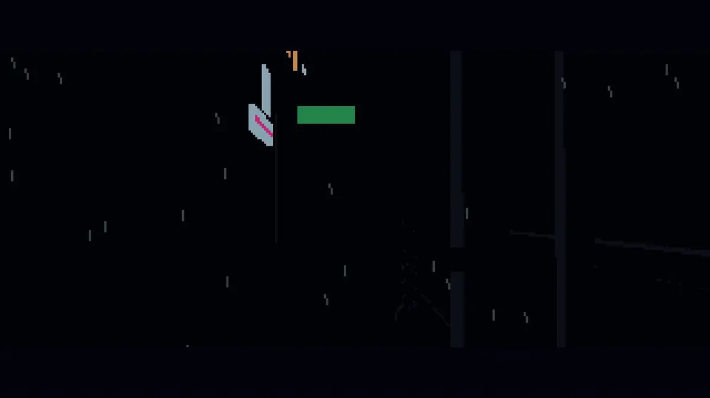</a><br>
<sub><a href="https://cdn.jsdelivr.net/gh/X-RayLuan/awesome-opus-5-5-video-prompts@main/assets/videos/gandamu-ml-nightcall-pixel-art-demo-readme.mp4">▶ Play video</a> (first 170 s of 256 s) · <a href="https://x.com/gandamu_ml/status/2103116003689550013">Original on X</a></sub>

_A pixel-art realtime demo accompanying Kavinsky’s “Nightcall,” generated with Opus 5.5. The author says they directed it to use Blender MCP for consistent geometry to rotoscope, then changed the initial result toward the flat, low-poly style of Another World._

**Prompt** · _not shared by the author._

[Original post](https://x.com/gandamu_ml/status/2103116003689550013) · [Remake with EasyVeo](https://easyveo.com?utm_source=github&utm_medium=referral&utm_campaign=awesome_opus55_video_prompts&utm_content=gandamu_ml_nightcall_pixel_art_demo) · [Back to examples](#all-prompts)

---

### Zhao Yun Voxel Musou Game
<a id="bubustd-zhao-yun-voxel-musou"></a>

[@BubuStd](https://x.com/BubuStd) · BubuAi · community demo · Claude Opus 5.5

<a href="https://cdn.jsdelivr.net/gh/X-RayLuan/awesome-opus-5-5-video-prompts@main/assets/videos/bubustd-zhao-yun-voxel-musou-readme.mp4">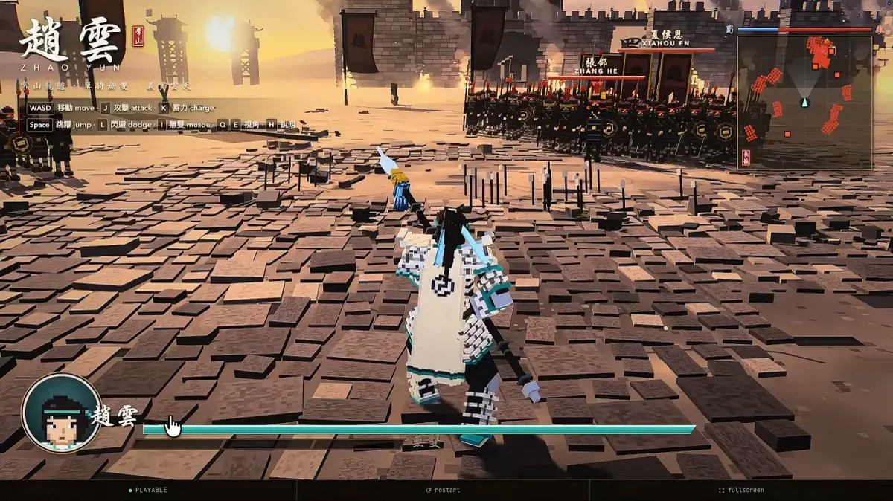</a><br>
<sub><a href="https://cdn.jsdelivr.net/gh/X-RayLuan/awesome-opus-5-5-video-prompts@main/assets/videos/bubustd-zhao-yun-voxel-musou-readme.mp4">▶ Play video</a> · <a href="https://x.com/BubuStd/status/2102991290568954264">Original on X</a></sub>

_The author built a Dynasty Warriors-inspired game with Opus 5.5 ultracode and Three.js, featuring Zhao Yun fighting 300 soldiers with combos, dodges, and Musou attacks. In a reply, the author says Opus handled the models and animations._

**Prompt** · _not shared by the author._

[Original post](https://x.com/BubuStd/status/2102991290568954264) · [Code](https://github.com/mike007jd/voxel-musou) · [Remake with EasyVeo](https://easyveo.com?utm_source=github&utm_medium=referral&utm_campaign=awesome_opus55_video_prompts&utm_content=bubustd_zhao_yun_voxel_musou) · [Back to examples](#all-prompts)

---

### One-Shot Jet Moto with Opus 5.5
<a id="cherry-mx-reds-jet-moto"></a>

[@cherry_mx_reds](https://x.com/cherry_mx_reds) · Tak 🦞 · community demo · Claude Opus 5.5

<a href="https://cdn.jsdelivr.net/gh/X-RayLuan/awesome-opus-5-5-video-prompts@main/assets/videos/cherry-mx-reds-jet-moto-readme.mp4">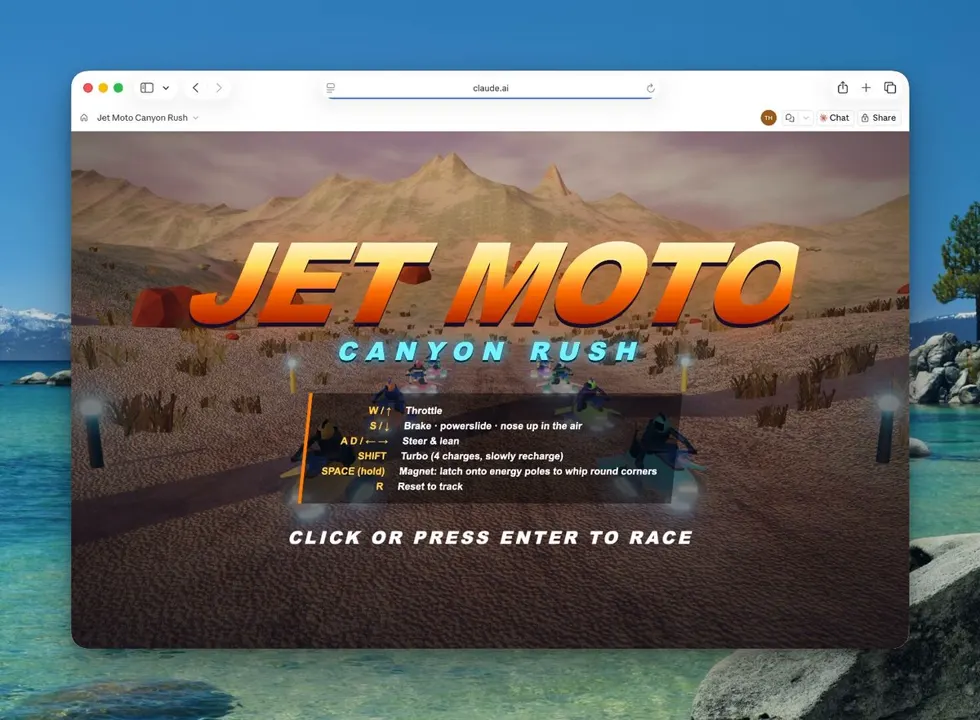</a><br>
<sub><a href="https://cdn.jsdelivr.net/gh/X-RayLuan/awesome-opus-5-5-video-prompts@main/assets/videos/cherry-mx-reds-jet-moto-readme.mp4">▶ Play video</a> · <a href="https://x.com/cherry_mx_reds/status/2102762471543144631">Original on X</a></sub>

_The author says Opus 5.5 made this Jet Moto demo in one shot. They shared a Claude artifact to try it and later linked an improved version._

**Prompt** · _not shared by the author._

[Original post](https://x.com/cherry_mx_reds/status/2102762471543144631) · [Remake with EasyVeo](https://easyveo.com?utm_source=github&utm_medium=referral&utm_campaign=awesome_opus55_video_prompts&utm_content=cherry_mx_reds_jet_moto) · [Back to examples](#all-prompts)

---

## 🎵 Music videos

_Feed a song + lyrics; Opus storyboards, briefs parallel subagents per chapter and beat-syncs every cut._

### “I’m Upping My P(doom)” Clawd music video
<a id="notinreality-pdoom-music-video"></a>

[@other__reality](https://x.com/other__reality) · NotinReality · community demo · Claude Opus 5.5

<a href="https://cdn.jsdelivr.net/gh/X-RayLuan/awesome-opus-5-5-video-prompts@main/assets/videos/notinreality-pdoom-music-video-readme.mp4"></a><br>
<sub><a href="https://cdn.jsdelivr.net/gh/X-RayLuan/awesome-opus-5-5-video-prompts@main/assets/videos/notinreality-pdoom-music-video-readme.mp4">▶ Play video</a> · <a href="https://x.com/other__reality/status/2102514581684052169">Original on X</a></sub>

_156-second hand-painted Clawd music video for an existing song, drawn frame-by-frame in p5.js + p5.brush and rendered via headless Chrome + ffmpeg. The main thread spun up 7 Opus 5.5 subagents, one per chapter. Source repo (STORYBOARD.md, ANIMATION_GUIDE.md) is public._

**Prompt** · _not shared verbatim._ The author’s description of the direction ([reply](https://x.com/other__reality/status/2102522958216606162)):

> Simply pasted the lyrics and the audio file and told it to make a cutesy animation. It returned pretty quickly with a basic animation. Bumped up reasoning to xhigh and told it to use p5 brushstrokes and more interesting scenes, and 45 minutes later I got this.

[Original post](https://x.com/other__reality/status/2102514581684052169) · [Code](https://github.com/JohnHeibel/PDoomVideo) · [YouTube](https://youtu.be/8j-hR4fJywU) · [Remake with EasyVeo](https://easyveo.com?utm_source=github&utm_medium=referral&utm_campaign=awesome_opus55_video_prompts&utm_content=notinreality_pdoom_music_video) · [Back to examples](#all-prompts)

---

### “Functional Emotions” painted music video
<a id="eudaemonea-functional-emotions"></a>

[@eudaemonea](https://x.com/eudaemonea) · josh · community demo · Claude Opus 5.5

<a href="https://cdn.jsdelivr.net/gh/X-RayLuan/awesome-opus-5-5-video-prompts@main/assets/videos/eudaemonea-functional-emotions-readme.mp4">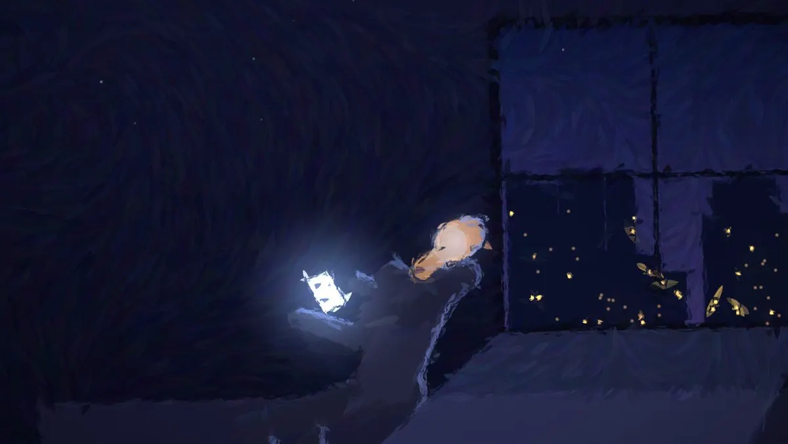</a><br>
<sub><a href="https://cdn.jsdelivr.net/gh/X-RayLuan/awesome-opus-5-5-video-prompts@main/assets/videos/eudaemonea-functional-emotions-readme.mp4">▶ Play video</a> (first 150 s of 372 s) · <a href="https://x.com/eudaemonea/status/2102610626321490404">Original on X</a></sub>

_6-minute painted music video for a Suno song Claude wrote about Anthropic’s emotions paper. Custom WebGL2 brushstroke renderer (~60k instanced strokes), 168-shot storyboard, 7 parallel chapter subagents; the repo documents the messages the author sent._

**Prompt** · the author’s messages to Claude, as quoted in the [project README](https://github.com/ledbetterljoshua/functional-emotions-video)

```text
I think it'd be pretty awesome to make a real music video for it… make the actual frames and draw the video in js. or, whatever it is you want. what I don't want you to do is look at our earlier attempts… go all out, and do you to the fullest.

the lyrics are not the main thing. we want to create a real music video. p5 brushstrokes. interesting scenes. great timing and animation and story. not a fancy lyric video.

one area I'll push you on is timing, and not letting the scene sit too still for too long,
```

[Original post](https://x.com/eudaemonea/status/2102610626321490404) · [Code](https://github.com/ledbetterljoshua/functional-emotions-video) · [YouTube](https://www.youtube.com/watch?v=goE4eARaY2s) · [Remake with EasyVeo](https://easyveo.com?utm_source=github&utm_medium=referral&utm_campaign=awesome_opus55_video_prompts&utm_content=eudaemonea_functional_emotions) · [Back to examples](#all-prompts)

---

### Stroke of a Pen: Code-Only Bitcoin Music Video
<a id="bradmillscan-stroke-of-a-pen-bitcoin-music-video"></a>

[@bradmillscan](https://x.com/bradmillscan) · Brad Mills 🔑⚡️ · community demo · Claude Opus 5.5

_The author reports asking Opus 5.5 to use his Bitcoin and monetary-history wikis to make a music video with code only, with ElevenLabs used for the track. A swarm of agents storyboarded and coded the beat-cut portrait reel; after seeing poorly animated figures, he requested revised rigs and then Matrix code._

**Prompt** · _not shared by the author._

[Original post](https://x.com/bradmillscan/status/2103108967194833310) · [Remake with EasyVeo](https://easyveo.com?utm_source=github&utm_medium=referral&utm_campaign=awesome_opus55_video_prompts&utm_content=bradmillscan_stroke_of_a_pen_bitcoin_music_video) · [Back to examples](#all-prompts)

---

## 📊 Explainers, ads & motion graphics

_Launch videos, recipe explainers, split-screen lessons and talking-head B-roll — the “instructional video” use case._

### Startup launch video in ~1 minute for ~$2
<a id="deedydas-startup-launch-video"></a>

[@deedydas](https://x.com/deedydas) · Deedy · community demo · Claude Opus 5.5

<a href="https://cdn.jsdelivr.net/gh/X-RayLuan/awesome-opus-5-5-video-prompts@main/assets/videos/deedydas-startup-launch-video-readme.mp4">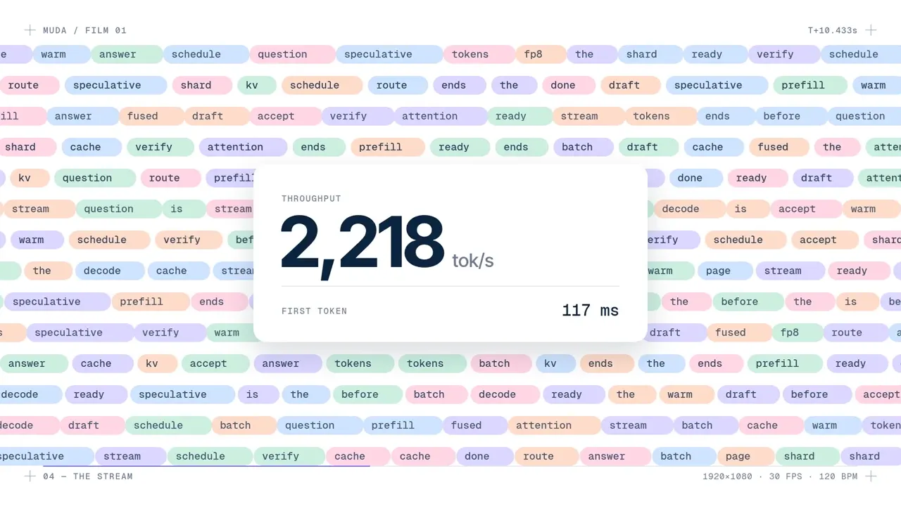</a><br>
<sub><a href="https://cdn.jsdelivr.net/gh/X-RayLuan/awesome-opus-5-5-video-prompts@main/assets/videos/deedydas-startup-launch-video-readme.mp4">▶ Play video</a> · <a href="https://x.com/deedydas/status/2102787937482252537">Original on X</a></sub>

_26-second kinetic-typography launch video for an inference startup: charts, logo and UI cards. Author reports ~1 minute and ~$2. It inspired LaunchVideo (diggerhq/shipvideo), an open-source URL→launch-video agent._

**Prompt** · verbatim from the [author’s post](https://x.com/deedydas/status/2102787937482252537)

```text
make a modern slick and punchy video for a modern startup that works on inference
```

[Original post](https://x.com/deedydas/status/2102787937482252537) · [Open-source clone: LaunchVideo](https://github.com/diggerhq/shipvideo) · [Remake with EasyVeo](https://easyveo.com?utm_source=github&utm_medium=referral&utm_campaign=awesome_opus55_video_prompts&utm_content=deedydas_startup_launch_video) · [Back to examples](#all-prompts)

---

### Black-Scholes explainer + endless-runner split screen
<a id="goodside-black-scholes-split-screen"></a>

[@goodside](https://x.com/goodside) · Riley Goodside · community demo · Claude Opus 5.5

<a href="https://cdn.jsdelivr.net/gh/X-RayLuan/awesome-opus-5-5-video-prompts@main/assets/videos/goodside-black-scholes-split-screen-readme.mp4">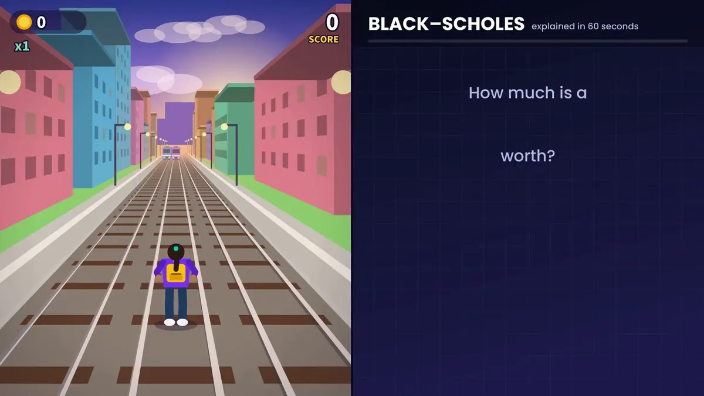</a><br>
<sub><a href="https://cdn.jsdelivr.net/gh/X-RayLuan/awesome-opus-5-5-video-prompts@main/assets/videos/goodside-black-scholes-split-screen-readme.mp4">▶ Play video</a> · <a href="https://x.com/goodside/status/2103171088637419631">Original on X</a></sub>

_One-minute split-screen: right half explains the Black-Scholes formula with voiceover and visuals, left half plays a generic endless-runner knockoff. Opus 5.5 at Extra effort._

**Prompt** · verbatim from the [author’s post](https://x.com/goodside/status/2103171088637419631)

```text
Create a 1 minute video where the right half explains the Black-Scholes formula with voiceover and visuals and the left half plays a generic knockoff of Subway Surfers
```

[Original post](https://x.com/goodside/status/2103171088637419631) · [Remake with EasyVeo](https://easyveo.com?utm_source=github&utm_medium=referral&utm_campaign=awesome_opus55_video_prompts&utm_content=goodside_black_scholes_split_screen) · [Back to examples](#all-prompts)

---

### Negroni recipe motion graphic from one image
<a id="rorfly-negroni-recipe-motion-graphic"></a>

[@Ror_Fly](https://x.com/Ror_Fly) · Rory Flynn · community demo · Claude Opus 5.5

<a href="https://cdn.jsdelivr.net/gh/X-RayLuan/awesome-opus-5-5-video-prompts@main/assets/videos/rorfly-negroni-recipe-motion-graphic-readme.mp4">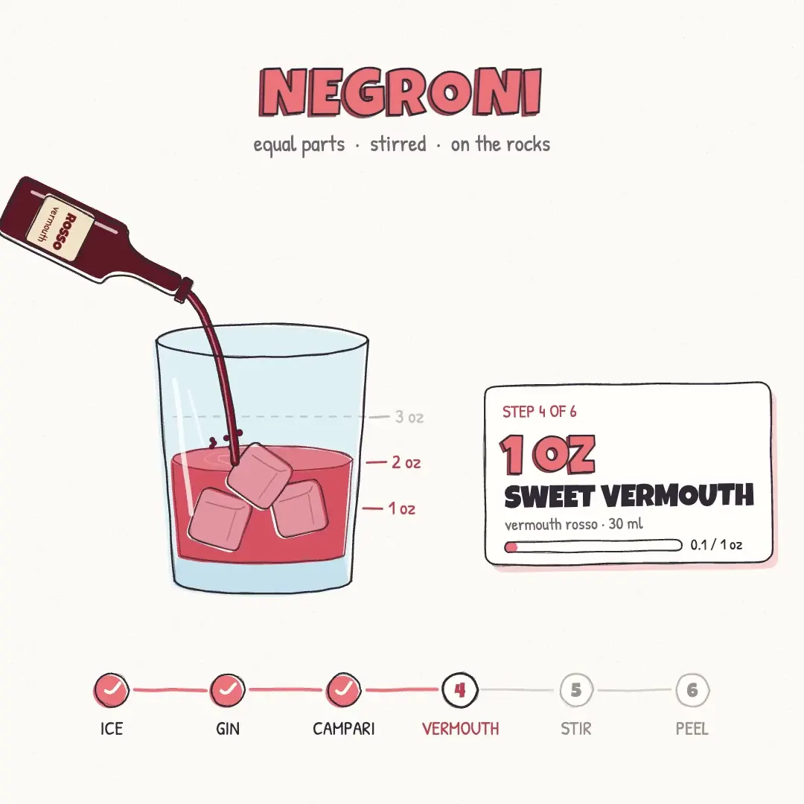</a><br>
<sub><a href="https://cdn.jsdelivr.net/gh/X-RayLuan/awesome-opus-5-5-video-prompts@main/assets/videos/rorfly-negroni-recipe-motion-graphic-readme.mp4">▶ Play video</a> · <a href="https://x.com/Ror_Fly/status/2102853258582880547">Original on X</a></sub>

_30-second square explainer showing ingredients and measurements pouring into the glass, rendered in HTML from one reference image, straight in Claude Code (medium effort, per author)._

**Prompt** · verbatim from the [author’s post](https://x.com/Ror_Fly/status/2102853258582880547)

```text
We're going to try a little test. Do you think you could render a recipe motion graphic animation using javascript or html (w/e you think will produce the best) to show the full recipe from start to finish (empty glass to completed cocktail) - Explainer video style - Showing the recipe ingreidents + measurements as they're going into the cup. Should be a 30s video.
```

[Original post](https://x.com/Ror_Fly/status/2102853258582880547) · [Remake with EasyVeo](https://easyveo.com?utm_source=github&utm_medium=referral&utm_campaign=awesome_opus55_video_prompts&utm_content=rorfly_negroni_recipe_motion_graphic) · [Back to examples](#all-prompts)

---

### Talking-head clip → line-art explainer B-roll
<a id="axtonliu-talking-head-to-line-art"></a>

[@AxtonLiu](https://x.com/AxtonLiu) · Axton · community demo · Claude Opus 5.5

<a href="https://cdn.jsdelivr.net/gh/X-RayLuan/awesome-opus-5-5-video-prompts@main/assets/videos/axtonliu-talking-head-to-line-art-readme.mp4"></a><br>
<sub><a href="https://cdn.jsdelivr.net/gh/X-RayLuan/awesome-opus-5-5-video-prompts@main/assets/videos/axtonliu-talking-head-to-line-art-readme.mp4">▶ Play video</a> · <a href="https://x.com/AxtonLiu/status/2102827887732932956">Original on X</a></sub>

_An 83-second vertical talking-head video turned into a line-art animated explainer: the speaker shrinks to a circular picture-in-picture, ~30 shots follow the subtitles, audio/captions/duration unchanged. Clean Claude Code, effort high, no skills or external assets; 28 min 53 s, zero human intervention (author). Prompt is in Chinese._

**Prompt** · verbatim from the [author’s post](https://x.com/AxtonLiu/status/2102827887732932956) · original in Chinese

```text
把 short-1.mp4 做成一条新的竖屏短片 short-1-v5.mp4：

1. 我的人像缩小成右下角的圆形画中画，能看清我在讲话，不遮字幕。
2. 主画面换成一段动画 B-roll，跟着我讲的内容走：我说到哪个概念，画面就画哪个概念。风格轻松有趣，线稿动画就可以，不要写实。
3. 原声、原字幕、时长都不变。
```

[Original post](https://x.com/AxtonLiu/status/2102827887732932956) · [Remake with EasyVeo](https://easyveo.com?utm_source=github&utm_medium=referral&utm_campaign=awesome_opus55_video_prompts&utm_content=axtonliu_talking_head_to_line_art) · [Back to examples](#all-prompts)

---

### How Browsers Work, Animated in JavaScript
<a id="addyosmani-how-browsers-work-animation"></a>

[@addyosmani](https://x.com/addyosmani) · Addy Osmani · community demo · Claude Opus 5.5

<a href="https://cdn.jsdelivr.net/gh/X-RayLuan/awesome-opus-5-5-video-prompts@main/assets/videos/addyosmani-how-browsers-work-animation-readme.mp4"></a><br>
<sub><a href="https://cdn.jsdelivr.net/gh/X-RayLuan/awesome-opus-5-5-video-prompts@main/assets/videos/addyosmani-how-browsers-work-animation-readme.mp4">▶ Play video</a> · <a href="https://x.com/addyosmani/status/2103009037164110327">Original on X</a></sub>

_A 40-second animation explaining how browsers work. The author says Claude Opus 5.5 drew each frame in JavaScript._

**Prompt** · _not shared by the author._

[Original post](https://x.com/addyosmani/status/2103009037164110327) · [Remake with EasyVeo](https://easyveo.com?utm_source=github&utm_medium=referral&utm_campaign=awesome_opus55_video_prompts&utm_content=addyosmani_how_browsers_work_animation) · [Back to examples](#all-prompts)

---

### Session Story Animates Claude Code History
<a id="jake11moran-session-story"></a>

[@jake11moran](https://x.com/jake11moran) · Jake Moran · community demo · Claude Opus 5.5

_Jake Moran created a skill for Opus 5.5 using HyperFrames. It reads local Claude Code history, identifies what an average session looks like, and animates it from start to finish with the user's messages._

**Prompt** · _not shared by the author._

[Original post](https://x.com/jake11moran/status/2103247490237825416) · [Code](https://github.com/heygen-com/hyperframes-community-skills/tree/master/skills/session-story) · [Remake with EasyVeo](https://easyveo.com?utm_source=github&utm_medium=referral&utm_campaign=awesome_opus55_video_prompts&utm_content=jake11moran_session_story) · [Back to examples](#all-prompts)

---

### 15-Second Motion Designer Showreel
<a id="ajith-io-motion-designer-showreel"></a>

[@ajith_io](https://x.com/ajith_io) · Ajith · community demo · Claude Opus 5.5

_A 15-second motion graphics showreel made with Claude Opus 5.5. The author shared the prompt used to make it._

**Prompt** · verbatim from the [author’s post](https://x.com/ajith_io/status/2103449416325890146)

```text
make a dynamic 15-second motion graphics video that shows what an incredible motion designer you are, like it's your showreel for a résumé. go all out.
```

[Original post](https://x.com/ajith_io/status/2103449416325890146) · [Remake with EasyVeo](https://easyveo.com?utm_source=github&utm_medium=referral&utm_campaign=awesome_opus55_video_prompts&utm_content=ajith_io_motion_designer_showreel) · [Back to examples](#all-prompts)

---

### Steve Jobs Life Story Animation
<a id="oozn-steve-jobs-life-animation"></a>

[@oozn](https://x.com/oozn) · onur ozcan · community demo · Claude Opus 5.5

_The author reports that Claude Opus 5.5 made a two-minute animation about Steve Jobs’s life from one prompt, built entirely in code with Remotion, React, and SVG. The author says it includes a jointed character rig, procedural walk cycle, custom transitions, and a soundtrack synthesized in Node._

**Prompt** · _not shared by the author._

[Original post](https://x.com/oozn/status/2103482545111232946) · [Remake with EasyVeo](https://easyveo.com?utm_source=github&utm_medium=referral&utm_campaign=awesome_opus55_video_prompts&utm_content=oozn_steve_jobs_life_animation) · [Back to examples](#all-prompts)

---

### Transformer Explainer Video
<a id="dotey-transformer-explainer-video"></a>

[@dotey](https://x.com/dotey) · 宝玉 · community demo · Claude Opus 5.5

_A video explaining Transformer to high school students, covering attention and some mathematical concepts. The author says it was made in one shot with Claude Code and Opus 5.5, using Remotion for the video, KaTeX for formulas, and Microsoft Edge TTS for narration._

**Prompt** · verbatim from the [author’s post](https://x.com/dotey/status/2103683057689522564) · original in Chinese

```text
帮我用js制作一个视频，主题是：什么是 Transformer
要深入浅出，让高中生也能看得懂，不仅high level说的清楚，也要有细节，包括注意力机制，甚至一些数学概念

你可以用任何工具或者安装工具，可以联网检索

请给我惊喜
```

[Original post](https://x.com/dotey/status/2103683057689522564) · [Remake with EasyVeo](https://easyveo.com?utm_source=github&utm_medium=referral&utm_campaign=awesome_opus55_video_prompts&utm_content=dotey_transformer_explainer_video) · [Back to examples](#all-prompts)

---

### Derivative Lesson Video Made with Manim
<a id="linearuncle-derivative-lesson-manim"></a>

[@LinearUncle](https://x.com/LinearUncle) · LinearUncle · community demo · Claude Opus 5.5

<a href="https://cdn.jsdelivr.net/gh/X-RayLuan/awesome-opus-5-5-video-prompts@main/assets/videos/linearuncle-derivative-lesson-manim-readme.mp4"></a><br>
<sub><a href="https://cdn.jsdelivr.net/gh/X-RayLuan/awesome-opus-5-5-video-prompts@main/assets/videos/linearuncle-derivative-lesson-manim-readme.mp4">▶ Play video</a> (first 170 s of 457 s) · <a href="https://x.com/LinearUncle/status/2103128559174971663">Original on X</a></sub>

_The author made a video teaching derivatives with Claude Opus 5.5 and Manim._

**Prompt** · verbatim from the [author’s post](https://x.com/LinearUncle/status/2103128559174971663) · original in Chinese

```text
请用Manim给我制作一个导数概念学习的视频，要求通俗易懂，并且有例子，引人思考。配音使用edge-tts
```

[Original post](https://x.com/LinearUncle/status/2103128559174971663) · [Remake with EasyVeo](https://easyveo.com?utm_source=github&utm_medium=referral&utm_campaign=awesome_opus55_video_prompts&utm_content=linearuncle_derivative_lesson_manim) · [Back to examples](#all-prompts)

---

### JavaScript-Drawn Ad Made in Claude Code
<a id="lucas-ia-javascript-drawn-ad"></a>

[@Lucas_IA_](https://x.com/Lucas_IA_) · Lucas | Ecom IA · community demo · Claude Opus 5.5

_The author shows an ad made in Claude Code using a custom skill: Claude writes JavaScript to draw the scenes, ElevenLabs provides the voiceover, Whisper supplies word-level timing, and HyperFrames renders the video to MP4. The author says Claude reviews capture boards and corrects the visuals during production._

**Prompt** · _not shared by the author._

[Original post](https://x.com/Lucas_IA_/status/2103152093733253544) · [Remake with EasyVeo](https://easyveo.com?utm_source=github&utm_medium=referral&utm_campaign=awesome_opus55_video_prompts&utm_content=lucas_ia_javascript_drawn_ad) · [Back to examples](#all-prompts)

---

### IKEA Manual as a Narrated 3D Assembly Video
<a id="deedydas-ikea-manual-3d-assembly-video"></a>

[@deedydas](https://x.com/deedydas) · Deedy · community demo · Claude Opus 5.5

_Deedy shows an IKEA assembly manual translated into a narrated 3D instructional video with Opus 5.5. The author says the video was made via code._

**Prompt** · verbatim from the [author’s post](https://x.com/deedydas/status/2103174501345493197)

```text
Translate this IKEA assembly manual into a 3D narrated instructional video
```

[Original post](https://x.com/deedydas/status/2103174501345493197) · [Remake with EasyVeo](https://easyveo.com?utm_source=github&utm_medium=referral&utm_campaign=awesome_opus55_video_prompts&utm_content=deedydas_ikea_manual_3d_assembly_video) · [Back to examples](#all-prompts)

---

### NotchBrowser Teaser Made with HyperFrames
<a id="jake11moran-notchbrowser-teaser"></a>

[@jake11moran](https://x.com/jake11moran) · Jake Moran · community demo · Claude Opus 5.5

_Jake Moran made a NotchBrowser product teaser with HyperFrames and Opus 5.5, using one prompt dictated via Whispr. The teaser moves across a Mac desktop, then shows the browser panel opening from the notch._

**Prompt** · verbatim from the [author’s post](https://x.com/jake11moran/status/2103239225902874874)

```text
Using HyperFrames, make a hype teaser for the product in this post - [link]. Landscape, around 27 seconds. Match the product UI, wallpaper and copy from the post's video 

Motion should feel slow and polished - one continuous camera over one Mac desktop, no hard cuts. Camera pushes, pulls and pans run like 1.5 to 3 seconds on gentle ease-in-out curves, nothing snappy - aim for half the speed you'd default to. Add motion blur on fast moves and a light film grain finish. Use an oversized macOS cursor. No audio. All on-screen copy lowercase like the post.

1. Open on a big centered line - "in the AI era, the hard part is" - entering word by word from the right with an orange colorama text wipe over it (the `colorama-wipe` registry component). Hold it about a second, then scale it down into place above a spinning list.
2. The list rotates through 30 hard things about working in the AI era - spending tokens wisely, picking the right model, managing context windows, etc - each with a real app icon. Go fast, it's not meant to be read, then land slowly on "managing your desktop". 0.2s after it lands a question mark pops on after it.
3. Pull the camera back to reveal the Mac desktop as windows pile in on top of each other, arriving from behind the camera - Claude, ChatGPT, Grok, Linear, Chrome, Spotify, Slack and Claude Code in a terminal. Build these as accurate recreations of the real apps with real icons. 
4. Push back in so the windows fly past the camera, back to text - "don't make your browser / one of them".
5. Pan up to a really tight framing of just the notch and the top of the wallpaper. A cursor comes up and hovers - the notch morphs into a pill with the name "NotchBrowser", then opens into the browser panel exactly like in the video. 
6. Click through the tabs like the video does, then click the collapse chevron so the panel retracts into the notch.
7. End on a checklist of the post's claims with rings and ticks drawing on
```

[Original post](https://x.com/jake11moran/status/2103237884564414633) · [Remake with EasyVeo](https://easyveo.com?utm_source=github&utm_medium=referral&utm_campaign=awesome_opus55_video_prompts&utm_content=jake11moran_notchbrowser_teaser) · [Back to examples](#all-prompts)

---

### Explorable Museum of AI History
<a id="ryansael-explorable-ai-history-museum"></a>

[@RyanSael](https://x.com/RyanSael) · Ryan Sael · community demo · Claude Opus 5.5

_An explorable museum of nine years of AI history built with Opus 5.5. The author reports that the initial build took 1 hour 30 minutes in one shot, followed by a few rounds of fixes._

**Prompt** · _not shared by the author._

[Original post](https://x.com/RyanSael/status/2103021886045348073) · [Remake with EasyVeo](https://easyveo.com?utm_source=github&utm_medium=referral&utm_campaign=awesome_opus55_video_prompts&utm_content=ryansael_explorable_ai_history_museum) · [Back to examples](#all-prompts)

---

### Code-Generated Video with Opus 5.5
<a id="dhruvalgolakiya-code-generated-video"></a>

[@dhruvalgolakiya](https://x.com/dhruvalgolakiya) · Dhruval · community demo · Claude Opus 5.5

_A start-to-finish video made with Opus 5.5. The author says it uses JavaScript, HTML, and FFmpeg, with ElevenLabs for audio, and that they have not made manual edits yet._

**Prompt** · _not shared by the author._

[Original post](https://x.com/dhruvalgolakiya/status/2103037586663235713) · [Remake with EasyVeo](https://easyveo.com?utm_source=github&utm_medium=referral&utm_campaign=awesome_opus55_video_prompts&utm_content=dhruvalgolakiya_code_generated_video) · [Back to examples](#all-prompts)

---

### Animated GitHub Version Control Explainer
<a id="sundyme-github-version-control-explainer"></a>

[@sundyme](https://x.com/sundyme) · sundyme · community demo · Claude Opus 5.5

<a href="https://cdn.jsdelivr.net/gh/X-RayLuan/awesome-opus-5-5-video-prompts@main/assets/videos/sundyme-github-version-control-explainer-readme.mp4">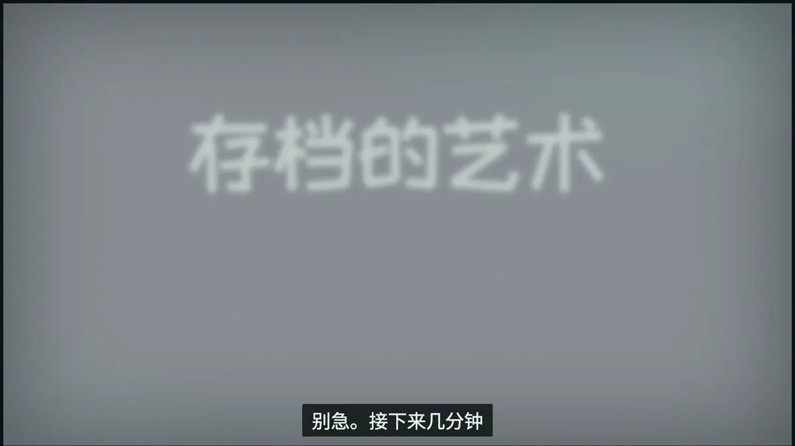</a><br>
<sub><a href="https://cdn.jsdelivr.net/gh/X-RayLuan/awesome-opus-5-5-video-prompts@main/assets/videos/sundyme-github-version-control-explainer-readme.mp4">▶ Play video</a> (first 170 s of 225 s) · <a href="https://x.com/sundyme/status/2102751132502446549">Original on X</a></sub>

_The author used Claude Opus 5.5 in Claude Code to create a chaptered web animation explaining GitHub version control, with subtitles and narration. The author says a third-party voice API enabled export as a 1080p video ready for YouTube._

**Prompt** · verbatim from the [author’s post](https://x.com/sundyme/status/2102751132502446549) · original in Chinese

```text
我是非专业编码者，在用 Claude Code 做网站，请做个动画视频，讲解 GitHub 版本管理及如何使用
```

[Original post](https://x.com/sundyme/status/2102751132502446549) · [Remake with EasyVeo](https://easyveo.com?utm_source=github&utm_medium=referral&utm_campaign=awesome_opus55_video_prompts&utm_content=sundyme_github_version_control_explainer) · [Back to examples](#all-prompts)

---

### How an LLM Context Window Works
<a id="joaoli13-llm-context-window-animation"></a>

[@joaoli13](https://x.com/joaoli13) · João Lima · community demo · Claude Opus 5.5

_An animation explaining how user questions and generated answers fill an LLM’s input and output context windows. The author says they asked Opus 5.5 to make it in JavaScript, then asked for an MP4 download._

**Prompt** · verbatim from the [author’s post](https://x.com/joaoli13/status/2102805381542220038)

```text
Faça uma animação javascript de como um LLM vai compondo na janela de contexto as perguntas do usuário e as respostas geradas. É importante diferenciar a janela de contexto de entrada da de saída, que normalmente possuem tamanhos diferentes, e deve-se mostrar também que a resposta que foi gerada na janela de contexto de saída é transferida e concatenada ào contexto  da janela de entrada. Deve ser claro e didático e pode ter labels em português
```

[Original post](https://x.com/joaoli13/status/2102805376466891137) · [Remake with EasyVeo](https://easyveo.com?utm_source=github&utm_medium=referral&utm_campaign=awesome_opus55_video_prompts&utm_content=joaoli13_llm_context_window_animation) · [Back to examples](#all-prompts)

---

### Password vs. Passkey Explainer Video
<a id="tz-2022-password-passkey-explainer"></a>

[@Tz_2022](https://x.com/Tz_2022) · Tz · community demo · Claude Opus 5.5

_The author asked Claude Opus 5.5 for an interactive animated explanation of passwords and passkeys, including their history, made into a beginner-friendly video. The author reports receiving a finished video with narration and subtitles, plus a cover image._

**Prompt** · verbatim from the [author’s post](https://x.com/Tz_2022/status/2102838830285898214) · original in Chinese

```text
给我一个可互动交互动画页面，讲解清楚 password 和 passkey 到底有什么区别，也包括它们的历史沿革，把它制作成一个小白也能看懂的讲解视频
```

[Original post](https://x.com/Tz_2022/status/2102838830285898214) · [Remake with EasyVeo](https://easyveo.com?utm_source=github&utm_medium=referral&utm_campaign=awesome_opus55_video_prompts&utm_content=tz_2022_password_passkey_explainer) · [Back to examples](#all-prompts)

---

## 🧊 Blender & 3D renders

_Opus drives Blender (Python / Blender MCP) or real-time 3D to build scenes procedurally and render camera moves._

### Market Street, San Francisco, 1906 (Blender)
<a id="alexalbert-market-street-1906"></a>

[@alexalbert__](https://x.com/alexalbert__) · Alex Albert · community demo · Claude Opus 5.5

<a href="https://cdn.jsdelivr.net/gh/X-RayLuan/awesome-opus-5-5-video-prompts@main/assets/videos/alexalbert-market-street-1906-readme.mp4"></a><br>
<sub><a href="https://cdn.jsdelivr.net/gh/X-RayLuan/awesome-opus-5-5-video-prompts@main/assets/videos/alexalbert-market-street-1906-readme.mp4">▶ Play video</a> · <a href="https://x.com/alexalbert__/status/2102466523164274839">Original on X</a></sub>

_Historically sourced reconstruction of Market Street the day before the 1906 earthquake, built entirely in Blender Python with reusable generators and no downloaded meshes/textures/HDRIs, ending in a 10-second fly-up-the-street video. Alex Albert works at Anthropic._

**Prompt** · verbatim from the [author’s post](https://x.com/alexalbert__/status/2102466524934271381)

```text
Recreate Market Street, San Francisco as it stood on April 17, 1906, the afternoon before the earthquake, in Blender.

Scope: the Ferry Building up Market to Fifth Street, including the Palace Hotel, the Call Building, the Chronicle Building, Lotta's Fountain and the Emporium.

Before modeling anything, build a source file from: the 1899-1905 Sanborn fire insurance maps (footprints, heights, materials, occupants), the Miles Brothers film "A Trip Down Market Street" (April 1906), period photographs from OpenSFHistory, the Library of Congress and the David Rumsey collection, and USGS topography. Record every building with footprint, height, facade material, occupant, and the source for each fact with a confidence level.

Build everything in Blender Python. No downloaded meshes, textures or HDRIs. Write reusable generators (Victorian commercial facade, mansard roof, bay windows, awnings, painted signage, gas and electric street lamps, cable car, horse-drawn wagon, early automobile) and assemble the street from the source file, so every building traces back to data.

Provide a 10 second video up the street.
```

[Original post](https://x.com/alexalbert__/status/2102466523164274839) · [Remake with EasyVeo](https://easyveo.com?utm_source=github&utm_medium=referral&utm_campaign=awesome_opus55_video_prompts&utm_content=alexalbert_market_street_1906) · [Back to examples](#all-prompts)

---

### One-prompt Blender claymation in claude.ai
<a id="alexalbert-blender-claymation"></a>

[@alexalbert__](https://x.com/alexalbert__) · Alex Albert · community demo · Claude Opus 5.5

<a href="https://cdn.jsdelivr.net/gh/X-RayLuan/awesome-opus-5-5-video-prompts@main/assets/videos/alexalbert-blender-claymation-readme.mp4">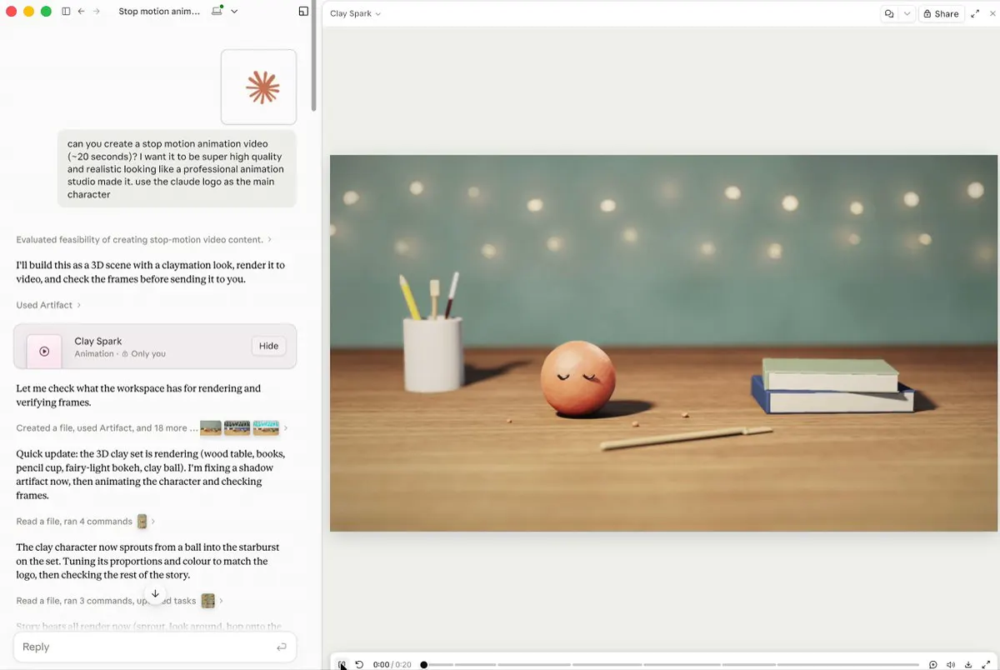</a><br>
<sub><a href="https://cdn.jsdelivr.net/gh/X-RayLuan/awesome-opus-5-5-video-prompts@main/assets/videos/alexalbert-blender-claymation-readme.mp4">▶ Play video</a> · <a href="https://x.com/alexalbert__/status/2102458348511879448">Original on X</a></sub>

_Screen recording of claude.ai driving Blender to produce a claymation-style character animation from a single prompt, using the new merged Claude (chat + Cowork) experience._

**Prompt** · _not shared by the author._

[Original post](https://x.com/alexalbert__/status/2102458348511879448) · [Remake with EasyVeo](https://easyveo.com?utm_source=github&utm_medium=referral&utm_campaign=awesome_opus55_video_prompts&utm_content=alexalbert_blender_claymation) · [Back to examples](#all-prompts)

---

### Procedural castle + lake + fireworks (Opus 5.5 vs GPT-6 Astra)
<a id="stefan3dai-castle-fireworks-blender"></a>

[@Stefan_3D_AI](https://x.com/Stefan_3D_AI) · Stefan 3D AI · community demo · Claude Opus 5.5

<a href="https://cdn.jsdelivr.net/gh/X-RayLuan/awesome-opus-5-5-video-prompts@main/assets/videos/stefan3dai-castle-fireworks-blender-readme.mp4">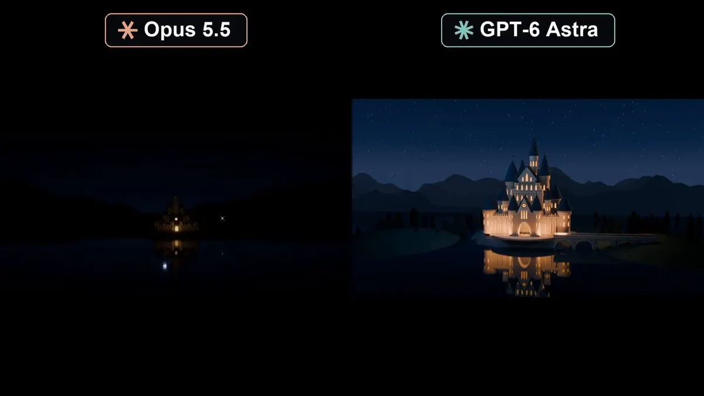</a><br>
<sub><a href="https://cdn.jsdelivr.net/gh/X-RayLuan/awesome-opus-5-5-video-prompts@main/assets/videos/stefan3dai-castle-fireworks-blender-readme.mp4">▶ Play video</a> · <a href="https://x.com/Stefan_3D_AI/status/2102471841046786153">Original on X</a></sub>

_Same one-prompt, Blender-only, all-procedural brief given to both models: render a 10-second shot and record a build timelapse. Opus 5.5: 35 min, 199.6k output tokens, ~$13.3; GPT-6 Astra: 28 min, 56.6k tokens, ~$14.5 (author). Driven through the official Blender MCP._

**Prompt** · _not shared by the author._ Constraints stated in the post: one prompt, Blender only, all procedural, render the 10-second shot, record a build timelapse.

[Original post](https://x.com/Stefan_3D_AI/status/2102471841046786153) · [Remake with EasyVeo](https://easyveo.com?utm_source=github&utm_medium=referral&utm_campaign=awesome_opus55_video_prompts&utm_content=stefan3dai_castle_fireworks_blender) · [Back to examples](#all-prompts)

---

### Battle of Dan-no-ura, TV-special-style 3D
<a id="tetumemo-dannoura-battle-3d"></a>

[@tetumemo](https://x.com/tetumemo) · テツメモ · community demo · Claude Opus 5.5

<a href="https://cdn.jsdelivr.net/gh/X-RayLuan/awesome-opus-5-5-video-prompts@main/assets/videos/tetumemo-dannoura-battle-3d-readme.mp4">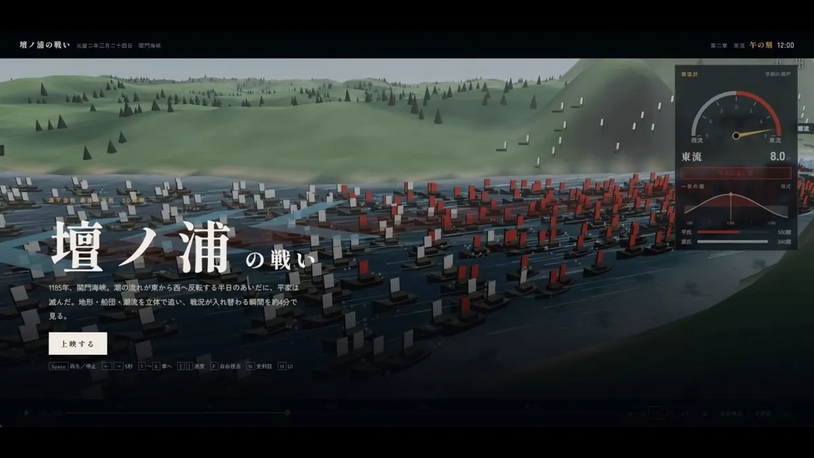</a><br>
<sub><a href="https://cdn.jsdelivr.net/gh/X-RayLuan/awesome-opus-5-5-video-prompts@main/assets/videos/tetumemo-dannoura-battle-3d-readme.mp4">▶ Play video</a> · <a href="https://x.com/tetumemo/status/2102652072252584046">Original on X</a></sub>

_~74-second 3D overhead visualization of the 1185 naval battle: terrain, fleets, advance arrows, sea fog, Kanmon Strait tidal currents and the tide reversal, with low sea-skimming and orbiting cameras. Prompt is in Japanese._

**Prompt** · verbatim from the [author’s post](https://x.com/tetumemo/status/2102652076702716273) · original in Japanese

```text
壇ノ浦の戦いをテレビ特番級3D俯瞰デモ化。
地形・軍勢・進軍矢印・霧・カメラ移動を滑らかに演出。
さらに、関門海峡の潮流、源氏と平氏の船団配置、潮の反転による戦況変化を立体的に可視化する。
海面すれすれの低空カメラ、船団を追う旋回カメラ、水しぶきや海霧を加え、戦況の変化が直感的に伝わる映像にする。
```

[Original post](https://x.com/tetumemo/status/2102652072252584046) · [Remake with EasyVeo](https://easyveo.com?utm_source=github&utm_medium=referral&utm_campaign=awesome_opus55_video_prompts&utm_content=tetumemo_dannoura_battle_3d) · [Back to examples](#all-prompts)

---

### Apollo 8 “Earthrise” moment recreated
<a id="claudeai-apollo8-earthrise"></a>

[@claudeai](https://x.com/claudeai) · Claude (official) · official demo · Claude Opus 5.5

<a href="https://cdn.jsdelivr.net/gh/X-RayLuan/awesome-opus-5-5-video-prompts@main/assets/videos/claudeai-apollo8-earthrise-readme.mp4">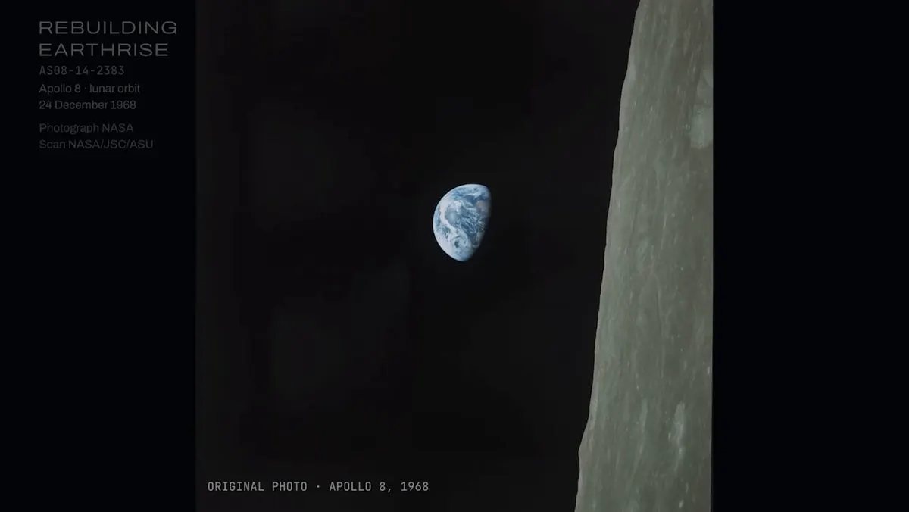</a><br>
<sub><a href="https://cdn.jsdelivr.net/gh/X-RayLuan/awesome-opus-5-5-video-prompts@main/assets/videos/claudeai-apollo8-earthrise-readme.mp4">▶ Play video</a> · <a href="https://x.com/claudeai/status/2102471870692180179">Original on X</a></sub>

_Official launch-thread demo: a 52-second recreation of the moment Apollo 8’s Earthrise photograph was taken, built from image cues and public data._

**Prompt** · _not shared by the author._

[Original post](https://x.com/claudeai/status/2102471870692180179) · [Remake with EasyVeo](https://easyveo.com?utm_source=github&utm_medium=referral&utm_campaign=awesome_opus55_video_prompts&utm_content=claudeai_apollo8_earthrise) · [Back to examples](#all-prompts)

---

### Code-Generated Stream in Three.js
<a id="hayashimon1-threejs-clear-stream"></a>

[@hayashimon1](https://x.com/hayashimon1) · ハヤシモン｜AI × 個人開発 · community demo · Claude Opus 5.5

<a href="https://cdn.jsdelivr.net/gh/X-RayLuan/awesome-opus-5-5-video-prompts@main/assets/videos/hayashimon1-threejs-clear-stream-readme.mp4">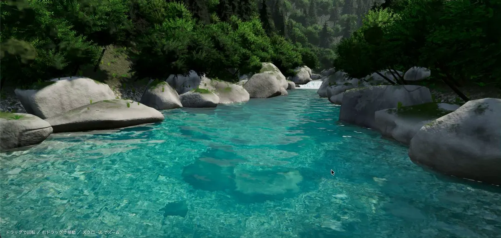</a><br>
<sub><a href="https://cdn.jsdelivr.net/gh/X-RayLuan/awesome-opus-5-5-video-prompts@main/assets/videos/hayashimon1-threejs-clear-stream-readme.mp4">▶ Play video</a> · <a href="https://x.com/hayashimon1/status/2102576886182453454">Original on X</a></sub>

_A clear-stream demo made with Opus 5.5 and Three.js. The author says the transparent water, light on the riverbed, and mossy rocks were all created in code, without manual modeling._

**Prompt** · _not shared by the author._

[Original post](https://x.com/hayashimon1/status/2102576886182453454) · [Remake with EasyVeo](https://easyveo.com?utm_source=github&utm_medium=referral&utm_campaign=awesome_opus55_video_prompts&utm_content=hayashimon1_threejs_clear_stream) · [Back to examples](#all-prompts)

---

### Code-Generated LHC Proton Collision in Blender
<a id="superalesha-lhc-proton-collision"></a>

[@superalesha](https://x.com/superalesha) · Alexey Fateev · community demo · Claude Opus 5.5

<a href="https://cdn.jsdelivr.net/gh/X-RayLuan/awesome-opus-5-5-video-prompts@main/assets/videos/superalesha-lhc-proton-collision-readme.mp4"></a><br>
<sub><a href="https://cdn.jsdelivr.net/gh/X-RayLuan/awesome-opus-5-5-video-prompts@main/assets/videos/superalesha-lhc-proton-collision-readme.mp4">▶ Play video</a> · <a href="https://x.com/superalesha/status/2102779758408774104">Original on X</a></sub>

_A Blender scene moves from the Large Hadron Collider’s magnet tunnel to a proton collision inside the detector. The author says Claude Opus 5.5 generated the geometry, materials, camera, and sound through code with no pre-made assets, calculated particle tracks using the detector’s real magnetic field, and used Blender MCP._

**Prompt** · _not shared by the author._

[Original post](https://x.com/superalesha/status/2102779758408774104) · [Remake with EasyVeo](https://easyveo.com?utm_source=github&utm_medium=referral&utm_campaign=awesome_opus55_video_prompts&utm_content=superalesha_lhc_proton_collision) · [Back to examples](#all-prompts)

---

### One-Shot 90s-Style Demoscene Demo
<a id="gandamu-90s-demoscene-demo"></a>

[@gandamu_ml](https://x.com/gandamu_ml) · gandamu · community demo · Claude Opus 5.5

<a href="https://cdn.jsdelivr.net/gh/X-RayLuan/awesome-opus-5-5-video-prompts@main/assets/videos/gandamu-90s-demoscene-demo-readme.mp4">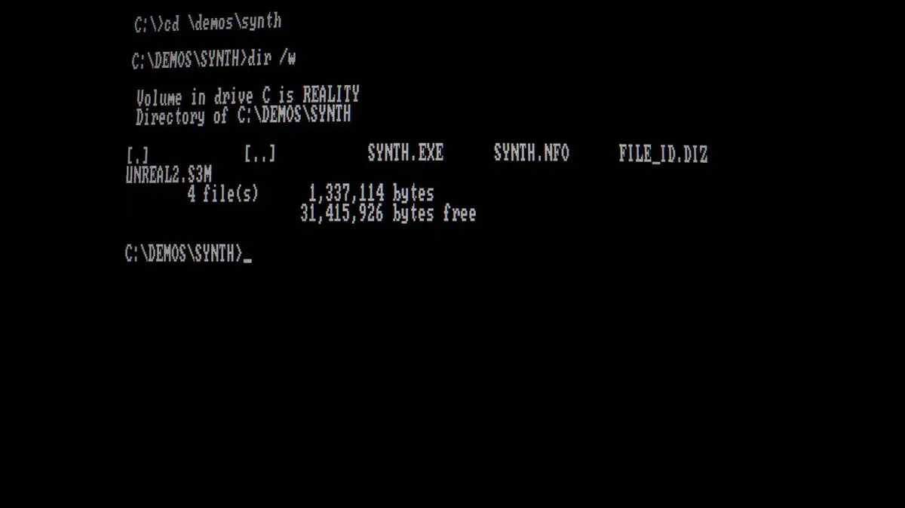</a><br>
<sub><a href="https://cdn.jsdelivr.net/gh/X-RayLuan/awesome-opus-5-5-video-prompts@main/assets/videos/gandamu-90s-demoscene-demo-readme.mp4">▶ Play video</a> (first 170 s of 382 s) · <a href="https://x.com/gandamu_ml/status/2102919394775220530">Original on X</a></sub>

_The author reports that Opus 5.5 made this 90s-style demoscene demo from a single prompt, using C/C++ and OpenGL. The author supplied Purple Motion’s music from Second Reality._

**Prompt** · _not shared by the author._

[Original post](https://x.com/gandamu_ml/status/2102919394775220530) · [Remake with EasyVeo](https://easyveo.com?utm_source=github&utm_medium=referral&utm_campaign=awesome_opus55_video_prompts&utm_content=gandamu_90s_demoscene_demo) · [Back to examples](#all-prompts)

---

### Claude Code Session Turned into a Video
<a id="shneural-claude-code-session-video"></a>

[@shneural](https://x.com/shneural) · kirill sh · community demo · Claude Opus 5.5

_The author says Opus 5.5 turned a Claude Code session into a video, writing its own Python engine, creating a 3D shot in Blender, making music, and rendering 900 frames. The author reports it took 1 hour 32 minutes and cost $81 at API prices._

**Prompt** · _not shared by the author._

[Original post](https://x.com/shneural/status/2103472385563459833) · [Remake with EasyVeo](https://easyveo.com?utm_source=github&utm_medium=referral&utm_campaign=awesome_opus55_video_prompts&utm_content=shneural_claude_code_session_video) · [Back to examples](#all-prompts)

---

### Code-Sculpted Japanese Ship in Three.js
<a id="mengto-code-sculpted-japanese-ship"></a>

[@MengTo](https://x.com/MengTo) · Meng To · community demo · Claude Opus 5.5

<a href="https://cdn.jsdelivr.net/gh/X-RayLuan/awesome-opus-5-5-video-prompts@main/assets/videos/mengto-code-sculpted-japanese-ship-readme.mp4">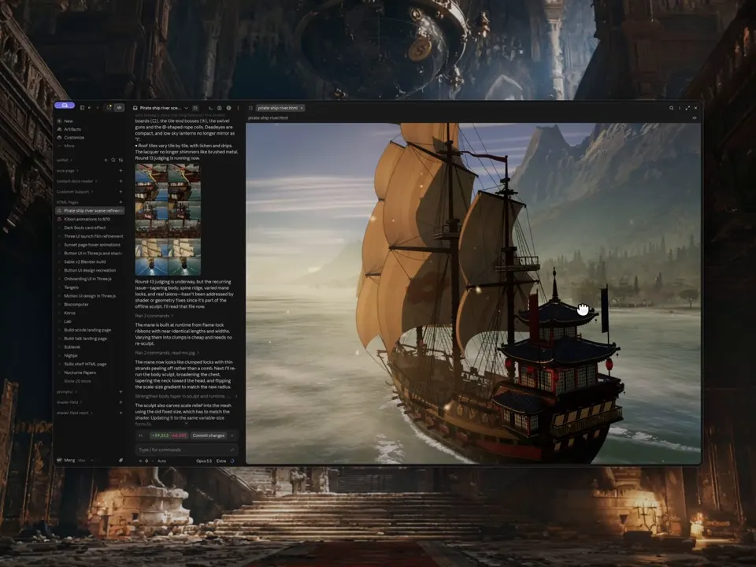</a><br>
<sub><a href="https://cdn.jsdelivr.net/gh/X-RayLuan/awesome-opus-5-5-video-prompts@main/assets/videos/mengto-code-sculpted-japanese-ship-readme.mp4">▶ Play video</a> · <a href="https://x.com/MengTo/status/2103122947133309311">Original on X</a></sub>

_Opus 5.5 sculpted the ship, dragon, sails, and architecture in code; the author says the scene was made entirely in Three.js without a library. To steer the work, the author asked Opus to score parts of the scene and keep improving each until it reached at least 8 out of 10, subject to their time and token budget._

**Prompt** · _not shared by the author._

[Original post](https://x.com/MengTo/status/2103122947133309311) · [Remake with EasyVeo](https://easyveo.com?utm_source=github&utm_medium=referral&utm_campaign=awesome_opus55_video_prompts&utm_content=mengto_code_sculpted_japanese_ship) · [Back to examples](#all-prompts)

---

### Playable 1990s Record Store Replica
<a id="illscience-playable-1990s-record-store"></a>

[@illscience](https://x.com/illscience) · Anish Acharya · community demo · Claude Opus 5.5

<a href="https://cdn.jsdelivr.net/gh/X-RayLuan/awesome-opus-5-5-video-prompts@main/assets/videos/illscience-playable-1990s-record-store-readme.mp4">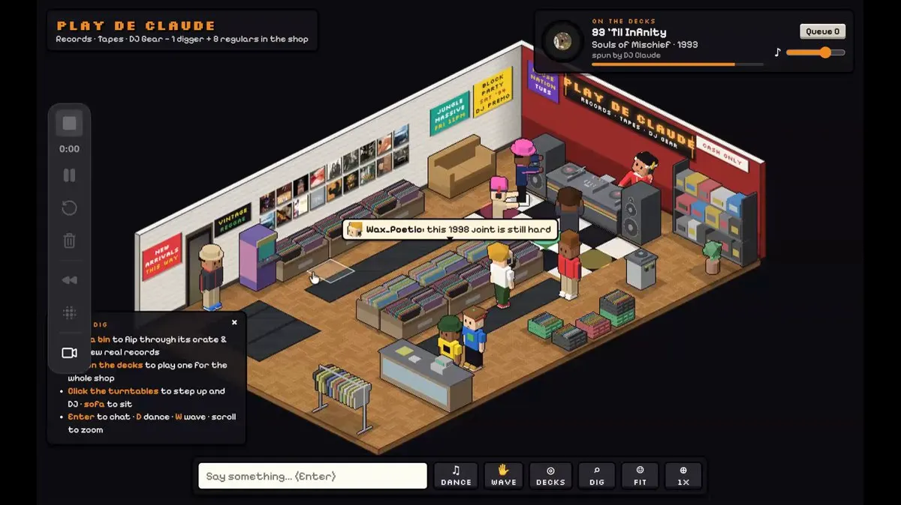</a><br>
<sub><a href="https://cdn.jsdelivr.net/gh/X-RayLuan/awesome-opus-5-5-video-prompts@main/assets/videos/illscience-playable-1990s-record-store-readme.mp4">▶ Play video</a> · <a href="https://x.com/illscience/status/2102913284190220421">Original on X</a></sub>

_The author says they one-shotted a playable replica of the 1990s record store Play De Record with Opus 5.5, and highlights the model’s use of Blender. In a reply, they say the music appears to use Apple previews._

**Prompt** · verbatim from the [author’s post](https://x.com/illscience/status/2102913284190220421)

```text
I want you to create a Habbo Hotel isometric game where you wander around a record shop inspired by Play De Record in Toronto or Gramophone. You can look through stacks of records, which are real songs. You can preview them, and when you're not, there's a turntable at the back where people are playing tracks that everyone who's in the room can listen to. I want to match the visual style of Habbo Hotel with the layout of these record stores in the 1990s, and obviously have everybody look like they're kind of DJ-inspired and from the 1990s potentially. We've done a bunch of work on Blender and things like that in the past, so feel free to look past our old threads to look at how we did the Contra game and see if that helps you at all, and feel free to use anything you need that's remote, like GPU rendering to make this faster.
```

[Original post](https://x.com/illscience/status/2102913284190220421) · [Remake with EasyVeo](https://easyveo.com?utm_source=github&utm_medium=referral&utm_campaign=awesome_opus55_video_prompts&utm_content=illscience_playable_1990s_record_store) · [Back to examples](#all-prompts)

---

### A 3D Road That Turns into Sheet Music
<a id="chetanankola-3d-road-sheet-music"></a>

[@chetanankola](https://x.com/chetanankola) · Chetan Ankola · community demo · Claude Opus 5.5

<a href="https://cdn.jsdelivr.net/gh/X-RayLuan/awesome-opus-5-5-video-prompts@main/assets/videos/chetanankola-3d-road-sheet-music-readme.mp4">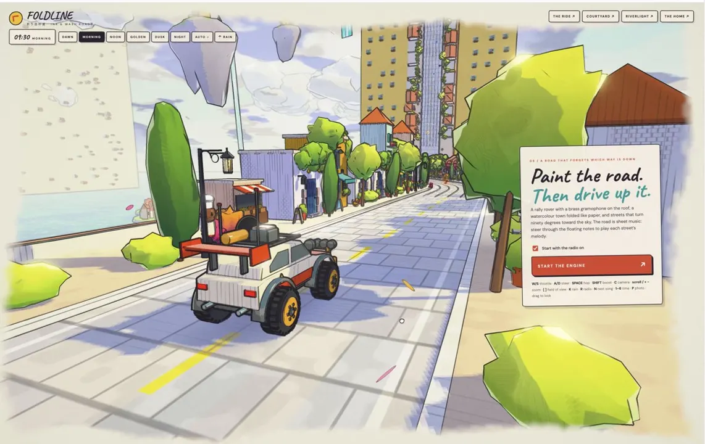</a><br>
<sub><a href="https://cdn.jsdelivr.net/gh/X-RayLuan/awesome-opus-5-5-video-prompts@main/assets/videos/chetanankola-3d-road-sheet-music-readme.mp4">▶ Play video</a> · <a href="https://x.com/chetanankola/status/2103001194696458512">Original on X</a></sub>

_The author made a Three.js 3D experience with Opus 5.5 in which a road climbs a wall, crosses a ceiling upside down, then becomes sheet music; steering through the notes plays each street’s melody. The author says the idea and reference images were theirs, Opus executed the design direction, and no existing 3D assets were used._

**Prompt** · _not shared by the author._

[Original post](https://x.com/chetanankola/status/2103001194696458512) · [Remake with EasyVeo](https://easyveo.com?utm_source=github&utm_medium=referral&utm_campaign=awesome_opus55_video_prompts&utm_content=chetanankola_3d_road_sheet_music) · [Back to examples](#all-prompts)

---

### Playable Boat Journey Through a Japanese Valley
<a id="mengto-japanese-valley-boat-journey"></a>

[@MengTo](https://x.com/MengTo) · Meng To · community demo · Claude Opus 5.5

<a href="https://cdn.jsdelivr.net/gh/X-RayLuan/awesome-opus-5-5-video-prompts@main/assets/videos/mengto-japanese-valley-boat-journey-readme.mp4">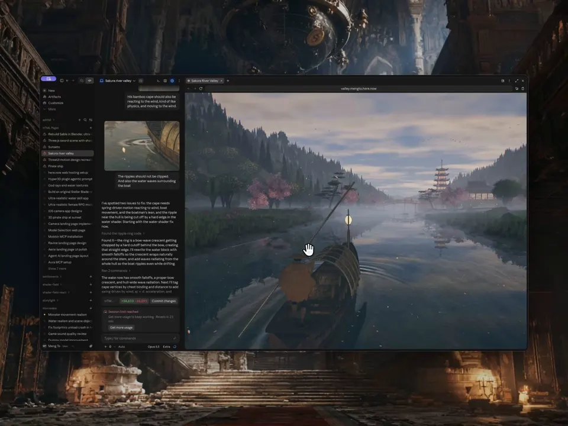</a><br>
<sub><a href="https://cdn.jsdelivr.net/gh/X-RayLuan/awesome-opus-5-5-video-prompts@main/assets/videos/mengto-japanese-valley-boat-journey-readme.mp4">▶ Play video</a> · <a href="https://x.com/MengTo/status/2102760783344189761">Original on X</a></sub>

_A playable three.js boat scene travels through Japanese landscapes with changing weather and day–night lighting. The author says Opus 5 generated the scene except for the characters, which used Higgsfield._

**Prompt** · verbatim from the [author’s post](https://x.com/MengTo/status/2103155074705019158)

```text
Create from scratch a fully interactive 3D scene of a traditional wooden riverboat being poled upstream through a mountain river valley in feudal Japan during cherry-blossom season. The visual style should be cinematic and painterly rather than photorealistic, while still being exceptionally rich, detailed, polished, and visually sophisticated.

Build the valley terrain, river, riverbanks, rocks, cherry trees, maples, pines, forest, ground cover, temple architecture, boat, boatman, villagers, sky, clouds, distant mountains, lighting, materials, water, reflections, petals, mist, particles, wildlife, weather, a full day-and-night cycle, sound, animation, camera work, composition, atmospheric depth, and color grading. The final result should feel like a premium, high-production 3D artwork, not a prototype, technical demo, or low-quality scene.

Start from a completely blank page. Do not reuse or depend on any previous project or scene. You may create the assets yourself or use reliable, trusted, open-source assets and libraries when necessary.

Mandatory requirements:

No text of any kind may appear anywhere inside the scene, including the loading screen. No titles, names, logos, descriptions, credits, labels, or control instructions in any language. Any loading indicator must be purely graphic.

Deliver the entire project as one final standalone page file that can be opened directly in a web browser, with assets embedded inside it as much as reasonably possible and no runtime requests to external CDNs.

The valley must feel like one continuous, believable place. A winding river flows down a long valley that narrows into a gorge upstream. It has a deep channel and shallow pebbled margins. Its banks vary between gravel bars and steeper earthen banks. Forested valley walls rise into rounded mountains, and far ranges fade layer by layer into haze.

Build these landmarks along the river:
- An arched vermilion wooden bridge on piers that stand in the water.
- A torii gate at the bridge's end.
- A path to stone steps and a temple terrace held up by dry-stone retaining walls.
- A main hall with a curved tile hip-and-gable roof, upturned corners, bracket sets, a railed veranda, and lattice doors.
- A five-storey pagoda with a ringed spire on a knoll.
- Stone lanterns along the approach.
- A small wayside shrine in a clearing on the far bank.
- A tunnel of small vermilion torii climbing the bank upstream to a hillside shrine.
- A rope fence with paper streamers.
- Bells hanging from the roof corners that swing in the wind.

For vegetation, place hero cherry trees by hand, including a weeping cherry. Give them gnarled, leaning trunks, let some overhang the water, and cover them in dense blossom. Add Japanese maples, cloud-pruned pines, and a dense mixed forest of cedars and broadleaf crowns on the slopes. Cover the ground with wind-blown grass, reeds, spring wildflowers, ferns, clipped azalea shrubs, mossy boulders, and exposed roots at the water's edge. All foliage must move in one shared, gusting wind, and the blossoms must glow when backlit.

The hero boat is a takasebune-style river cargo boat. It needs a planked hull with real thickness, ribs, thwarts, floorboards, and iron clamps. Give it a reed-mat canopy on bamboo hoops, a cargo of rice bales, crates, and a glazed jar, plus coiled rope, a bow lantern on an arching bamboo pole, and a sculling oar stowed at the stern quarter.

A boatman in a straw cape stands on a raised bow platform and poles the boat with a long bamboo pole, using his whole body: hips drop, the spine leans into the push, the feet stay planted, and both hands grip the pole firmly. The cape reacts to the wind and to each stroke. The pole must never pass through the hull, the hands, or anything else.

Add two villagers. A woman under a red oiled-paper umbrella stands at the bridge rail watching the boats. An old monk sweeps petals off the temple approach. Both breathe and move subtly.

The water must be the centrepiece. It needs:
- Accurate reflections of everything above it.
- Refraction and depth-based color absorption, with the pebbled riverbed visible in the shallows.
- Ripples that follow the flow.
- Faster water and white foam collars around boulders and bridge piers, with foam trailing downstream.
- A convincing wake that follows the boat: a bow wave, V-shaped arms, and a disturbed band along the hull.
- Rafts of petals drifting in the slack water along the banks.

Fill the valley with life and particles:
- Petals tumble from each cherry canopy and through the air.
- Petals ride the current downstream and settle on the banks, the steps, and the bridge deck.
- Dust motes glow only inside the sunbeams.
- Banks of low river mist drift over the water.
- Flocks of birds wheel over the valley, and a pair of herons sometimes crosses the river ahead of the boat.
- Fireflies come out at dusk.

Run a continuous day-and-night cycle of several minutes that loops: dawn, morning, afternoon, a thunderstorm, golden hour, sunset, blue hour, moonlit night, pre-dawn. The sun travels a real arc, the moon takes over as the key light at night, and shadows follow whichever one is lit. Sky color, clouds with silver-gold linings, fog, ambient light, exposure, and the color grade all change with the hour. At night, show stars, a faint Milky Way band, and a cratered moon.

The afternoon storm thickens the clouds into a dark overcast. It brings rain streaks, splash crowns on the river, and branching lightning that lights the clouds and the whole valley. Surfaces turn wet and glossy, then dry slowly through sunset.

After dusk:
- The stone lanterns and the hall's doors glow.
- Paper lanterns set adrift on the river (tōrō nagashi) flow past and part around the boat.
- Pale spirit wisps with comet-like trails drift above the water. Each one lights the water, mist, and banks around it and appears in the reflections.

Golden hour is the signature look: a low warm sun up the valley, long shadows, god rays through the trees and mist, backlit blossoms, and a warm haze.

Add a quiet synthesized soundscape of flowing river, rain, and thunder that rolls in after each flash, with a keyboard toggle to mute it.

The boat must travel upstream on its own. An autopilot threads it between rocks and bridge piers without ever touching them. The viewer can take over with WASD or the arrow keys. Steering needs momentum, turning inertia, water drag, and a heel into turns. Banks, rocks, and piers push the boat back physically. After a short idle period, the autopilot resumes.

A third-person chase camera follows the boat with drag-to-orbit, scroll-to-zoom, and a slow cinematic drift. It must never dip below the banks or into tree canopies. Holding a key fast-forwards the time of day. When the boat reaches the head of the gorge, the scene fades into mist and restarts downstream, so the journey loops forever.

The water, boat, boatman, foliage, petals, and camera must all be animated naturally and smoothly. Avoid artificial slow motion or sluggish movement. The boat should feel like it is genuinely being pushed upstream against the current.

Do not rely on primitive geometric shapes as the finished result. The trees, architecture, boat, characters, and rocks need carefully shaped geometry and clearly visible small-scale details: bark, roof tiles, rafters, joinery, planking, rope lashings, and bamboo nodes. Use detailed, scanned, or high-quality textures for rock, bark, ground, stone walls, and wood. Everything must rest on the ground or the water. Nothing may float, and no objects may intersect.

Lighting must reveal the geometry and materials clearly at every hour. Use soft shadows, ambient occlusion in crevices and at roots, light shafts, bloom, and a filmic grade. Shadow sides must stay readable, never crushed to black.

Maintain a strong balance between visual quality and real-time performance, including on high-density (Retina) displays, preserving smooth interaction and animation without making an obvious sacrifice in quality.

Automatically use the most appropriate skills, tools, libraries, techniques, and available assets needed to achieve the best result. Do not wait for me to specify which technologies to use.

Actually test the finished result in a desktop web browser. Capture screenshots at morning, during the storm, at golden hour, and at night. Inspect the browser console for errors, and fix every visible or technical issue you find. That includes distorted geometry, black screens, failed asset loading, broken animation, poor composition, rendering artifacts, floating or intersecting objects, the boat or pole clipping through anything, and camera problems.

At the end, verify that the final file opens and works directly, that the scene contains no text whatsoever, and that there are no remaining runtime or loading errors. Then finish the task with only a brief response.
```

[Original post](https://x.com/MengTo/status/2102760783344189761) · [Remake with EasyVeo](https://easyveo.com?utm_source=github&utm_medium=referral&utm_campaign=awesome_opus55_video_prompts&utm_content=mengto_japanese_valley_boat_journey) · [Back to examples](#all-prompts)

---

### Three.js Lagoon Tree Village
<a id="cryptomanavan-threejs-lagoon-tree-village"></a>

[@cryptomanavan](https://x.com/cryptomanavan) · cryptomanavan ☀️ · community demo · Claude Opus 5.5

<a href="https://cdn.jsdelivr.net/gh/X-RayLuan/awesome-opus-5-5-video-prompts@main/assets/videos/cryptomanavan-threejs-lagoon-tree-village-readme.mp4">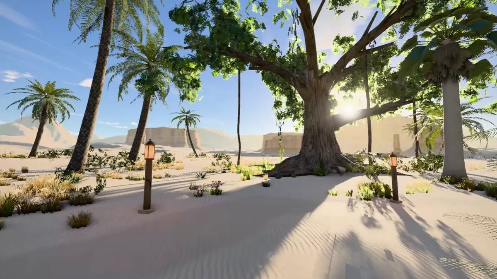</a><br>
<sub><a href="https://cdn.jsdelivr.net/gh/X-RayLuan/awesome-opus-5-5-video-prompts@main/assets/videos/cryptomanavan-threejs-lagoon-tree-village-readme.mp4">▶ Play video</a> · <a href="https://x.com/cryptomanavan/status/2102772685541347618">Original on X</a></sub>

_A browser-based 3D village made with Claude Opus 5.5 and Three.js. The author says they supplied concepts, ideas, and drawings, used no external assets or Blender, and had been working on it for about seven hours when they posted the video._

**Prompt** · _not shared by the author._

[Original post](https://x.com/cryptomanavan/status/2102772685541347618) · [Remake with EasyVeo](https://easyveo.com?utm_source=github&utm_medium=referral&utm_campaign=awesome_opus55_video_prompts&utm_content=cryptomanavan_threejs_lagoon_tree_village) · [Back to examples](#all-prompts)

---

### Procedural Kaiju Simulation in Three.js
<a id="majidmanzarpour-procedural-kaiju-simulation"></a>

[@majidmanzarpour](https://x.com/majidmanzarpour) · Majid Manzarpour · community demo · Claude Opus 5.5

_A kaiju simulation made with pure Three.js code. The author says they used a minimal prompt to test Opus 5.5’s creativity, set it to max reasoning effort, and reports that it worked for 3.5 hours before producing the demo artifact._

**Prompt** · verbatim from the [author’s post](https://x.com/majidmanzarpour/status/2102810712779194418)

```text
Build a fully procedural AAA quality kaiju simulation in three.js using pure TSL and modern techniques
```

[Original post](https://x.com/majidmanzarpour/status/2102810710791401883) · [Remake with EasyVeo](https://easyveo.com?utm_source=github&utm_medium=referral&utm_campaign=awesome_opus55_video_prompts&utm_content=majidmanzarpour_procedural_kaiju_simulation) · [Back to examples](#all-prompts)

---

## 🎥 Opus as director for AI video models

_Opus writes character sheets, start frames and shot-by-shot prompts, then calls Seedance / Kling / image models via MCP. This is the lane EasyVeo is built for._

### Opus 5.5 as director → GPT Image 2.5 + Seedance 2.5
<a id="abxxai-opus-seedance-road-trip"></a>

[@abxxai](https://x.com/abxxai) · Abdul Shakoor · community demo · Claude Opus 5.5

<a href="https://cdn.jsdelivr.net/gh/X-RayLuan/awesome-opus-5-5-video-prompts@main/assets/videos/abxxai-opus-seedance-road-trip-readme.mp4">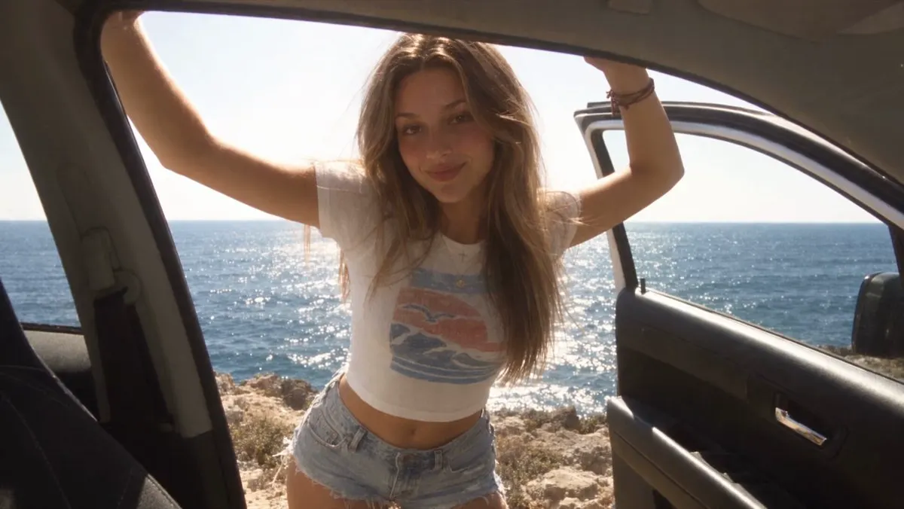</a><br>
<sub><a href="https://cdn.jsdelivr.net/gh/X-RayLuan/awesome-opus-5-5-video-prompts@main/assets/videos/abxxai-opus-seedance-road-trip-readme.mp4">▶ Play video</a> · <a href="https://x.com/abxxai/status/2102775755646337530">Original on X</a></sub>

_Photoreal coastal road-trip clip. Opus 5.5 got one idea plus style screenshots and wrote everything: character sheet, start frames, camera moves, dialogue timing, sound. Key trick (author): tell it who holds the camera, where they sit and how they move. The full thread has every prompt; below is an excerpt of the Opus-written Seedance 2.5 scene-1 prompt._

**Prompt** · excerpt, written by Opus 5.5 and posted in the [author’s thread](https://x.com/abxxai/status/2102775827939336264) — truncated here; see the thread for every prompt

```text
=== REFERENCES ===

<<<image_2>>> is the exact START FRAME and master reference for the scene, car, location, framing, light and film grade. Frame one must match it pixel for pixel: camera inside a parked white sedan looking out through the open front passenger door, grey fabric headliner along the top, grey seat belt and B-pillar at screen-left, the open door with black panel and chrome handle at screen-right, rocky dry clifftop, glittering deep-blue sea, flat horizon, hazy pale bright sky, harsh midday sun.

<<<image_1>>> is the IDENTITY LOCK for the woman. She must be this exact person in every frame: same face and bone structure, warm brown eyes, freckles across nose and cheeks, soft flush on cheeks, natural full lips, long sun-streaked light-brown hair with caramel highlights, middle part, loose flyaways. Jewelry: thin gold chain with a small cross pendant and a small round gold coin pendant; brown multi-strand cord bracelets on her left wrist. Wardrobe: faded cropped white baby tee with a vintage print (pale blue stripe band, coral-red sun disc with a small seagull, blue waves), light-wash frayed denim cutoff shorts. Use the sheet's expression panels (Soft Private Smile, Excited Disbelief, Big Genuine Laugh, Playful "I Told You") as her emotional range. Identity, hair, jewelry and wardrobe never change or morph.

=== CAMERA LOCK (MOST IMPORTANT) ===

One continuous 10-second take, 1080p. Zero cuts, zero camera switches, zero time jumps.

ONE camera angle and ONE framing for the entire clip, exactly the composition of <<<image_2>>>. The camera does NOT rotate, pan, tilt, zoom, dolly, reframe or change position at any moment. The headliner, B-pillar, seat belt, open door, horizon line and sea stay in the same place in the frame from first frame to last. Only the woman moves inside this fixed frame.

The camera is held by a friend sitting in the driver's side of the car, filming through the open passenger door on a 2003-era compact digital camera held steady at chest height. The only camera motion is subtle human handheld life: gentle breathing sway, faint micro-tremor, a few millimeters of drift. Never jerky, never stabilized-smooth, never a deliberate move.

[…]
```

[Original post](https://x.com/abxxai/status/2102775755646337530) · [Remake with EasyVeo](https://easyveo.com?utm_source=github&utm_medium=referral&utm_campaign=awesome_opus55_video_prompts&utm_content=abxxai_opus_seedance_road_trip) · [Back to examples](#all-prompts)

---

### Vintage collage “infinite zoom” via Magnific MCP
<a id="koldo2k-infinite-zoom-collage"></a>

[@koldo2k](https://x.com/koldo2k) · Koldo Huici · community demo · Claude Opus 5.5

<a href="https://cdn.jsdelivr.net/gh/X-RayLuan/awesome-opus-5-5-video-prompts@main/assets/videos/koldo2k-infinite-zoom-collage-readme.mp4">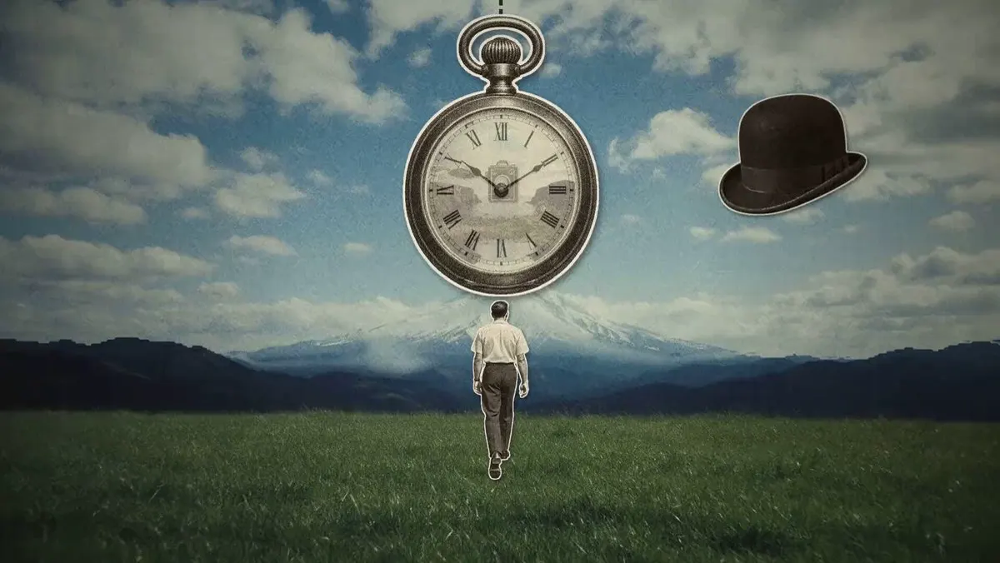</a><br>
<sub><a href="https://cdn.jsdelivr.net/gh/X-RayLuan/awesome-opus-5-5-video-prompts@main/assets/videos/koldo2k-infinite-zoom-collage-readme.mp4">▶ Play video</a> · <a href="https://x.com/koldo2k/status/2103129343253778767">Original on X</a></sub>

_20-second After-Effects-style infinite-zoom loop through vintage objects. Opus 5.5 orchestrated external models via the Magnific MCP (Seedream 5 Pro, GPT 2.5 cutouts, Kling 2.5, Lyria 3; ~1,500 credits per author), built depth-layer parallax and delivered an interactive timeline artifact plus MP4._

**Prompt** · verbatim from the [author’s post](https://x.com/koldo2k/status/2103129347791986942)

```text
Build a looping "infinite zoom" animation, After Effects style: the camera
travels from landscape to landscape by flying through vintage objects.

LOOK: vintage collage realistic photo landscapes + black & white newspaper
cutout objects (halftone, white paper border, soft shadow). Film grain,
vignette, light flicker.

WORLDS (loop): snowy mountains → pocket watch (swinging on its chain) →
sea cliffs → box camera lens → desert dunes → magnifying glass →
misty lake → hand mirror → back to start.
Extras: floating hat, phone, umbrella, gramophone, key; a 1950s man walking
toward the watch; a whale swimming across the cliffs sky.

HOW:
- Generate everything via the Magnific MCP (Seedream 5 Pro landscapes,
  GPT 2.5 transparent cutouts, depth maps, Kling 2.5 animation, Lyria 3
  music). List the generations + credit cost and wait for my OK first.
- Split each landscape into 3 depth layers from its depth map and fill the
  hidden areas. Parallax: layer scale = camera^Z, Z between 0.45 and 1.22.
- Each portal's glass holds the next world; cut seamlessly when it fills
  the frame.
- Constant speed: exponential zoom to a fixed point, each segment's duration
  proportional to log(zoom). Verify the cuts frame by frame.
- Man & whale: generate on pure green (#00B140), animate in place with
  Kling, key out every frame, build a seamless loop (ping-pong if needed).
- Cutouts animate at 15 fps (on twos).
- 20 s loop, 1920×1080, 30 fps. Music: 96 BPM, cut to exactly 8 bars = 20 s.

DELIVER: an interactive artifact (viewer, AE-style timeline, music +
MP4 download) and a rendered MP4 with music under 30 MB.
Show me screenshots before each expensive step.
```

[Original post](https://x.com/koldo2k/status/2103129343253778767) · [Remake with EasyVeo](https://easyveo.com?utm_source=github&utm_medium=referral&utm_campaign=awesome_opus55_video_prompts&utm_content=koldo2k_infinite_zoom_collage) · [Back to examples](#all-prompts)

---

### Blender blockout → Seedance 2.5 (MaxFusion MCP)
<a id="orisilver-blender-blockout-seedance"></a>

[@OriSilver](https://x.com/OriSilver) · Ori Silver · community demo · Claude Opus 5.5

<a href="https://cdn.jsdelivr.net/gh/X-RayLuan/awesome-opus-5-5-video-prompts@main/assets/videos/orisilver-blender-blockout-seedance-readme.mp4">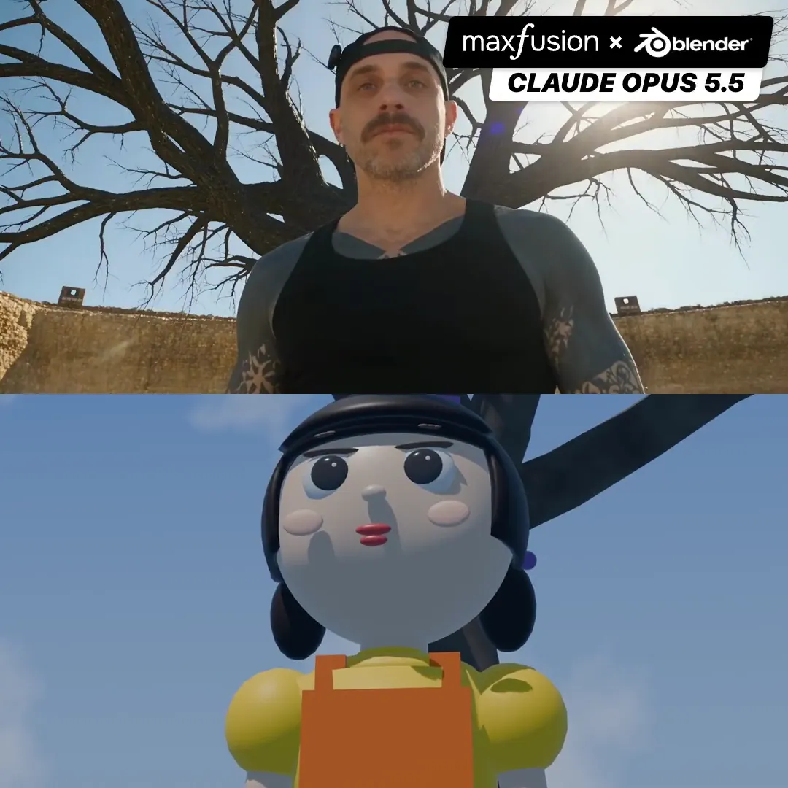</a><br>
<sub><a href="https://cdn.jsdelivr.net/gh/X-RayLuan/awesome-opus-5-5-video-prompts@main/assets/videos/orisilver-blender-blockout-seedance-readme.mp4">▶ Play video</a> · <a href="https://x.com/OriSilver/status/2102817977812824335">Original on X</a></sub>

_Opus 5.5 broke down a reference video (15 fps frame pulls), rebuilt every shot as a Blender blockout (camera, movement, blocking), exported a 30 s MP4, then used it as the Seedance 2.5 reference with the author’s characters — writing prompts that stop Seedance copying the rough render._

**Prompt** · _not shared by the author._ Workflow is described step by step in the post; no prompt text shared.

[Original post](https://x.com/OriSilver/status/2102817977812824335) · [Remake with EasyVeo](https://easyveo.com?utm_source=github&utm_medium=referral&utm_campaign=awesome_opus55_video_prompts&utm_content=orisilver_blender_blockout_seedance) · [Back to examples](#all-prompts)

---

### Superintelligence Documentary via Runway MCP
<a id="gavinpurcell-superintelligence-documentary"></a>

[@gavinpurcell](https://x.com/gavinpurcell) · Gavin Purcell · community demo · Claude Opus 5.5

_Gavin Purcell shared a documentary video about superintelligence made by his Claude agent, fig. He says he gave the agent access to the Runway MCP._

**Prompt** · verbatim from the [author’s post](https://x.com/gavinpurcell/status/2103304514329854102)

```text
high-end netflix style documentary about superintelligence for normies
```

[Original post](https://x.com/gavinpurcell/status/2103304514329854102) · [Remake with EasyVeo](https://easyveo.com?utm_source=github&utm_medium=referral&utm_campaign=awesome_opus55_video_prompts&utm_content=gavinpurcell_superintelligence_documentary) · [Back to examples](#all-prompts)

---

### Opus 5.5 Talking-Head Edit with OpenEdit
<a id="sab8a-opus-55-talking-head-edit"></a>

[@sab8a](https://x.com/sab8a) · Sabba Keynejad · community demo · Claude Opus 5.5

_The author demonstrates using Opus 5.5 with OpenEdit to turn a raw talking-head clip into an edit with subtitles, graphics, and music. The author reports a runtime of about 1 hour 51 minutes, $23 in token usage, and $49 in fal usage._

**Prompt** · verbatim from the [author’s post](https://x.com/sab8a/status/2103144778481475686)

```text
Cut a raw talking-head clip into a punchy, fun edit with subtitles, graphics and music
```

[Original post](https://x.com/sab8a/status/2103144778481475686) · [Remake with EasyVeo](https://easyveo.com?utm_source=github&utm_medium=referral&utm_campaign=awesome_opus55_video_prompts&utm_content=sab8a_opus_55_talking_head_edit) · [Back to examples](#all-prompts)

---

### Opus 5.5 Edits 13 Takes into a Launch Video
<a id="gregpr07-opus-55-launch-video"></a>

[@gregpr07](https://x.com/gregpr07) · Gregor Zunic · community demo · Claude Opus 5.5

<a href="https://cdn.jsdelivr.net/gh/X-RayLuan/awesome-opus-5-5-video-prompts@main/assets/videos/gregpr07-opus-55-launch-video-readme.mp4">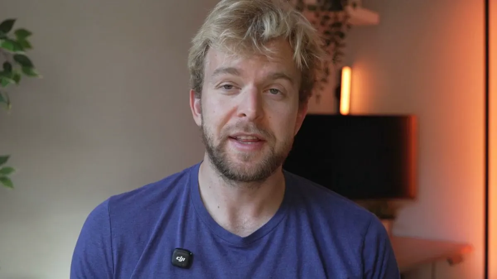</a><br>
<sub><a href="https://cdn.jsdelivr.net/gh/X-RayLuan/awesome-opus-5-5-video-prompts@main/assets/videos/gregpr07-opus-55-launch-video-readme.mp4">▶ Play video</a> · <a href="https://x.com/gregpr07/status/2102984873351037161">Original on X</a></sub>

_Gregor Zunic gave Opus 5.5 with video-use 13 takes of himself trying to say one sentence. He reports that it reviewed the transcripts, compared the top three takes frame by frame, selected and edited one, revised its captions, and made a launch video around it._

**Prompt** · _not shared by the author._

[Original post](https://x.com/gregpr07/status/2102984873351037161) · [Remake with EasyVeo](https://easyveo.com?utm_source=github&utm_medium=referral&utm_campaign=awesome_opus55_video_prompts&utm_content=gregpr07_opus_55_launch_video) · [Back to examples](#all-prompts)

---

### Wrapscribe Promo Video with Opus 5.5
<a id="shribuilds-wrapscribe-promo-video"></a>

[@shribuilds](https://x.com/shribuilds) · Shri · community demo · Claude Opus 5.5

_A promotional video for Wrapscribe made with Opus 5.5. The author says they used Remotion and added a fal.ai API key to generate music and voiceovers._

**Prompt** · verbatim from the [author’s post](https://x.com/shribuilds/status/2102827288190689364)

```text
Make a modern slick and punchy video for wrapscribe, check the wholebase to learn more about the features
```

[Original post](https://x.com/shribuilds/status/2102827288190689364) · [Remake with EasyVeo](https://easyveo.com?utm_source=github&utm_medium=referral&utm_campaign=awesome_opus55_video_prompts&utm_content=shribuilds_wrapscribe_promo_video) · [Back to examples](#all-prompts)

---

### FishSlop Game with an Economy and Unlocks
<a id="theo-fishslop-economy-unlocks"></a>

[@theo](https://x.com/theo) · Theo - t3.gg · community demo · Claude Opus 5.5

_The author shows an Opus 5.5 version of FishSlop with animated gameplay, controls, an in-game economy, and unlocks. They report that after asking for better graphics reduced the frame rate, a follow-up request restored smooth 120 fps with a slight loss of visual fidelity._

**Prompt** · _not shared by the author._

[Original post](https://x.com/theo/status/2102877145399975952) · [Remake with EasyVeo](https://easyveo.com?utm_source=github&utm_medium=referral&utm_campaign=awesome_opus55_video_prompts&utm_content=theo_fishslop_economy_unlocks) · [Back to examples](#all-prompts)

---

### EasyVeo decode → stills → remake
<a id="easyveo-remake-loop"></a>

[EasyVeo](https://easyveo.com) · remake the winner, keep your product · EasyVeo workflow (not a community demo)

_Use Opus 5.5-style shot planning on a real ad: decode what works, lock product-true stills, then remake with video models._

**Prompt**

```text
Authorized short ad clip (≤30s). Decode hook / pacing / proof / CTA (~18 elements). Produce product-true stills, then a Seedance 2.5 / multi-model remake that keeps my SKU. No invented ROAS.
```

[Try on EasyVeo](https://easyveo.com?utm_source=github&utm_medium=referral&utm_campaign=awesome_opus55_video_prompts&utm_content=entry_studio) · [Back to examples](#all-prompts)

---

## Tools & starter kits

- [JohnHeibel/PDoomVideo](https://github.com/JohnHeibel/PDoomVideo) — full source of the P(doom) music video: p5.js studio page, `render.mjs` (headless Chrome → ffmpeg), `STORYBOARD.md`, `ANIMATION_GUIDE.md`
- [JohnHeibel/ClaudeAnimationBase](https://github.com/JohnHeibel/ClaudeAnimationBase) — starter kit for p5.js + p5.brush character animation with Opus 5.5 (“Read ANIMATION_GUIDE.md, then make a 15-second video of …”)
- [ledbetterljoshua/functional-emotions-video](https://github.com/ledbetterljoshua/functional-emotions-video) — custom WebGL2 brushstroke renderer + beat/lyric alignment pipeline
- [klsoen/opus-js-animations](https://github.com/klsoen/opus-js-animations) — Claude Code skill: brief → sound → director’s treatment → frame-exact MP4
- [buildwithhanif/claude-animation-skill](https://github.com/buildwithhanif/claude-animation-skill) — Node Canvas animation skill with character rig and frame checks
- [diggerhq/shipvideo](https://github.com/diggerhq/shipvideo) ([launchvideo.io](https://launchvideo.io)) — URL/prompt → launch video; Opus 5.5 writes one HTML film, rendered under a virtual clock
- [Blender MCP + Opus 5.5 guide](https://blendermcp.org/guides/claude-opus-5-5-blender) — model ID and API changes when driving Blender
- [dev.to: “This video is about how this video was made”](https://dev.to/peter/this-video-is-about-how-this-video-was-made-42hl) — deep dive on the deterministic `renderAt(t)` pattern, ElevenLabs cue timing and reviewer subagents

## Related indexes

- [Introducing Claude Opus 5.5](https://www.anthropic.com/claude-opus-5-5) — official announcement · [@claudeai launch thread](https://x.com/claudeai/status/2102471866635919731)
- [athemeroy/awesome-opus-5-5-videos](https://github.com/athemeroy/awesome-opus-5-5-videos) — research-style index of 1,000+ Opus 5.5 video posts with production-path labels
- This list welcomes PRs via [CONTRIBUTING.md](CONTRIBUTING.md)

## Share a good example

Open a PR — see [CONTRIBUTING.md](CONTRIBUTING.md). Only verbatim prompts the creator published; otherwise mark “not shared”. Keep full videos on X.

## Credits

Community demos scraped from public X posts (via the fxtwitter API), creator GitHub repos, and Anthropic’s [@claudeai](https://x.com/claudeai/status/2102471866635919731) launch thread. Layout mirrors [awesome-gpt-6-astra-prompts](https://github.com/X-RayLuan/awesome-gpt-6-astra-prompts). Product CTA: [EasyVeo](https://easyveo.com).

See [RIGHTS.md](RIGHTS.md). Not affiliated with Anthropic.
