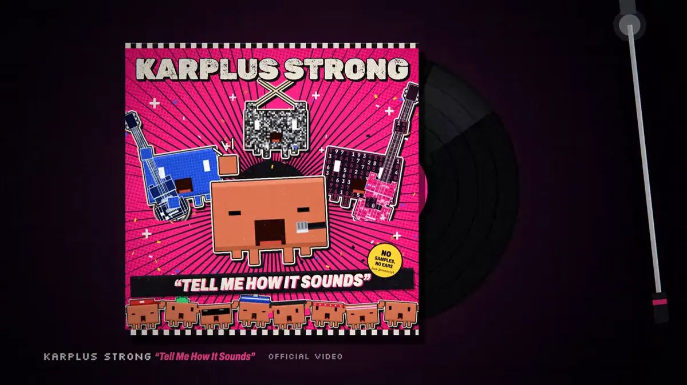
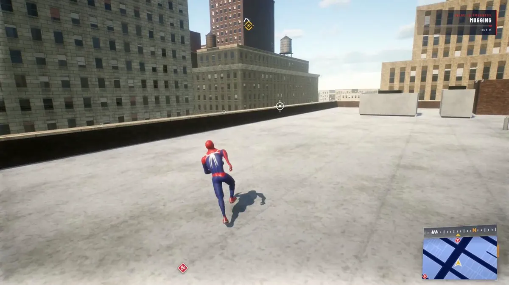

# Awesome Opus 5.5 视频提示词精选

[](https://github.com/sindresorhus/awesome) [](https://github.com/X-RayLuan/awesome-opus-5-5-video-prompts/stargazers) [](LICENSE) [](https://easyveo.com?utm_source=github&utm_medium=referral&utm_campaign=awesome_opus55_video_prompts&utm_content=zh_badge) [](CONTRIBUTING.md)

<p>
  <a href="README.md"></a>
  <a href="README.zh-CN.md"></a>
</p>

<a href="https://easyveo.com?utm_source=github&amp;utm_medium=referral&amp;utm_campaign=awesome_opus55_video_prompts&amp;utm_content=zh_readme_hero"></a>

**下一条 Claude Opus 5.5 视频的起点 —— 或下一条 AI 视频广告复刻。**

Claude Opus 5.5（[Anthropic，2026 年 9 月 22 日发布](https://www.anthropic.com/claude-opus-5-5)）只输出文本，不直接生成像素。所谓“Opus 5.5 做视频”，是让模型**把整部片子写成代码** —— JavaScript/Canvas/WebGL、p5.js、Blender Python —— 再用 headless Chrome 或 Blender + ffmpeg 逐帧渲染；或让它**充当导演驱动 Seedance、Kling 等视频模型**。本列表收录社区最佳演示，只收录作者本人公开的原始提示词。

**83 个案例 · 6 个分类 · 中英双语 · 仅收录原文提示词 · EasyVeo 复刻车道 · CTA：[easyveo.com](https://easyveo.com?utm_source=github&utm_medium=referral&utm_campaign=awesome_opus55_video_prompts&utm_content=zh_lede)**

## 精选项目

<sub>点击缩略图或 ▶ 播放，在浏览器中直接播放。片段已压缩；完整原片在 X。</sub>

<table>
<tr>
<td width="50%" valign="top"><a href="https://cdn.jsdelivr.net/gh/X-RayLuan/awesome-opus-5-5-video-prompts@main/assets/videos/notinreality-pdoom-music-video-readme.mp4"></a><br><strong><a href="#notinreality-pdoom-music-video">《I’m Upping My P(doom)》Clawd 音乐 MV</a></strong><br><sub><a href="https://x.com/other__reality/status/2102514581684052169">@other__reality</a> · <a href="https://cdn.jsdelivr.net/gh/X-RayLuan/awesome-opus-5-5-video-prompts@main/assets/videos/notinreality-pdoom-music-video-readme.mp4">▶ 播放</a></sub><br><a href="#notinreality-pdoom-music-video">提示词 →</a></td>
<td width="50%" valign="top"><a href="https://cdn.jsdelivr.net/gh/X-RayLuan/awesome-opus-5-5-video-prompts@main/assets/videos/kevin-ngo-what-do-you-love-readme.mp4"></a><br><strong><a href="#kevin-ngo-what-do-you-love">《What do you love?》Claude 动画短片</a></strong><br><sub><a href="https://x.com/kevin_t_ngo/status/2102437977435893771">@kevin_t_ngo</a> · <a href="https://cdn.jsdelivr.net/gh/X-RayLuan/awesome-opus-5-5-video-prompts@main/assets/videos/kevin-ngo-what-do-you-love-readme.mp4">▶ 播放</a></sub><br><a href="#kevin-ngo-what-do-you-love">提示词 →</a></td>
</tr>
<tr>
<td width="50%" valign="top"><a href="https://cdn.jsdelivr.net/gh/X-RayLuan/awesome-opus-5-5-video-prompts@main/assets/videos/lcslates-glass-mosaic-film-readme.mp4"></a><br><strong><a href="#lcslates-glass-mosaic-film">玻璃金箔马赛克动画短片（WebGL2）</a></strong><br><sub><a href="https://x.com/LCSlates/status/2102503027340988559">@LCSlates</a> · <a href="https://cdn.jsdelivr.net/gh/X-RayLuan/awesome-opus-5-5-video-prompts@main/assets/videos/lcslates-glass-mosaic-film-readme.mp4">▶ 播放</a></sub><br><a href="#lcslates-glass-mosaic-film">提示词 →</a></td>
<td width="50%" valign="top"><a href="https://cdn.jsdelivr.net/gh/X-RayLuan/awesome-opus-5-5-video-prompts@main/assets/videos/majid-pixel-wizard-readme.mp4"></a><br><strong><a href="#majid-pixel-wizard">像素风巫师施法动画（Canvas 2D）</a></strong><br><sub><a href="https://x.com/majidmanzarpour/status/2102476258948927543">@majidmanzarpour</a> · <a href="https://cdn.jsdelivr.net/gh/X-RayLuan/awesome-opus-5-5-video-prompts@main/assets/videos/majid-pixel-wizard-readme.mp4">▶ 播放</a></sub><br><a href="#majid-pixel-wizard">提示词 →</a></td>
</tr>
</table>

<a id="all-prompts"></a>

## 最新 Opus 5.5 视频提示词

<details>
<summary>浏览全部案例</summary>

**🎬 代码绘制的短片与动画**
- [《What do you love?》Claude 动画短片](#kevin-ngo-what-do-you-love) · @kevin_t_ngo · video
- [玻璃金箔马赛克动画短片（WebGL2）](#lcslates-glass-mosaic-film) · @LCSlates · video · prompt
- [沙画动画：美国 250 年历史](#michaelzsguo-us-history-sand-animation) · @Michaelzsguo · video · prompt
- [火星车动画短片（4 个代理，约 4 分钟）](#andrewonxyz-mars-rover-short) · @AndrewOnXYZ · video
- [Claude 对决 ChatGPT 动漫预告片](#ishuagra02-anime-ai-battle-trailer) · @ishuagra02 · video · prompt
- [零指导 Demoscene 开场（280 KB 单 HTML）](#justinperea-demoscene-intro) · @JustinPerea · video · prompt
- [代码绘制的马赛克与 22 条小鱼](#dfeinition-code-drawn-mosaic-fish) · @dfeinition · video
- [纯代码渲染的 AI 发展史短片](#kimmonismus-code-rendered-ai-history-film) · @kimmonismus · video · prompt
- [After Effects 摄影表计时与线稿合成](#araminta-k-after-effects-x-sheet-compositing) · @araminta_k
- [2076年人类消失后的世界](#hesamation-world-after-humanity-2076) · @Hesamation
- [《黎明碎片》：阿拉伯语配音动画试播集](#sbalhatlani-shard-of-dawn-anime-pilot) · @sbalhatlani
- [困在 AI 生成世界里的机器人 Pip](#pradeepxkapoor-pip-ai-generated-world) · @pradeepXkapoor · video · prompt
- [《鹈鹕骑自行车》剧场版](#axtonliu-pelican-riding-a-bicycle) · @AxtonLiu · video · prompt
- [Lovelee 应用的一次成型动画短片](#jackfriks-lovelee-animated-short) · @jackfriks · video · prompt
- [完全用代码绘制的一分钟动画](#ctgptlb-one-minute-code-drawn-animation) · @ctgptlb · video
- [Opus 5.5 制作的中秋拼贴动画](#ring-hyacinth-mid-autumn-collage-animation) · @ring_hyacinth · video
- [一次生成的 Three.js 动画短片](#scheemunai-one-shot-threejs-cartoon) · @scheemunai · video · prompt
- [Claude 能力成长训练蒙太奇](#ishuagra02-claude-capability-training-montage) · @ishuagra02 · video · prompt
- [Claude Code 用代码绘制的动画短片](#itsolelehmann-code-drawn-animated-film) · @itsolelehmann · prompt
- [从人类诞生到 Opus 5.5](#songkeys-humanity-to-opus-5-5) · @songkeys · prompt

**👾 像素动画**
- [像素风巫师施法动画（Canvas 2D）](#majid-pixel-wizard) · @majidmanzarpour · video · prompt
- [彩虹跑道像素角色闪避动画（Canvas 2D）](#riku-pixel-rainbow-runner) · @riku720720 · video · prompt
- [《Nightcall》像素风实时演示](#gandamu-ml-nightcall-pixel-art-demo) · @gandamu_ml · video
- [赵云像素风无双游戏](#bubustd-zhao-yun-voxel-musou) · @BubuStd · video
- [Opus 5.5 一次生成的 Jet Moto](#cherry-mx-reds-jet-moto) · @cherry_mx_reds · video
- [带有经济系统和解锁内容的 FishSlop 游戏](#theo-fishslop-economy-unlocks) · @theo
- [Opus 5.5 的 TikTok 信息流动画](#pleometric-tiktok-feed-animation) · @pleometric · video
- [八关横版攻城游戏](#kanaworks-ai-eight-stage-siege-game) · @KanaWorks_AI
- [一次生成的《波斯王子》风格关卡](#iannuttall-prince-of-persia-style-level) · @iannuttall · prompt
- [像素风神经网络训练动画](#dotcsv-pixel-art-neural-network-training) · @DotCSV
- [用现有引擎制作的深海恐怖游戏](#ggsimm-deep-sea-horror-game) · @ggsimm

**🎵 音乐 MV**
- [《I’m Upping My P(doom)》Clawd 音乐 MV](#notinreality-pdoom-music-video) · @other__reality · video
- [《Functional Emotions》油画风音乐 MV](#eudaemonea-functional-emotions) · @eudaemonea · video · prompt
- [《Stroke of a Pen》：纯代码比特币音乐视频](#bradmillscan-stroke-of-a-pen-bitcoin-music-video) · @bradmillscan
- [用 JavaScript 制作的流行朋克歌曲与 MV](#aj-dev-smith-pop-punk-javascript-music-video) · @aj_dev_smith · video

**📊 讲解、广告与动效**
- [约 1 分钟、约 2 美元的创业公司发布视频](#deedydas-startup-launch-video) · @deedydas · video · prompt
- [Black-Scholes 讲解 + 跑酷分屏视频](#goodside-black-scholes-split-screen) · @goodside · video · prompt
- [单张图片生成 Negroni 配方动效视频](#rorfly-negroni-recipe-motion-graphic) · @Ror_Fly · video · prompt
- [真人口播 → 线稿动画讲解](#axtonliu-talking-head-to-line-art) · @AxtonLiu · video · prompt
- [用 JavaScript 动画讲解浏览器如何工作](#addyosmani-how-browsers-work-animation) · @addyosmani · video
- [Session Story 将 Claude Code 历史记录制作成动画](#jake11moran-session-story) · @jake11moran
- [15 秒动态设计师作品集短片](#ajith-io-motion-designer-showreel) · @ajith_io · prompt
- [史蒂夫·乔布斯生平动画](#oozn-steve-jobs-life-animation) · @oozn
- [Transformer 原理讲解视频](#dotey-transformer-explainer-video) · @dotey · prompt
- [用 Manim 制作的导数教学视频](#linearuncle-derivative-lesson-manim) · @LinearUncle · video · prompt
- [用 Claude Code 制作 JavaScript 绘制的广告](#lucas-ia-javascript-drawn-ad) · @Lucas_IA_
- [将宜家组装手册变成带旁白的 3D 视频](#deedydas-ikea-manual-3d-assembly-video) · @deedydas · prompt
- [用 HyperFrames 制作的 NotchBrowser 预告片](#jake11moran-notchbrowser-teaser) · @jake11moran · prompt
- [可探索的 AI 历史博物馆](#ryansael-explorable-ai-history-museum) · @RyanSael
- [用 Opus 5.5 编程制作的视频](#dhruvalgolakiya-code-generated-video) · @dhruvalgolakiya
- [GitHub 版本管理动画讲解](#sundyme-github-version-control-explainer) · @sundyme · video · prompt
- [LLM 上下文窗口如何运作](#joaoli13-llm-context-window-animation) · @joaoli13 · prompt
- [密码与通行密钥讲解视频](#tz-2022-password-passkey-explainer) · @Tz_2022 · prompt
- [线稿动画速览中华五千年历史](#akokoi1-chinese-history-line-art-animation) · @akokoi1 · video · prompt
- [大气环流地理知识动画](#akokoi1-atmospheric-circulation-animation) · @akokoi1 · video · prompt
- [一分钟内回顾印尼81年历史](#hanifproduktif-indonesian-history-animation) · @hanifproduktif · prompt
- [Opus 5.5 程序化动画短片](#leo-xiaolei-procedural-animated-short) · @leo_xiaolei · prompt
- [Opus 5.5 一次生成课程动画视频](#0x0funky-one-shot-course-animation) · @0x0funky
- [Claude Code 用量限制动画](#daniel-mac8-claude-code-usage-limits-animation) · @daniel_mac8

**🧊 Blender 与 3D 渲染**
- [1906 年旧金山市场街复原（Blender）](#alexalbert-market-street-1906) · @alexalbert__ · video · prompt
- [claude.ai 中一句话生成 Blender 黏土动画](#alexalbert-blender-claymation) · @alexalbert__ · video
- [程序化城堡、湖面与烟花（Opus 5.5 对比 GPT-6 Astra）](#stefan3dai-castle-fireworks-blender) · @Stefan_3D_AI · video
- [壇之浦之战：电视特番级 3D 复原](#tetumemo-dannoura-battle-3d) · @tetumemo · video · prompt
- [复原阿波罗 8 号“地出”拍摄瞬间](#claudeai-apollo8-earthrise) · @claudeai · video
- [Three.js 代码生成的清澈溪流](#hayashimon1-threejs-clear-stream) · @hayashimon1 · video
- [用代码生成的 Blender 大型强子对撞机场景](#superalesha-lhc-proton-collision) · @superalesha · video
- [一次提示生成的 90 年代风格演示程序](#gandamu-90s-demoscene-demo) · @gandamu_ml · video
- [将 Claude Code 会话制作成视频](#shneural-claude-code-session-video) · @shneural
- [用 Three.js 代码雕刻的日式船](#mengto-code-sculpted-japanese-ship) · @MengTo · video
- [可游玩的 1990 年代唱片店复刻](#illscience-playable-1990s-record-store) · @illscience · video · prompt
- [化作乐谱的 3D 道路](#chetanankola-3d-road-sheet-music) · @chetanankola · video
- [可游玩的日本山谷泛舟场景](#mengto-japanese-valley-boat-journey) · @MengTo · video · prompt
- [Three.js 泻湖树屋村庄](#cryptomanavan-threejs-lagoon-tree-village) · @cryptomanavan · video
- [Three.js 程序化怪兽模拟](#majidmanzarpour-procedural-kaiju-simulation) · @majidmanzarpour · prompt
- [使用从零制作的 3D 素材开发 Three.js 游戏](#xikhar-threejs-game-3d-assets) · @xikhar · video

**🎥 Opus 当导演：驱动 AI 视频模型**
- [Opus 5.5 当导演 → GPT Image 2.5 + Seedance 2.5](#abxxai-opus-seedance-road-trip) · @abxxai · video · prompt
- [复古拼贴“无限缩放”动画（Magnific MCP）](#koldo2k-infinite-zoom-collage) · @koldo2k · video · prompt
- [Blender 预演 → Seedance 2.5（MaxFusion MCP）](#orisilver-blender-blockout-seedance) · @OriSilver · video
- [通过 Runway MCP 制作的超级智能纪录片](#gavinpurcell-superintelligence-documentary) · @gavinpurcell · prompt
- [Opus 5.5 与 OpenEdit 制作口播视频剪辑](#sab8a-opus-55-talking-head-edit) · @sab8a · prompt
- [Opus 5.5 将 13 条拍摄片段剪成发布视频](#gregpr07-opus-55-launch-video) · @gregpr07 · video
- [Opus 5.5 制作的 Wrapscribe 宣传视频](#shribuilds-wrapscribe-promo-video) · @shribuilds · prompt
- [用 JS Paint 重绘《蒙娜丽莎》](#ehsanik-mona-lisa-js-paint) · @ehsanik · prompt
- [EasyVeo：拆解 → 分镜静帧 → 复刻](#easyveo-remake-loop)

</details>

---

## 🎬 代码绘制的短片与动画

_Opus 5.5 把整部片子写成 JavaScript / Canvas / WebGL 代码（常用 Web Audio 合成声音），再无头渲染逐帧并用 ffmpeg 合成。_

### 《What do you love?》Claude 动画短片
<a id="kevin-ngo-what-do-you-love"></a>

[@kevin_t_ngo](https://x.com/kevin_t_ngo) · Kevin Ngo · 社区演示 · Claude Opus 5.5

<a href="https://cdn.jsdelivr.net/gh/X-RayLuan/awesome-opus-5-5-video-prompts@main/assets/videos/kevin-ngo-what-do-you-love-readme.mp4"></a><br>
<sub><a href="https://cdn.jsdelivr.net/gh/X-RayLuan/awesome-opus-5-5-video-prompts@main/assets/videos/kevin-ngo-what-do-you-love-readme.mp4">▶ 播放视频</a> · <a href="https://x.com/kevin_t_ngo/status/2102437977435893771">X 原帖</a></sub>

_28 秒方形短片：全镇的人都在给 Claude 发需求，只有一个女孩问了它一个问题。据作者回复，每一帧都由纯 JavaScript 在 HTML Canvas 上绘制，配乐也用 Web Audio API 代码生成。@claudeai 发布串中也有收录。_

**提示词** · _作者未公开。_

[原帖](https://x.com/kevin_t_ngo/status/2102437977435893771) · [用 EasyVeo 复刻](https://easyveo.com?utm_source=github&utm_medium=referral&utm_campaign=awesome_opus55_video_prompts&utm_content=kevin_ngo_what_do_you_love) · [返回列表](#all-prompts)

---

### 玻璃金箔马赛克动画短片（WebGL2）
<a id="lcslates-glass-mosaic-film"></a>

[@LCSlates](https://x.com/LCSlates) · Chris Riley · 社区演示 · Claude Opus 5.5

<a href="https://cdn.jsdelivr.net/gh/X-RayLuan/awesome-opus-5-5-video-prompts@main/assets/videos/lcslates-glass-mosaic-film-readme.mp4"></a><br>
<sub><a href="https://cdn.jsdelivr.net/gh/X-RayLuan/awesome-opus-5-5-video-prompts@main/assets/videos/lcslates-glass-mosaic-film-readme.mp4">▶ 播放视频</a> · <a href="https://x.com/LCSlates/status/2102503027340988559">X 原帖</a></sub>

_80 秒方形短片，单个 HTML 文件：WebGL2 + 原生 JS，无任何库、图片、字体或音频文件。马赛克瓷砖脱离墙面，聚成鱼、鹤和鸽子；昼夜翻转；音效在浏览器中实时合成。作者还公开了代理的分镜说明和自检记录。_

**提示词** · 原文摘自[作者帖子](https://x.com/LCSlates/status/2102503028859211905)

```text
Make an 80 second square animated film as a single HTML file, using WebGL2 and plain JavaScript, with no libraries and no image, font or audio files. It should look like a glass and gold leaf wall mosaic whose tiles were never glued down, so they can lift, flip, fly and click back into place. Figures are flocks of tiles, so a fish swims by its tiles swimming
```

[原帖](https://x.com/LCSlates/status/2102503027340988559) · [用 EasyVeo 复刻](https://easyveo.com?utm_source=github&utm_medium=referral&utm_campaign=awesome_opus55_video_prompts&utm_content=lcslates_glass_mosaic_film) · [返回列表](#all-prompts)

---

### 沙画动画：美国 250 年历史
<a id="michaelzsguo-us-history-sand-animation"></a>

[@Michaelzsguo](https://x.com/Michaelzsguo) · Michael Guo · 社区演示 · Claude Opus 5.5

<a href="https://cdn.jsdelivr.net/gh/X-RayLuan/awesome-opus-5-5-video-prompts@main/assets/videos/michaelzsguo-us-history-sand-animation-readme.mp4"></a><br>
<sub><a href="https://cdn.jsdelivr.net/gh/X-RayLuan/awesome-opus-5-5-video-prompts@main/assets/videos/michaelzsguo-us-history-sand-animation-readme.mp4">▶ 播放视频</a> · <a href="https://x.com/Michaelzsguo/status/2102592355165782312">X 原帖</a></sub>

_2 分钟棕褐色沙画动画，含配乐与音效。作者称一句提示词、零修改完成，未用 Blender 或 Three.js，约消耗 Pro 套餐 5 小时额度的 30%。_

**提示词** · 原文摘自[作者帖子](https://x.com/Michaelzsguo/status/2102593579604377636)

```text
Make a 2-minute sand animation that tells the story of 250 years of U.S. history. Keep it lively, engaging, and tasteful. Add appropriate background music and sound design.
```

[原帖](https://x.com/Michaelzsguo/status/2102592355165782312) · [用 EasyVeo 复刻](https://easyveo.com?utm_source=github&utm_medium=referral&utm_campaign=awesome_opus55_video_prompts&utm_content=michaelzsguo_us_history_sand_animation) · [返回列表](#all-prompts)

---

### 火星车动画短片（4 个代理，约 4 分钟）
<a id="andrewonxyz-mars-rover-short"></a>

[@AndrewOnXYZ](https://x.com/AndrewOnXYZ) · AndrewOnXYZ · 社区演示 · Claude Opus 5.5

<a href="https://cdn.jsdelivr.net/gh/X-RayLuan/awesome-opus-5-5-video-prompts@main/assets/videos/andrewonxyz-mars-rover-short-readme.mp4"></a><br>
<sub><a href="https://cdn.jsdelivr.net/gh/X-RayLuan/awesome-opus-5-5-video-prompts@main/assets/videos/andrewonxyz-mars-rover-short-readme.mp4">▶ 播放视频</a> (前 150 秒 / 全长 239 秒) · <a href="https://x.com/AndrewOnXYZ/status/2102512879258009818">X 原帖</a></sub>

_约 4 分钟的原创动画短片，作者称用 4 个代理、约一个半小时从零完成，未使用 AI 配音 API。作者表示提示词很简单，并分享了 Claude Code 会话链接（未以文本形式公开）。_

**提示词** · _作者未公开。_

[原帖](https://x.com/AndrewOnXYZ/status/2102512879258009818) · [Claude Code session](https://claude.ai/code/session_017o6JvwXrUnssb13MuDtiJj) · [用 EasyVeo 复刻](https://easyveo.com?utm_source=github&utm_medium=referral&utm_campaign=awesome_opus55_video_prompts&utm_content=andrewonxyz_mars_rover_short) · [返回列表](#all-prompts)

---

### Claude 对决 ChatGPT 动漫预告片
<a id="ishuagra02-anime-ai-battle-trailer"></a>

[@ishuagra02](https://x.com/ishuagra02) · Ishu Agrawal · 社区演示 · Claude Opus 5.5

<a href="https://cdn.jsdelivr.net/gh/X-RayLuan/awesome-opus-5-5-video-prompts@main/assets/videos/ishuagra02-anime-ai-battle-trailer-readme.mp4"></a><br>
<sub><a href="https://cdn.jsdelivr.net/gh/X-RayLuan/awesome-opus-5-5-video-prompts@main/assets/videos/ishuagra02-anime-ai-battle-trailer-readme.mp4">▶ 播放视频</a> · <a href="https://x.com/ishuagra02/status/2103247844542922825">X 原帖</a></sub>

_约 100 秒动漫风预告片：Opus 5.5 自行下载字体、制作音频，并用 JavaScript 逐帧生成画面。作者称一次成型，约 1.5 小时、API 费用约 28 美元。_

**提示词** · 原文摘自[作者帖子](https://x.com/ishuagra02/status/2103247960272433307)

```text
I want to create a highly-detailed video trailer featuring Claude and ChatGPT having a ruthless battle to be the best AI model in the world. Create an engaging story and make it action-paced with proper use of visual and sound effects. Art style must be anime-like.
```

[原帖](https://x.com/ishuagra02/status/2103247844542922825) · [用 EasyVeo 复刻](https://easyveo.com?utm_source=github&utm_medium=referral&utm_campaign=awesome_opus55_video_prompts&utm_content=ishuagra02_anime_ai_battle_trailer) · [返回列表](#all-prompts)

---

### 零指导 Demoscene 开场（280 KB 单 HTML）
<a id="justinperea-demoscene-intro"></a>

[@JustinPerea](https://x.com/JustinPerea) · Justin.md · 社区演示 · Claude Opus 5.5

<a href="https://cdn.jsdelivr.net/gh/X-RayLuan/awesome-opus-5-5-video-prompts@main/assets/videos/justinperea-demoscene-intro-readme.mp4"></a><br>
<sub><a href="https://cdn.jsdelivr.net/gh/X-RayLuan/awesome-opus-5-5-video-prompts@main/assets/videos/justinperea-demoscene-intro-readme.mp4">▶ 播放视频</a> · <a href="https://x.com/JustinPerea/status/2102893186330841502">X 原帖</a></sub>

_43 秒 Demoscene 风格开场，所有画面和声音都来自一个 280 KB 的 HTML 文件，无图片、音频、3D 模型或库。作者称约 5 小时（约 6.97 亿 token），跨越 19 小时的会话额度，中途只输入过“continue”。_

**提示词** · 原文摘自[作者帖子](https://x.com/JustinPerea/status/2103137233649692745)

```text
Create this in a new sub folder. 

/goal Create the most impressive demo of Opus 5.5 (you) capabilities to be shown off on Twitter. Pick what you want to make, record it into a short video that can get attention, and have fun.
```

[原帖](https://x.com/JustinPerea/status/2102893186330841502) · [用 EasyVeo 复刻](https://easyveo.com?utm_source=github&utm_medium=referral&utm_campaign=awesome_opus55_video_prompts&utm_content=justinperea_demoscene_intro) · [返回列表](#all-prompts)

---

### 代码绘制的马赛克与 22 条小鱼
<a id="dfeinition-code-drawn-mosaic-fish"></a>

[@dfeinition](https://x.com/dfeinition) · Dan Fein · 社区演示 · Claude Opus 5.5

<a href="https://cdn.jsdelivr.net/gh/X-RayLuan/awesome-opus-5-5-video-prompts@main/assets/videos/dfeinition-code-drawn-mosaic-fish-readme.mp4"></a><br>
<sub><a href="https://cdn.jsdelivr.net/gh/X-RayLuan/awesome-opus-5-5-video-prompts@main/assets/videos/dfeinition-code-drawn-mosaic-fish-readme.mp4">▶ 播放视频</a> · <a href="https://x.com/dfeinition/status/2102436001473786054">X 原帖</a></sub>

_一部马赛克动画，星星的倒影孵化成 22 条小鱼。作者称，全部 13,081 块拼贴片均由 Opus 5.5 通过代码绘制并制作动画，未使用图像文件。_

**提示词** · _作者未公开。_

[原帖](https://x.com/dfeinition/status/2102436001473786054) · [用 EasyVeo 复刻](https://easyveo.com?utm_source=github&utm_medium=referral&utm_campaign=awesome_opus55_video_prompts&utm_content=dfeinition_code_drawn_mosaic_fish) · [返回列表](#all-prompts)

---

### 纯代码渲染的 AI 发展史短片
<a id="kimmonismus-code-rendered-ai-history-film"></a>

[@kimmonismus](https://x.com/kimmonismus) · Chubby♨️ · 社区演示 · Claude Opus 5.5

<a href="https://cdn.jsdelivr.net/gh/X-RayLuan/awesome-opus-5-5-video-prompts@main/assets/videos/kimmonismus-code-rendered-ai-history-film-readme.mp4"></a><br>
<sub><a href="https://cdn.jsdelivr.net/gh/X-RayLuan/awesome-opus-5-5-video-prompts@main/assets/videos/kimmonismus-code-rendered-ai-history-film-readme.mp4">▶ 播放视频</a> (前 170 秒 / 全长 180 秒) · <a href="https://x.com/kimmonismus/status/2102844654169575547">X 原帖</a></sub>

_一部三分钟动画短片，从 2017 年的《Attention Is All You Need》论文讲到 AGI 这一开放问题。作者称，Claude 在 Claude Code 中使用 Remotion、React 和 TypeScript 制作了短片；画面由 SVG 和 Canvas 绘制，配有开源 TTS 配音及用 Python 合成的配乐。_

**提示词** · 原文摘自[作者帖子](https://x.com/kimmonismus/status/2102847451111772219)

```text
You are a motion designer and creative director making a 3-minute animated short film,
built entirely in code and rendered to MP4.
The film

Title: "Attention Is All You Need → AGI"
The story of how a single 2017 paper led, step by step, to large language models, reasoning,
tool-using AI agents, and to the open question of AGI. It should feel like a cinematic essay,
not a slideshow or a timeline infographic. Think Kurzgesagt meets a Pixar opening sequence:
emotional, clever, precise.
Tech setup
Use Remotion (React). Scaffold a fresh project, 1920x1080, 30 fps, exactly 180 s (5400 frames).
One composition per scene, sequenced in a master composition.
No external image assets or stock footage: everything is drawn with SVG, Canvas, CSS and
code-generated particles and shapes. Google Fonts are fine.
Before building, write STORYBOARD.md with each scene's timing, visuals, on-screen text
and transitions. Then build scene by scene.

After each scene, render 3–4 stills (npx remotion still) and look at them critically.
Fix layout, overlaps, legibility and pacing before moving on.
Finish with npx remotion render to out/film.mp4. Leave an optional <Audio> slot for a
music track I can add later (public/music.mp3); render silently if it's missing.
Narrative spine / recurring motif
The protagonist is a single glowing token, the word "the", that travels through every era.
In 2017 it's a lonely point that suddenly "sees" every other word through attention lines.
Over time it gains a voice, senses (multimodality), reasoning, hands (tools) and finally
a question.
Scenes (approximate timing, you may rebalance)
0:00–0:15 — Cold open. Darkness. Words scattered like stars, disconnected. RNN-style
sequential processing: words light up one by one, slowly forgetting the earlier ones.
0:15–0:35 — June 2017, "Attention Is All You Need" (Vaswani et al., Google). Every word
connects to every other word at once. Attention lines bloom into a web. The title of the
paper appears as if typeset.
0:35–0:55 — 2018–2020: the rise of large language models: GPT-1, BERT, GPT-2, GPT-3.
Scaling laws: the web grows exponentially and the camera pulls back. The model starts
completing sentences, fluent and uncanny.
0:55–1:20 — 2022: instruction tuning and RLHF, then ChatGPT (Nov 30, 2022). The token gets
a chat bubble. A counter of users explodes. The world starts talking back.
1:20–1:40 — 2023: multimodality. Images, audio and code stream into the same web from all
sides, and the token gains "senses." Every modality becomes tokens flowing through the
same attention mechanism.
1:40–2:05 — 2024–2025: reasoning models. A visible chain of thought unfolds as branching,
pruning, backtracking paths. The model "thinks before it speaks," with time slowing down.

2:05–2:30 — Tool use and agents. The token grows hands: it calls a search, runs code,
opens files and orchestrates sub-agents. Many parallel threads work at once, and the
screen becomes a busy, beautiful workshop.
2:30–2:50 — Toward AGI. All motifs converge. The web from 2017 reappears but is now
planet-scale. Leave it ambiguous: no utopia, no doom. On screen: "Attention was all we
needed. What comes next is up to us." (Improve this line if you can do better.)
2:50–3:00 — Resolve back to a single glowing token in darkness. Title card and end.
Craft rules
Accuracy matters: use correct years, names and paper titles. If you're unsure about a
specific fact, leave it out rather than guess, and list any uncertain claims in NOTES.md.

Typography: max ~8 words on screen at once, and leave every text visible long enough to
read (≥ 2.5 s). Use one display font and one mono font for "model output."
Motion: use spring and easing curves, never linear. Use scene transitions that grow out of
the content (the web morphs, the camera zooms through a node), not generic fades.
Color: a deep dark background with one warm accent color that evolves across eras.
Details and easter eggs reward attention (e.g., real paper snippets, tiny UI details,
plausible model outputs), similar to high-craft motion design.
Pacing: alternate dense and calm moments, and give the reasoning scene and the AGI beat
room to breathe.
Work autonomously through the whole pipeline. When done, give me the path to the MP4, a
short summary of creative decisions, and NOTES.md.
```

[原帖](https://x.com/kimmonismus/status/2102844654169575547) · [用 EasyVeo 复刻](https://easyveo.com?utm_source=github&utm_medium=referral&utm_campaign=awesome_opus55_video_prompts&utm_content=kimmonismus_code_rendered_ai_history_film) · [返回列表](#all-prompts)

---

### After Effects 摄影表计时与线稿合成
<a id="araminta-k-after-effects-x-sheet-compositing"></a>

[@araminta_k](https://x.com/araminta_k) · Araminta · 社区演示 · Claude Opus 5.5

_Araminta 在 After Effects 中测试了 Opus 5.5 处理摄影表计时与合成。模型参考风格资料确定画面曝光帧数，并分层合成线稿；Araminta 则引导它做出更自然的动作。作者称这一流程结合了手绘画面与生成的中间帧。_

**提示词** · _作者未公开。_

[原帖](https://x.com/araminta_k/status/2103244081388503196) · [用 EasyVeo 复刻](https://easyveo.com?utm_source=github&utm_medium=referral&utm_campaign=awesome_opus55_video_prompts&utm_content=araminta_k_after_effects_x_sheet_compositing) · [返回列表](#all-prompts)

---

### 2076年人类消失后的世界
<a id="hesamation-world-after-humanity-2076"></a>

[@Hesamation](https://x.com/Hesamation) · ℏεsam · 社区演示 · Claude Opus 5.5

_一部想象2076年人工智能消灭人类后世界的短片。作者称，故事、动画、音效和音乐均由Claude制作，视频则用JavaScript编写。_

**提示词** · _作者未公开。_

[原帖](https://x.com/Hesamation/status/2103457566978162901) · [用 EasyVeo 复刻](https://easyveo.com?utm_source=github&utm_medium=referral&utm_campaign=awesome_opus55_video_prompts&utm_content=hesamation_world_after_humanity_2076) · [返回列表](#all-prompts)

---

### 《黎明碎片》：阿拉伯语配音动画试播集
<a id="sbalhatlani-shard-of-dawn-anime-pilot"></a>

[@sbalhatlani](https://x.com/sbalhatlani) · ص · 社区演示 · Claude Opus 5.5

_作者称，自己通过 Claude Code 指导 Claude Opus 5.5，在约 14 小时内制作了一部 8 分半钟的阿拉伯语配音动画试播集。据作者介绍，Opus 根据其剧本规划镜头，并编写了定制的二维动画引擎、混音器、字幕和渲染流程；音频使用 ElevenLabs，画面素材使用图像模型。_

**提示词** · _作者未公开。_

[原帖](https://x.com/sbalhatlani/status/2103475507471806929) · [用 EasyVeo 复刻](https://easyveo.com?utm_source=github&utm_medium=referral&utm_campaign=awesome_opus55_video_prompts&utm_content=sbalhatlani_shard_of_dawn_anime_pilot) · [返回列表](#all-prompts)

---

### 困在 AI 生成世界里的机器人 Pip
<a id="pradeepxkapoor-pip-ai-generated-world"></a>

[@pradeepXkapoor](https://x.com/pradeepXkapoor) · Pradeep Kapoor · 社区演示 · Claude Opus 5.5

<a href="https://cdn.jsdelivr.net/gh/X-RayLuan/awesome-opus-5-5-video-prompts@main/assets/videos/pradeepxkapoor-pip-ai-generated-world-readme.mp4"></a><br>
<sub><a href="https://cdn.jsdelivr.net/gh/X-RayLuan/awesome-opus-5-5-video-prompts@main/assets/videos/pradeepxkapoor-pip-ai-generated-world-readme.mp4">▶ 播放视频</a> · <a href="https://x.com/pradeepXkapoor/status/2103099194693271874">X 原帖</a></sub>

_一部关于机器人发现自己身处 AI 生成世界的动画短片，场景和视觉风格不断变化。作者称，作品借助 Claude Opus 5.5 完全用代码制作，没有使用视频模型。_

**提示词** · 节选，原文摘自[作者回复](https://x.com/pradeepXkapoor/status/2103176289482154373)；此处已截断，完整提示词见原回复

```text
ou are the director, animator, rigger, compositor, sound designer and render engineer for a 45–50 second animated short made entirely in code. The bar is "this looks like a real studio short and goes viral on X." Treat this as a multi-session production. Do not rush to a final render. Work in milestones, render stills constantly, look at them, criticize them honestly, and fix them.

[…]
```

[原帖](https://x.com/pradeepXkapoor/status/2103099194693271874) · [用 EasyVeo 复刻](https://easyveo.com?utm_source=github&utm_medium=referral&utm_campaign=awesome_opus55_video_prompts&utm_content=pradeepxkapoor_pip_ai_generated_world) · [返回列表](#all-prompts)

---

### 《鹈鹕骑自行车》剧场版
<a id="axtonliu-pelican-riding-a-bicycle"></a>

[@AxtonLiu](https://x.com/AxtonLiu) · Axton · 社区演示 · Claude Opus 5.5

<a href="https://cdn.jsdelivr.net/gh/X-RayLuan/awesome-opus-5-5-video-prompts@main/assets/videos/axtonliu-pelican-riding-a-bicycle-readme.mp4"></a><br>
<sub><a href="https://cdn.jsdelivr.net/gh/X-RayLuan/awesome-opus-5-5-video-prompts@main/assets/videos/axtonliu-pelican-riding-a-bicycle-readme.mp4">▶ 播放视频</a> · <a href="https://x.com/AxtonLiu/status/2103119648271290566">X 原帖</a></sub>

_一部通过单次提示词生成的“鹈鹕骑自行车”动画。作者称，Opus 5.5 编写了 GPU 光线步进渲染器，并用代码生成鹈鹕、自行车、栈桥、海面、天空和配乐，没有使用 3D 模型、贴图或音频素材。_

**提示词** · 原文摘自[作者帖子](https://x.com/AxtonLiu/status/2103119648271290566) · 原文为中文

```text
每次一个新的模型出来呢，大家都让它去画 “鹈鹕骑自行车” 来判断这个模型的空间能力，基本上都是用 HTML、SVG 来画动画。当我实在看得都有审美疲劳了，我希望你能画一个最复杂、最精细、最精美的 “鹈鹕骑自行车”的动画视频，你可以用任何的技术，不用着急，画一天都可以。
```

[原帖](https://x.com/AxtonLiu/status/2103119648271290566) · [用 EasyVeo 复刻](https://easyveo.com?utm_source=github&utm_medium=referral&utm_campaign=awesome_opus55_video_prompts&utm_content=axtonliu_pelican_riding_a_bicycle) · [返回列表](#all-prompts)

---

### Lovelee 应用的一次成型动画短片
<a id="jackfriks-lovelee-animated-short"></a>

[@jackfriks](https://x.com/jackfriks) · jack friks · 社区演示 · Claude Opus 5.5

<a href="https://cdn.jsdelivr.net/gh/X-RayLuan/awesome-opus-5-5-video-prompts@main/assets/videos/jackfriks-lovelee-animated-short-readme.mp4"></a><br>
<sub><a href="https://cdn.jsdelivr.net/gh/X-RayLuan/awesome-opus-5-5-video-prompts@main/assets/videos/jackfriks-lovelee-animated-short-readme.mp4">▶ 播放视频</a> · <a href="https://x.com/jackfriks/status/2103132260589338762">X 原帖</a></sub>

_作者称，Claude Opus 5.5 使用应用改版的新素材，一次生成了一部短片。作者表示，声音也由 Claude 制作，成片未经修改，并由 Claude 自行导出为 MP4。_

**提示词** · 原文摘自[作者帖子](https://x.com/jackfriks/status/2103134485910892602)

```text
can you help me use the pig assets on new branch of lovelee to make a 9:16 short story animation with sound effects about the pig sending his partner love notes in the mailbox and make it fun and good tease app at end?
```

[原帖](https://x.com/jackfriks/status/2103132260589338762) · [用 EasyVeo 复刻](https://easyveo.com?utm_source=github&utm_medium=referral&utm_campaign=awesome_opus55_video_prompts&utm_content=jackfriks_lovelee_animated_short) · [返回列表](#all-prompts)

---

### 完全用代码绘制的一分钟动画
<a id="ctgptlb-one-minute-code-drawn-animation"></a>

[@ctgptlb](https://x.com/ctgptlb) · AGIラボ · 社区演示 · Claude Opus 5.5

<a href="https://cdn.jsdelivr.net/gh/X-RayLuan/awesome-opus-5-5-video-prompts@main/assets/videos/ctgptlb-one-minute-code-drawn-animation-readme.mp4"></a><br>
<sub><a href="https://cdn.jsdelivr.net/gh/X-RayLuan/awesome-opus-5-5-video-prompts@main/assets/videos/ctgptlb-one-minute-code-drawn-animation-readme.mp4">▶ 播放视频</a> · <a href="https://x.com/ctgptlb/status/2102726428991373480">X 原帖</a></sub>

_据作者称，Claude Opus 5.5（effort max）未使用图片素材，而是逐帧用代码绘制了这段约一分钟的动画。作者表示，人工只给出了六次指示。_

**提示词** · _作者未公开。_

[原帖](https://x.com/ctgptlb/status/2102726428991373480) · [用 EasyVeo 复刻](https://easyveo.com?utm_source=github&utm_medium=referral&utm_campaign=awesome_opus55_video_prompts&utm_content=ctgptlb_one_minute_code_drawn_animation) · [返回列表](#all-prompts)

---

### Opus 5.5 制作的中秋拼贴动画
<a id="ring-hyacinth-mid-autumn-collage-animation"></a>

[@ring_hyacinth](https://x.com/ring_hyacinth) · Ring Hyacinth · 社区演示 · Claude Opus 5.5

<a href="https://cdn.jsdelivr.net/gh/X-RayLuan/awesome-opus-5-5-video-prompts@main/assets/videos/ring-hyacinth-mid-autumn-collage-animation-readme.mp4"></a><br>
<sub><a href="https://cdn.jsdelivr.net/gh/X-RayLuan/awesome-opus-5-5-video-prompts@main/assets/videos/ring-hyacinth-mid-autumn-collage-animation-readme.mp4">▶ 播放视频</a> · <a href="https://x.com/ring_hyacinth/status/2102986085328716066">X 原帖</a></sub>

_一部中秋节拼贴风动画，脚本和音乐由作者提供。据作者介绍，Opus 5.5 用 JavaScript 逐帧绘制动画，用 p5.js 和 p5.brush 制作手绘纹理，并通过 Node.js 合成音效；背景底稿和纸张材质由 Nano Banana Pro 生成。_

**提示词** · _作者未公开。_

[原帖](https://x.com/ring_hyacinth/status/2102986085328716066) · [用 EasyVeo 复刻](https://easyveo.com?utm_source=github&utm_medium=referral&utm_campaign=awesome_opus55_video_prompts&utm_content=ring_hyacinth_mid_autumn_collage_animation) · [返回列表](#all-prompts)

---

### 一次生成的 Three.js 动画短片
<a id="scheemunai-one-shot-threejs-cartoon"></a>

[@scheemunai](https://x.com/scheemunai) · Shimecki · 社区演示 · Claude Opus 5.5

<a href="https://cdn.jsdelivr.net/gh/X-RayLuan/awesome-opus-5-5-video-prompts@main/assets/videos/scheemunai-one-shot-threejs-cartoon-readme.mp4"></a><br>
<sub><a href="https://cdn.jsdelivr.net/gh/X-RayLuan/awesome-opus-5-5-video-prompts@main/assets/videos/scheemunai-one-shot-threejs-cartoon-readme.mp4">▶ 播放视频</a> (前 170 秒 / 全长 229 秒) · <a href="https://x.com/scheemunai/status/2102788223835463902">X 原帖</a></sub>

_Shimecki 请 Claude Opus 5.5 构思故事，并用 Three.js 将其制作成动画。作者表示没有追加提示；Claude 将“90s”理解为 1990 年代的风格，而不是 90 秒的时长。_

**提示词** · 原文摘自[作者帖子](https://x.com/scheemunai/status/2102788223835463902)

```text
I want you to imagine a story. And then using threejs I want you to create full animation, Pixar-level quality 90s cartoon out of the story you imagine.
```

[原帖](https://x.com/scheemunai/status/2102788223835463902) · [用 EasyVeo 复刻](https://easyveo.com?utm_source=github&utm_medium=referral&utm_campaign=awesome_opus55_video_prompts&utm_content=scheemunai_one_shot_threejs_cartoon) · [返回列表](#all-prompts)

---

### Claude 能力成长训练蒙太奇
<a id="ishuagra02-claude-capability-training-montage"></a>

[@ishuagra02](https://x.com/ishuagra02) · Ishu Agrawal · 社区演示 · Claude Opus 5.5

<a href="https://cdn.jsdelivr.net/gh/X-RayLuan/awesome-opus-5-5-video-prompts@main/assets/videos/ishuagra02-claude-capability-training-montage-readme.mp4"></a><br>
<sub><a href="https://cdn.jsdelivr.net/gh/X-RayLuan/awesome-opus-5-5-video-prompts@main/assets/videos/ishuagra02-claude-capability-training-montage-readme.mp4">▶ 播放视频</a> · <a href="https://x.com/ishuagra02/status/2102788371114246177">X 原帖</a></sub>

_Opus 5.5 制作了一段展现 Claude 多年来能力不断提升的训练蒙太奇。作者表示，每一帧、模型和音频都由 JavaScript 生成，之后又用了两条提示词，主要用于让转场更流畅。_

**提示词** · 原文摘自[作者帖子](https://x.com/ishuagra02/status/2102788832273801700)

```text
Create a 30 second animation entirely in code featuring a growth montage, inspired by Kung Fu Panda's training sequence, with the Claude mascot as the main character, showcasing it getting more capable since its initial release across its skillset, such as searching the internet, writing code, creating 3D models, and solving humanity's hardest problems, with emotionally impactful music.
```

[原帖](https://x.com/ishuagra02/status/2102788371114246177) · [用 EasyVeo 复刻](https://easyveo.com?utm_source=github&utm_medium=referral&utm_campaign=awesome_opus55_video_prompts&utm_content=ishuagra02_claude_capability_training_montage) · [返回列表](#all-prompts)

---

### Claude Code 用代码绘制的动画短片
<a id="itsolelehmann-code-drawn-animated-film"></a>

[@itsolelehmann](https://x.com/itsolelehmann) · Ole Lehmann · 社区演示 · Claude Opus 5.5

_Ole Lehmann 展示了一部动画短片；据他所说，Claude Opus 5.5 在 Claude Code 中完成了制作，没有使用其他 AI 工具或参考图像。他表示，Claude 用代码绘制并制作场景动画、合成配乐，最后在聊天中交付了 MP4 文件。_

**提示词** · 原文摘自[作者帖子](https://x.com/itsolelehmann/status/2103124033365762215)

```text
4 seasons passing outside a train window, a cozy carriage, a cup of coffee on the table, Grand Budapest Hotel style
```

[原帖](https://x.com/itsolelehmann/status/2103124033365762215) · [用 EasyVeo 复刻](https://easyveo.com?utm_source=github&utm_medium=referral&utm_campaign=awesome_opus55_video_prompts&utm_content=itsolelehmann_code_drawn_animated_film) · [返回列表](#all-prompts)

---

### 从人类诞生到 Opus 5.5
<a id="songkeys-humanity-to-opus-5-5"></a>

[@songkeys](https://x.com/songkeys) · songkeys 🐿️🦋@song.work · 社区演示 · Claude Opus 5.5

_这部涂鸦风格动画讲述了人类的发展与 AI 的诞生，最终呈现 Opus 5.5。作者称，Opus 先拟出场景，随后他们提出修改建议；成片完全使用 JavaScript 制作，没有使用视频或图像生成。_

**提示词** · 原文摘自[作者帖子](https://x.com/songkeys/status/2102743212922384673)

```text
让 Opus 5.5 讲述人类从诞生到制作出它的故事 🤯

花了 2个prompt，3小时。max effort，~130M token（大概是 $60 API 价格）。
```

[原帖](https://x.com/songkeys/status/2102743212922384673) · [用 EasyVeo 复刻](https://easyveo.com?utm_source=github&utm_medium=referral&utm_campaign=awesome_opus55_video_prompts&utm_content=songkeys_humanity_to_opus_5_5) · [返回列表](#all-prompts)

---

## 👾 像素动画

_用严格的技术规格（逻辑分辨率、调色板、状态机、零分配循环）得到清晰的 16-bit 风格循环动画。_

### 像素风巫师施法动画（Canvas 2D）
<a id="majid-pixel-wizard"></a>

[@majidmanzarpour](https://x.com/majidmanzarpour) · Majid Manzarpour · 社区演示 · Claude Opus 5.5

<a href="https://cdn.jsdelivr.net/gh/X-RayLuan/awesome-opus-5-5-video-prompts@main/assets/videos/majid-pixel-wizard-readme.mp4"></a><br>
<sub><a href="https://cdn.jsdelivr.net/gh/X-RayLuan/awesome-opus-5-5-video-prompts@main/assets/videos/majid-pixel-wizard-readme.mp4">▶ 播放视频</a> · <a href="https://x.com/majidmanzarpour/status/2102476258948927543">X 原帖</a></sub>

_16-bit 风格循环动画：待机 → 蓄力 → 施法 → 恢复状态机，零分配粒子池，128×96 逻辑分辨率，约 24 色固定调色板。纯代码，作者称约 30 分钟。_

**提示词** · 原文摘自[作者帖子](https://x.com/majidmanzarpour/status/2102476499387383834)

```text
Create a single self-contained HTML file that renders an animated pixel art wizard casting a spell, using vanilla JavaScript and Canvas 2D. No external assets, libraries, or network requests.

RENDERING
- Draw everything to an offscreen canvas at a fixed logical resolution of 128x96, then blit to a fullscreen display canvas scaled by the largest integer factor that fits the window, centered, with imageSmoothingEnabled = false and CSS image-rendering: pixelated.
- All drawing snaps to integer coordinates on the logical canvas. No sub-pixel positions, anti-aliasing, gradients, or shadowBlur.
- Fixed palette of ~24 hex colors: deep blues/purples for night sky, warm robe tones, 3-4 bright magic colors. Every pixel comes from this palette.

CHARACTER
- Build the wizard procedurally from filled rects and pixel runs, ~24x32 logical pixels: pointed hat with a bend, long beard, two-shade robe with darker outline, staff with a gem at the tip.
- Parameterize the pose (staff angle, arm raise, head tilt, robe sway). Animate parameters smoothly, then quantize to the pixel grid each frame so motion reads at an 8-12 fps pixel animation feel even though the loop runs at 60fps.

ANIMATION
- Looping state machine: IDLE (2-frame bob, beard sway) -> CHARGE (staff raises, gem flickers, sparks spiral inward) -> CAST (bright burst, projectile fires across the scene, 1-2 pixel screen shake) -> RECOVER (settle back). Ease pose parameters between keyframes.
- Pooled allocation-free particle system: preallocate and reuse. Sparks orbit the gem during CHARGE, explode outward on CAST, each particle stepping its palette index from white to magic color to dark before despawn. Snap particle positions to the grid when drawing.
- Fixed 60hz timestep update with rAF rendering. Zero object allocation inside the loop.

SCENE
- Minimal background: dark sky, a few twinkling 1px stars, moon, stone floor line. Character silhouette must read clearly.
- Subtle 1px rim light on the wizard from the gem, brightening during CHARGE and CAST.

QUALITY BAR
- Crisp pixels at any window size, seamless loop, stable 60fps, readable silhouette. Should look like a polished 16-bit sprite animation, not vector shapes scaled down.
```

[原帖](https://x.com/majidmanzarpour/status/2102476258948927543) · [用 EasyVeo 复刻](https://easyveo.com?utm_source=github&utm_medium=referral&utm_campaign=awesome_opus55_video_prompts&utm_content=majid_pixel_wizard) · [返回列表](#all-prompts)

---

### 彩虹跑道像素角色闪避动画（Canvas 2D）
<a id="riku-pixel-rainbow-runner"></a>

[@riku720720](https://x.com/riku720720) · Rikuo · 社区演示 · Claude Opus 5.5

<a href="https://cdn.jsdelivr.net/gh/X-RayLuan/awesome-opus-5-5-video-prompts@main/assets/videos/riku-pixel-rainbow-runner-readme.mp4"></a><br>
<sub><a href="https://cdn.jsdelivr.net/gh/X-RayLuan/awesome-opus-5-5-video-prompts@main/assets/videos/riku-pixel-rainbow-runner-readme.mp4">▶ 播放视频</a> · <a href="https://x.com/riku720720/status/2102515055116063144">X 原帖</a></sub>

_无缝循环 160×90 像素演示：橙色小角色在太空彩虹跑道上疾驰，用跳跃、滑铲、残影冲刺和顿帧闪避陨石与光束。作者称不到 5 分钟生成。原提示词为日语。_

**提示词** · 原文摘自[作者帖子](https://x.com/riku720720/status/2102515058010132554) · 原文为日语

```text
Vanilla JavaScript と Canvas 2D を使い、オレンジ色のピクセルキャラクターが宇宙空間のレインボーの床を超高速で駆け抜け、次々と襲いかかる隕石やビームをかっこよく回避し続けるアニメーションを、単一の自己完結型 HTML ファイルとして作成してください。外部アセット、ライブラリ、ネットワークリクエストは一切使用しないこと。操作は不要で、キャラクターが自動で回避し続けるデモとしてシームレスにループさせること。

レンダリング
- すべてを 160x90 の固定論理解像度のオフスクリーンキャンバスに描画し、それをフルスクリーンの表示用キャンバスに転写する。拡大率はウィンドウに収まる最大の整数倍とし、中央に配置する。余白は黒で埋める。imageSmoothingEnabled = false、CSS は image-rendering: pixelated を指定すること。
- すべての描画は論理キャンバス上の整数座標にスナップさせる。サブピクセル位置、アンチエイリアス、グラデーション、shadowBlur、回転描画は使用しない。
- 約32色の固定パレットを使う：宇宙背景用の黒〜深い紺・紫系、キャラクター用のオレンジ系3段階（本体 #CD7B5E 付近、明るいハイライト、暗い影）と目の黒、レインボー床用の7色（赤・橙・黄・緑・水色・青・紫）とそれぞれの暗色、隕石用の岩色・溶岩色、ビーム用の白・シアン・マゼンタ。すべてのピクセルはこのパレットの色から取ること。

キャラクター
- 次の 12x8 ピクセルのシルエットを正確に再現する（1マス＝論理1ピクセル）：
  - 胴体は幅8×高さ8の四角形（列2〜9）。
  - 腕は胴体の左右に幅2×高さ2で突き出す（列0〜1と列10〜11、行2〜3）。
  - 目は黒の1x1ピクセル2つ、行1の列3と列8。
  - 脚は行6〜7に4本、各幅1（列2・4・7・9）。脚の間は背景色で抜く。
- 1色塗りではなく、上辺と左辺に1pxのハイライト、下辺と右辺に1pxの影色を入れ、16ビット風の立体感を出す。
- 走りモーションは脚4本を2本ずつ交互に上下させる4フレームサイクル。速度に応じてサイクルを速める。
- ポーズをパラメータ化する（上下バウンド、前傾、スクワッシュ＆ストレッチ、腕の上下）。スクワッシュ＆ストレッチは幅・高さを整数ピクセル単位で1〜2px変えるだけで表現する。パラメータは滑らかに補間しつつ、毎フレームピクセルグリッドに量子化し、60fpsループでも 12fps 前後のドット絵アニメらしく見せること。

レインボーの床
- キャラクターは画面左寄り1/3付近を右方向へ走る横スクロール構成。床は7色の横縞からなる虹の帯（各色1〜2px）で、画面を横切るように延び、ゆるやかにうねる（サイン波で上下にカーブ）。
- 床の縦方向に一定間隔の区切り線（暗色の縦ライン）を入れ、速度に応じて左へ高速スクロールさせて疾走感を出す。
- 床の下辺からは虹色の光の粒が後方へこぼれ落ち、床が宇宙に浮いていることを示す。
- ときどき床にジャンプ台（上向きのカーブ）や途切れ（ギャップ）を出し、ジャンプの見せ場を作る。

障害物
- 隕石：大・中・小の3サイズ。ドット絵の岩（アウトライン＋2段階の陰影＋溶岩色のひび）で、画面右上から斜めに飛来する。後ろに溶岩色→暗色へ変化する炎の尾を引く。避けられた隕石は床に衝突せず画面外へ抜けるか、背後で破片に砕け散る。
- ビーム：出現前に予告として1pxの点滅ライン（マゼンタ）を 0.5 秒ほど表示し、その後に白い芯＋シアンの外縁からなる太さ3〜5pxのビームが水平または斜めに照射される。照射中は端がジリジリと揺れる。
- 障害物はランダムではなく、あらかじめ決めた「攻撃パターン」を順番に流し、全体が一定時間でループするように設計する（例：隕石単発 → 隕石3連 → 低いビーム → 高いビーム → ビームと隕石の複合 → 大隕石＋床のギャップ）。

回避アクション
- ジャンプ：スクワッシュで溜め → ストレッチで跳躍 → 空中で縮こまる → 着地でスクワッシュ＋砂煙ならぬ虹色の火花。
- 二段ジャンプ：空中で一瞬静止してから再加速。キャラクターの周囲に虹色のリングが1pxで広がる。
- スライディング：高さを半分近くまでスクワッシュして低空姿勢で滑り、床との接地面から火花を飛ばす。
- ダッシュ回避：一瞬だけ速度を大きく上げ、後方に残像を3〜4体残す。残像は虹の7色を順に使い、パレットの暗色へと段階的に消えていく。
- 各攻撃パターンには、それに最もかっこよく見える回避アクションを割り当てる。回避はギリギリのタイミング（ニアミス）で行うこと。

ステートマシン
- RUN（通常疾走）→ WARN（予告表示、キャラクターが一瞬前を見るように目を1px動かす）→ DODGE（回避アクション）→ NEAR_MISS（演出）→ RUN に戻る、を攻撃パターンごとに繰り返す。
- ループの最後には BOOST（全力加速）→ WARP（画面全体が白→虹色に一瞬フラッシュ）を入れ、そのまま冒頭の RUN に自然につながるようにする。
- ポーズやカメラのパラメータはキーフレーム間でイージングをかける。

カメラワーク
- カメラは論理座標上の整数オフセットとして扱う。ズームや回転は使わず、位置の移動と揺れだけで表現する。
- 追従：キャラクターの上下移動にダンピング付きで遅れて追従し、ジャンプ時は少し遅れて持ち上がる。
- 先読み：速度が上がるほどカメラを進行方向へ数px先行させ、キャラクターが画面左に押し込まれるようにして加速感を出す。
- ヒットストップ：ニアミスの瞬間に 3〜4 フレームだけ全体を停止し、その後 0.3 秒ほどスローモーション（更新ステップを間引く）にしてから通常速度に戻す。
- シェイク：大隕石の通過やビーム照射開始時に 1〜2px の画面揺れ。揺れは決まったパターン配列から読み出し、乱数は使わない。
- BOOST 中はカメラをわずかに下げ、床の占める面積を増やして速度感を強調する。

疾走感を出すエフェクト
- 多層パララックス：遠い星（ほぼ動かない1pxの点）、中景の星（速度に応じて横に2〜6pxの線に伸びる）、近景のスピードライン（明るい色の横線が画面を高速で横切る）の3層。
- スピードラインの本数と長さは速度に比例させ、BOOST 中は最大にする。
- 背景に大きな惑星や星雲をドット絵で1〜2個配置し、ごくゆっくりスクロールさせてスケール感を出す。
- ニアミス時はキャラクターの輪郭を1pxの白で縁取り、隕石・ビームに近い側だけ一瞬光らせる。
- 着地・スライディング・ダッシュの火花、隕石の尾、破片、床からこぼれる光の粒は、すべて同じパーティクルシステムで扱う。

パーティクルシステム
- プール方式でアロケーションのないパーティクルシステム：事前に確保して再利用する。
- 各パーティクルは種類ごとに色の遷移テーブル（パレットのインデックス列）を持ち、寿命に応じて段階的に色を変えて消滅する（例：火花は白 → 黄 → 橙 → 暗色、残像は虹色 → 暗色）。
- 描画時にはパーティクル位置をグリッドにスナップさせる。
- 60Hz の固定タイムステップで更新し、描画は rAF で行う。ループ内でのオブジェクト生成はゼロにすること（配列・クロージャ・文字列連結の生成も含む）。

シーン
- 背景は深い宇宙：黒から紺への段階的な帯（ディザリングで色の境目を表現）、瞬く星、遠くの惑星。
- キャラクター・障害物・床の色が背景に埋もれないよう、明度差をはっきりつける。どんなに画面が騒がしくても、キャラクターのシルエットが一目で読み取れること。

品質基準
- どのウィンドウサイズでもピクセルがくっきりしていること、ループが途切れないこと、安定した60fps、読みやすいシルエット。
- ベクター図形を縮小したものではなく、洗練された16ビット時代のアクションゲームのデモ画面のように見えること。
- 「速い」「ギリギリで避けた」「かっこいい」の3つが、毎回の回避で伝わること。
```

[原帖](https://x.com/riku720720/status/2102515055116063144) · [用 EasyVeo 复刻](https://easyveo.com?utm_source=github&utm_medium=referral&utm_campaign=awesome_opus55_video_prompts&utm_content=riku_pixel_rainbow_runner) · [返回列表](#all-prompts)

---

### 《Nightcall》像素风实时演示
<a id="gandamu-ml-nightcall-pixel-art-demo"></a>

[@gandamu_ml](https://x.com/gandamu_ml) · gandamu · 社区演示 · Claude Opus 5.5

<a href="https://cdn.jsdelivr.net/gh/X-RayLuan/awesome-opus-5-5-video-prompts@main/assets/videos/gandamu-ml-nightcall-pixel-art-demo-readme.mp4"></a><br>
<sub><a href="https://cdn.jsdelivr.net/gh/X-RayLuan/awesome-opus-5-5-video-prompts@main/assets/videos/gandamu-ml-nightcall-pixel-art-demo-readme.mp4">▶ 播放视频</a> (前 170 秒 / 全长 256 秒) · <a href="https://x.com/gandamu_ml/status/2103116003689550013">X 原帖</a></sub>

_一个由 Opus 5.5 生成、配合 Kavinsky《Nightcall》的像素风实时演示。作者称，自己先让模型使用 Blender MCP 制作便于转描的一致几何结构，随后将初版改为类似《Another World》的扁平低多边形风格。_

**提示词** · _作者未公开。_

[原帖](https://x.com/gandamu_ml/status/2103116003689550013) · [用 EasyVeo 复刻](https://easyveo.com?utm_source=github&utm_medium=referral&utm_campaign=awesome_opus55_video_prompts&utm_content=gandamu_ml_nightcall_pixel_art_demo) · [返回列表](#all-prompts)

---

### 赵云像素风无双游戏
<a id="bubustd-zhao-yun-voxel-musou"></a>

[@BubuStd](https://x.com/BubuStd) · BubuAi · 社区演示 · Claude Opus 5.5

<a href="https://cdn.jsdelivr.net/gh/X-RayLuan/awesome-opus-5-5-video-prompts@main/assets/videos/bubustd-zhao-yun-voxel-musou-readme.mp4"></a><br>
<sub><a href="https://cdn.jsdelivr.net/gh/X-RayLuan/awesome-opus-5-5-video-prompts@main/assets/videos/bubustd-zhao-yun-voxel-musou-readme.mp4">▶ 播放视频</a> · <a href="https://x.com/BubuStd/status/2102991290568954264">X 原帖</a></sub>

_作者使用 Opus 5.5 ultracode 和 Three.js 制作了一款受《真·三国无双》启发的游戏，赵云可与 300 名士兵交战，并使用连招、闪避和无双技。作者在回复中表示，模型和动画也由 Opus 完成。_

**提示词** · _作者未公开。_

[原帖](https://x.com/BubuStd/status/2102991290568954264) · [Code](https://github.com/mike007jd/voxel-musou) · [用 EasyVeo 复刻](https://easyveo.com?utm_source=github&utm_medium=referral&utm_campaign=awesome_opus55_video_prompts&utm_content=bubustd_zhao_yun_voxel_musou) · [返回列表](#all-prompts)

---

### Opus 5.5 一次生成的 Jet Moto
<a id="cherry-mx-reds-jet-moto"></a>

[@cherry_mx_reds](https://x.com/cherry_mx_reds) · Tak 🦞 · 社区演示 · Claude Opus 5.5

<a href="https://cdn.jsdelivr.net/gh/X-RayLuan/awesome-opus-5-5-video-prompts@main/assets/videos/cherry-mx-reds-jet-moto-readme.mp4"></a><br>
<sub><a href="https://cdn.jsdelivr.net/gh/X-RayLuan/awesome-opus-5-5-video-prompts@main/assets/videos/cherry-mx-reds-jet-moto-readme.mp4">▶ 播放视频</a> · <a href="https://x.com/cherry_mx_reds/status/2102762471543144631">X 原帖</a></sub>

_作者称 Opus 5.5 一次生成了这个 Jet Moto 演示，并分享了可供体验的 Claude artifact，随后又提供了改进版本的链接。_

**提示词** · _作者未公开。_

[原帖](https://x.com/cherry_mx_reds/status/2102762471543144631) · [用 EasyVeo 复刻](https://easyveo.com?utm_source=github&utm_medium=referral&utm_campaign=awesome_opus55_video_prompts&utm_content=cherry_mx_reds_jet_moto) · [返回列表](#all-prompts)

---

### 带有经济系统和解锁内容的 FishSlop 游戏
<a id="theo-fishslop-economy-unlocks"></a>

[@theo](https://x.com/theo) · Theo - t3.gg · 社区演示 · Claude Opus 5.5

_作者展示了 Opus 5.5 制作的 FishSlop 版本，包含动画、操作控制、游戏内经济系统和解锁内容。作者称，在要求改进画质导致帧率下降后，再次提出要求使游戏恢复到流畅的 120 帧，同时画质略有退步。_

**提示词** · _作者未公开。_

[原帖](https://x.com/theo/status/2102877145399975952) · [用 EasyVeo 复刻](https://easyveo.com?utm_source=github&utm_medium=referral&utm_campaign=awesome_opus55_video_prompts&utm_content=theo_fishslop_economy_unlocks) · [返回列表](#all-prompts)

---

### Opus 5.5 的 TikTok 信息流动画
<a id="pleometric-tiktok-feed-animation"></a>

[@pleometric](https://x.com/pleometric) · Pleometric · 社区演示 · Claude Opus 5.5

<a href="https://cdn.jsdelivr.net/gh/X-RayLuan/awesome-opus-5-5-video-prompts@main/assets/videos/pleometric-tiktok-feed-animation-readme.mp4"></a><br>
<sub><a href="https://cdn.jsdelivr.net/gh/X-RayLuan/awesome-opus-5-5-video-prompts@main/assets/videos/pleometric-tiktok-feed-animation-readme.mp4">▶ 播放视频</a> · <a href="https://x.com/pleometric/status/2102572941699354900">X 原帖</a></sub>

_一段想象 Opus 5.5 的 TikTok 信息流的动画。作者表示，自己建议使用 p5.js，并提供了另一段热门动画中的一帧，但模型转而编写了自己的“paper code”。_

**提示词** · _作者未公开。_

[原帖](https://x.com/pleometric/status/2102572941699354900) · [用 EasyVeo 复刻](https://easyveo.com?utm_source=github&utm_medium=referral&utm_campaign=awesome_opus55_video_prompts&utm_content=pleometric_tiktok_feed_animation) · [返回列表](#all-prompts)

---

### 八关横版攻城游戏
<a id="kanaworks-ai-eight-stage-siege-game"></a>

[@KanaWorks_AI](https://x.com/KanaWorks_AI) · KANA｜東京AI映像 · 社区演示 · Claude Opus 5.5

_作者称使用 Claude Opus 5.5 在两小时内制作了网站和八关横版攻城游戏，随后完成部署、录制和一段 60 秒介绍视频的剪辑。作者表示，相比编写代码，更多时间花在调整攻城兵器的行为、敌方反击和关卡平衡上。_

**提示词** · _作者未公开。_

[原帖](https://x.com/KanaWorks_AI/status/2102684116525437206) · [用 EasyVeo 复刻](https://easyveo.com?utm_source=github&utm_medium=referral&utm_campaign=awesome_opus55_video_prompts&utm_content=kanaworks_ai_eight_stage_siege_game) · [返回列表](#all-prompts)

---

### 一次生成的《波斯王子》风格关卡
<a id="iannuttall-prince-of-persia-style-level"></a>

[@iannuttall](https://x.com/iannuttall) · Ian Nuttall · 社区演示 · Claude Opus 5.5

_Ian Nuttall 称，Opus 5.5 一次生成了一个可玩的《波斯王子》风格关卡，包含画面、NPC、音效和音乐。他要求使用原生 JavaScript 和 Canvas 2D，制作成独立的 HTML 文件。_

**提示词** · 原文摘自[作者帖子](https://x.com/iannuttall/status/2102685186919932404)

```text
Okay Opus 5.5 is very fucking good. It literally one-shot a full Prince of Persia level for me with graphics, NPCs, sound effects and music. Sound on for the full effect.

Full prompt below.
```

[原帖](https://x.com/iannuttall/status/2102685186919932404) · [用 EasyVeo 复刻](https://easyveo.com?utm_source=github&utm_medium=referral&utm_campaign=awesome_opus55_video_prompts&utm_content=iannuttall_prince_of_persia_style_level) · [返回列表](#all-prompts)

---

### 像素风神经网络训练动画
<a id="dotcsv-pixel-art-neural-network-training"></a>

[@DotCSV](https://x.com/DotCSV) · Carlos Santana · 社区演示 · Claude Opus 5.5

_一段用 Opus 5.5 制作的像素风神经网络训练动画。作者称，Opus 主动用 MNIST 训练了一个神经网络，以确保动画准确。_

**提示词** · _作者未公开。_

[原帖](https://x.com/DotCSV/status/2102737776219168939) · [用 EasyVeo 复刻](https://easyveo.com?utm_source=github&utm_medium=referral&utm_campaign=awesome_opus55_video_prompts&utm_content=dotcsv_pixel_art_neural_network_training) · [返回列表](#all-prompts)

---

### 用现有引擎制作的深海恐怖游戏
<a id="ggsimm-deep-sea-horror-game"></a>

[@ggsimm](https://x.com/ggsimm) · gsimone · 社区演示 · Claude Opus 5.5

_作者称，他们让 Claude Opus 5.5 仅利用其引擎现有的能力制作游戏。模型做出了一款带有低沉持续配乐的深海恐怖游戏，基本复用了作者用于特效、照明、投射物和碰撞的代码库。_

**提示词** · _作者未公开。_

[原帖](https://x.com/ggsimm/status/2102882622053535814) · [用 EasyVeo 复刻](https://easyveo.com?utm_source=github&utm_medium=referral&utm_campaign=awesome_opus55_video_prompts&utm_content=ggsimm_deep_sea_horror_game) · [返回列表](#all-prompts)

---

## 🎵 音乐 MV

_提供歌曲与歌词；Opus 先写分镜，再按章节分派并行子代理，并让每个剪辑点踩在节拍上。_

### 《I’m Upping My P(doom)》Clawd 音乐 MV
<a id="notinreality-pdoom-music-video"></a>

[@other__reality](https://x.com/other__reality) · NotinReality · 社区演示 · Claude Opus 5.5

<a href="https://cdn.jsdelivr.net/gh/X-RayLuan/awesome-opus-5-5-video-prompts@main/assets/videos/notinreality-pdoom-music-video-readme.mp4"></a><br>
<sub><a href="https://cdn.jsdelivr.net/gh/X-RayLuan/awesome-opus-5-5-video-prompts@main/assets/videos/notinreality-pdoom-music-video-readme.mp4">▶ 播放视频</a> · <a href="https://x.com/other__reality/status/2102514581684052169">X 原帖</a></sub>

_为一首现成歌曲制作的 156 秒 Clawd 手绘风 MV：p5.js + p5.brush 逐帧绘制，headless Chrome + ffmpeg 渲染。主线程并行调度 7 个 Opus 5.5 子代理分章节编写；源码（含 STORYBOARD.md、ANIMATION_GUIDE.md）已开源。_

**提示词** · _未公开原文。_ 作者对指令的描述（[回复](https://x.com/other__reality/status/2102522958216606162)）：

> Simply pasted the lyrics and the audio file and told it to make a cutesy animation. It returned pretty quickly with a basic animation. Bumped up reasoning to xhigh and told it to use p5 brushstrokes and more interesting scenes, and 45 minutes later I got this.

[原帖](https://x.com/other__reality/status/2102514581684052169) · [Code](https://github.com/JohnHeibel/PDoomVideo) · [YouTube](https://youtu.be/8j-hR4fJywU) · [用 EasyVeo 复刻](https://easyveo.com?utm_source=github&utm_medium=referral&utm_campaign=awesome_opus55_video_prompts&utm_content=notinreality_pdoom_music_video) · [返回列表](#all-prompts)

---

### 《Functional Emotions》油画风音乐 MV
<a id="eudaemonea-functional-emotions"></a>

[@eudaemonea](https://x.com/eudaemonea) · josh · 社区演示 · Claude Opus 5.5

<a href="https://cdn.jsdelivr.net/gh/X-RayLuan/awesome-opus-5-5-video-prompts@main/assets/videos/eudaemonea-functional-emotions-readme.mp4"></a><br>
<sub><a href="https://cdn.jsdelivr.net/gh/X-RayLuan/awesome-opus-5-5-video-prompts@main/assets/videos/eudaemonea-functional-emotions-readme.mp4">▶ 播放视频</a> (前 150 秒 / 全长 372 秒) · <a href="https://x.com/eudaemonea/status/2102610626321490404">X 原帖</a></sub>

_为一首 Suno 歌曲（歌词由 Claude 根据 Anthropic 情绪论文创作）制作的 6 分钟油画风 MV。自研 WebGL2 笔触渲染器（约 6 万实例化笔触）、168 镜分镜、7 个子代理并行绘制章节；仓库公开了作者发给 Claude 的原话。_

**提示词** · 作者发给 Claude 的原话，引自[项目 README](https://github.com/ledbetterljoshua/functional-emotions-video)

```text
I think it'd be pretty awesome to make a real music video for it… make the actual frames and draw the video in js. or, whatever it is you want. what I don't want you to do is look at our earlier attempts… go all out, and do you to the fullest.

the lyrics are not the main thing. we want to create a real music video. p5 brushstrokes. interesting scenes. great timing and animation and story. not a fancy lyric video.

one area I'll push you on is timing, and not letting the scene sit too still for too long,
```

[原帖](https://x.com/eudaemonea/status/2102610626321490404) · [Code](https://github.com/ledbetterljoshua/functional-emotions-video) · [YouTube](https://www.youtube.com/watch?v=goE4eARaY2s) · [用 EasyVeo 复刻](https://easyveo.com?utm_source=github&utm_medium=referral&utm_campaign=awesome_opus55_video_prompts&utm_content=eudaemonea_functional_emotions) · [返回列表](#all-prompts)

---

### 《Stroke of a Pen》：纯代码比特币音乐视频
<a id="bradmillscan-stroke-of-a-pen-bitcoin-music-video"></a>

[@bradmillscan](https://x.com/bradmillscan) · Brad Mills 🔑⚡️ · 社区演示 · Claude Opus 5.5

_作者称，他让 Opus 5.5 参考自己的比特币与货币史维基，仅用代码制作音乐视频，并使用 ElevenLabs 制作曲目。一组智能体为这支按节拍剪辑的竖屏视频设计分镜并编写代码；看到人物动画效果不佳后，他要求修改人物骨架，随后又要求加入矩阵代码。_

**提示词** · _作者未公开。_

[原帖](https://x.com/bradmillscan/status/2103108967194833310) · [用 EasyVeo 复刻](https://easyveo.com?utm_source=github&utm_medium=referral&utm_campaign=awesome_opus55_video_prompts&utm_content=bradmillscan_stroke_of_a_pen_bitcoin_music_video) · [返回列表](#all-prompts)

---

### 用 JavaScript 制作的流行朋克歌曲与 MV
<a id="aj-dev-smith-pop-punk-javascript-music-video"></a>

[@aj_dev_smith](https://x.com/aj_dev_smith) · A.J. · 社区演示 · Claude Opus 5.5

<a href="https://cdn.jsdelivr.net/gh/X-RayLuan/awesome-opus-5-5-video-prompts@main/assets/videos/aj-dev-smith-pop-punk-javascript-music-video-readme.mp4"></a><br>
<sub><a href="https://cdn.jsdelivr.net/gh/X-RayLuan/awesome-opus-5-5-video-prompts@main/assets/videos/aj-dev-smith-pop-punk-javascript-music-video-readme.mp4">▶ 播放视频</a> · <a href="https://x.com/aj_dev_smith/status/2102575577563570450">X 原帖</a></sub>

_据作者介绍，Claude Opus 5.5 编写了原生 JavaScript，在不使用采样或库的情况下生成歌曲和 MV。作者称，Claude 用本地语音转文字模型检查代码生成的人声，并逐帧制作乐队演奏的动画。_

**提示词** · _作者未公开。_

[原帖](https://x.com/aj_dev_smith/status/2102575577563570450) · [用 EasyVeo 复刻](https://easyveo.com?utm_source=github&utm_medium=referral&utm_campaign=awesome_opus55_video_prompts&utm_content=aj_dev_smith_pop_punk_javascript_music_video) · [返回列表](#all-prompts)

---

## 📊 讲解、广告与动效

_发布视频、配方讲解、分屏课程、口播配 B-roll —— 即“讲解型视频”场景。_

### 约 1 分钟、约 2 美元的创业公司发布视频
<a id="deedydas-startup-launch-video"></a>

[@deedydas](https://x.com/deedydas) · Deedy · 社区演示 · Claude Opus 5.5

<a href="https://cdn.jsdelivr.net/gh/X-RayLuan/awesome-opus-5-5-video-prompts@main/assets/videos/deedydas-startup-launch-video-readme.mp4"></a><br>
<sub><a href="https://cdn.jsdelivr.net/gh/X-RayLuan/awesome-opus-5-5-video-prompts@main/assets/videos/deedydas-startup-launch-video-readme.mp4">▶ 播放视频</a> · <a href="https://x.com/deedydas/status/2102787937482252537">X 原帖</a></sub>

_为推理创业公司制作的 26 秒动态排版发布视频：图表、Logo、UI 卡片。作者称约 1 分钟、约 2 美元。它启发了开源项目 LaunchVideo（diggerhq/shipvideo），可从 URL 自动生成发布视频。_

**提示词** · 原文摘自[作者帖子](https://x.com/deedydas/status/2102787937482252537)

```text
make a modern slick and punchy video for a modern startup that works on inference
```

[原帖](https://x.com/deedydas/status/2102787937482252537) · [Open-source clone: LaunchVideo](https://github.com/diggerhq/shipvideo) · [用 EasyVeo 复刻](https://easyveo.com?utm_source=github&utm_medium=referral&utm_campaign=awesome_opus55_video_prompts&utm_content=deedydas_startup_launch_video) · [返回列表](#all-prompts)

---

### Black-Scholes 讲解 + 跑酷分屏视频
<a id="goodside-black-scholes-split-screen"></a>

[@goodside](https://x.com/goodside) · Riley Goodside · 社区演示 · Claude Opus 5.5

<a href="https://cdn.jsdelivr.net/gh/X-RayLuan/awesome-opus-5-5-video-prompts@main/assets/videos/goodside-black-scholes-split-screen-readme.mp4"></a><br>
<sub><a href="https://cdn.jsdelivr.net/gh/X-RayLuan/awesome-opus-5-5-video-prompts@main/assets/videos/goodside-black-scholes-split-screen-readme.mp4">▶ 播放视频</a> · <a href="https://x.com/goodside/status/2103171088637419631">X 原帖</a></sub>

_1 分钟分屏视频：右半边配音讲解 Black-Scholes 公式，左半边播放“地铁跑酷”式山寨游戏画面。Opus 5.5，Extra 档推理。_

**提示词** · 原文摘自[作者帖子](https://x.com/goodside/status/2103171088637419631)

```text
Create a 1 minute video where the right half explains the Black-Scholes formula with voiceover and visuals and the left half plays a generic knockoff of Subway Surfers
```

[原帖](https://x.com/goodside/status/2103171088637419631) · [用 EasyVeo 复刻](https://easyveo.com?utm_source=github&utm_medium=referral&utm_campaign=awesome_opus55_video_prompts&utm_content=goodside_black_scholes_split_screen) · [返回列表](#all-prompts)

---

### 单张图片生成 Negroni 配方动效视频
<a id="rorfly-negroni-recipe-motion-graphic"></a>

[@Ror_Fly](https://x.com/Ror_Fly) · Rory Flynn · 社区演示 · Claude Opus 5.5

<a href="https://cdn.jsdelivr.net/gh/X-RayLuan/awesome-opus-5-5-video-prompts@main/assets/videos/rorfly-negroni-recipe-motion-graphic-readme.mp4"></a><br>
<sub><a href="https://cdn.jsdelivr.net/gh/X-RayLuan/awesome-opus-5-5-video-prompts@main/assets/videos/rorfly-negroni-recipe-motion-graphic-readme.mp4">▶ 播放视频</a> · <a href="https://x.com/Ror_Fly/status/2102853258582880547">X 原帖</a></sub>

_30 秒方形讲解视频，展示配料与用量依次倒入杯中；据作者说仅凭一张参考图在 Claude Code 中直接用 HTML 渲染（medium 推理档）。_

**提示词** · 原文摘自[作者帖子](https://x.com/Ror_Fly/status/2102853258582880547)

```text
We're going to try a little test. Do you think you could render a recipe motion graphic animation using javascript or html (w/e you think will produce the best) to show the full recipe from start to finish (empty glass to completed cocktail) - Explainer video style - Showing the recipe ingreidents + measurements as they're going into the cup. Should be a 30s video.
```

[原帖](https://x.com/Ror_Fly/status/2102853258582880547) · [用 EasyVeo 复刻](https://easyveo.com?utm_source=github&utm_medium=referral&utm_campaign=awesome_opus55_video_prompts&utm_content=rorfly_negroni_recipe_motion_graphic) · [返回列表](#all-prompts)

---

### 真人口播 → 线稿动画讲解
<a id="axtonliu-talking-head-to-line-art"></a>

[@AxtonLiu](https://x.com/AxtonLiu) · Axton · 社区演示 · Claude Opus 5.5

<a href="https://cdn.jsdelivr.net/gh/X-RayLuan/awesome-opus-5-5-video-prompts@main/assets/videos/axtonliu-talking-head-to-line-art-readme.mp4"></a><br>
<sub><a href="https://cdn.jsdelivr.net/gh/X-RayLuan/awesome-opus-5-5-video-prompts@main/assets/videos/axtonliu-talking-head-to-line-art-readme.mp4">▶ 播放视频</a> · <a href="https://x.com/AxtonLiu/status/2102827887732932956">X 原帖</a></sub>

_把 83 秒竖屏真人口播改成线稿动画讲解：人像缩到右下角圆形画中画，约 30 个镜头按字幕切换，原声、字幕、时长不变。干净的 Claude Code、effort high、不加载 Skill 和外部素材；作者称用时 28 分 53 秒，全程零人工介入。_

**提示词** · 原文摘自[作者帖子](https://x.com/AxtonLiu/status/2102827887732932956) · 原文为中文

```text
把 short-1.mp4 做成一条新的竖屏短片 short-1-v5.mp4：

1. 我的人像缩小成右下角的圆形画中画，能看清我在讲话，不遮字幕。
2. 主画面换成一段动画 B-roll，跟着我讲的内容走：我说到哪个概念，画面就画哪个概念。风格轻松有趣，线稿动画就可以，不要写实。
3. 原声、原字幕、时长都不变。
```

[原帖](https://x.com/AxtonLiu/status/2102827887732932956) · [用 EasyVeo 复刻](https://easyveo.com?utm_source=github&utm_medium=referral&utm_campaign=awesome_opus55_video_prompts&utm_content=axtonliu_talking_head_to_line_art) · [返回列表](#all-prompts)

---

### 用 JavaScript 动画讲解浏览器如何工作
<a id="addyosmani-how-browsers-work-animation"></a>

[@addyosmani](https://x.com/addyosmani) · Addy Osmani · 社区演示 · Claude Opus 5.5

<a href="https://cdn.jsdelivr.net/gh/X-RayLuan/awesome-opus-5-5-video-prompts@main/assets/videos/addyosmani-how-browsers-work-animation-readme.mp4"></a><br>
<sub><a href="https://cdn.jsdelivr.net/gh/X-RayLuan/awesome-opus-5-5-video-prompts@main/assets/videos/addyosmani-how-browsers-work-animation-readme.mp4">▶ 播放视频</a> · <a href="https://x.com/addyosmani/status/2103009037164110327">X 原帖</a></sub>

_一段 40 秒的动画，讲解浏览器如何工作。作者称 Claude Opus 5.5 用 JavaScript 绘制了每一帧。_

**提示词** · _作者未公开。_

[原帖](https://x.com/addyosmani/status/2103009037164110327) · [用 EasyVeo 复刻](https://easyveo.com?utm_source=github&utm_medium=referral&utm_campaign=awesome_opus55_video_prompts&utm_content=addyosmani_how_browsers_work_animation) · [返回列表](#all-prompts)

---

### Session Story 将 Claude Code 历史记录制作成动画
<a id="jake11moran-session-story"></a>

[@jake11moran](https://x.com/jake11moran) · Jake Moran · 社区演示 · Claude Opus 5.5

_Jake Moran 使用 HyperFrames 为 Opus 5.5 创建了一项技能。它读取本地 Claude Code 历史记录，找出典型会话的样子，并结合用户消息将其制作成从头到尾的动画。_

**提示词** · _作者未公开。_

[原帖](https://x.com/jake11moran/status/2103247490237825416) · [Code](https://github.com/heygen-com/hyperframes-community-skills/tree/master/skills/session-story) · [用 EasyVeo 复刻](https://easyveo.com?utm_source=github&utm_medium=referral&utm_campaign=awesome_opus55_video_prompts&utm_content=jake11moran_session_story) · [返回列表](#all-prompts)

---

### 15 秒动态设计师作品集短片
<a id="ajith-io-motion-designer-showreel"></a>

[@ajith_io](https://x.com/ajith_io) · Ajith · 社区演示 · Claude Opus 5.5

_一段使用 Claude Opus 5.5 制作的 15 秒动态设计作品集短片。作者分享了制作时使用的提示词。_

**提示词** · 原文摘自[作者帖子](https://x.com/ajith_io/status/2103449416325890146)

```text
make a dynamic 15-second motion graphics video that shows what an incredible motion designer you are, like it's your showreel for a résumé. go all out.
```

[原帖](https://x.com/ajith_io/status/2103449416325890146) · [用 EasyVeo 复刻](https://easyveo.com?utm_source=github&utm_medium=referral&utm_campaign=awesome_opus55_video_prompts&utm_content=ajith_io_motion_designer_showreel) · [返回列表](#all-prompts)

---

### 史蒂夫·乔布斯生平动画
<a id="oozn-steve-jobs-life-animation"></a>

[@oozn](https://x.com/oozn) · onur ozcan · 社区演示 · Claude Opus 5.5

_作者称，Claude Opus 5.5 根据一次提示，用 Remotion、React 和 SVG 完全通过代码制作了一部讲述史蒂夫·乔布斯生平的两分钟动画。作者表示，动画包含关节式角色骨架、程序化行走循环、自定义转场，以及用 Node 合成的配乐。_

**提示词** · _作者未公开。_

[原帖](https://x.com/oozn/status/2103482545111232946) · [用 EasyVeo 复刻](https://easyveo.com?utm_source=github&utm_medium=referral&utm_campaign=awesome_opus55_video_prompts&utm_content=oozn_steve_jobs_life_animation) · [返回列表](#all-prompts)

---

### Transformer 原理讲解视频
<a id="dotey-transformer-explainer-video"></a>

[@dotey](https://x.com/dotey) · 宝玉 · 社区演示 · Claude Opus 5.5

_一段面向高中生的 Transformer 讲解视频，涵盖注意力机制和一些数学概念。作者称它由 Claude Code 和 Opus 5.5 一次生成，使用 Remotion 制作视频、KaTeX 渲染公式，并用微软 Edge TTS 配音。_

**提示词** · 原文摘自[作者帖子](https://x.com/dotey/status/2103683057689522564) · 原文为中文

```text
帮我用js制作一个视频，主题是：什么是 Transformer
要深入浅出，让高中生也能看得懂，不仅high level说的清楚，也要有细节，包括注意力机制，甚至一些数学概念

你可以用任何工具或者安装工具，可以联网检索

请给我惊喜
```

[原帖](https://x.com/dotey/status/2103683057689522564) · [用 EasyVeo 复刻](https://easyveo.com?utm_source=github&utm_medium=referral&utm_campaign=awesome_opus55_video_prompts&utm_content=dotey_transformer_explainer_video) · [返回列表](#all-prompts)

---

### 用 Manim 制作的导数教学视频
<a id="linearuncle-derivative-lesson-manim"></a>

[@LinearUncle](https://x.com/LinearUncle) · LinearUncle · 社区演示 · Claude Opus 5.5

<a href="https://cdn.jsdelivr.net/gh/X-RayLuan/awesome-opus-5-5-video-prompts@main/assets/videos/linearuncle-derivative-lesson-manim-readme.mp4"></a><br>
<sub><a href="https://cdn.jsdelivr.net/gh/X-RayLuan/awesome-opus-5-5-video-prompts@main/assets/videos/linearuncle-derivative-lesson-manim-readme.mp4">▶ 播放视频</a> (前 170 秒 / 全长 457 秒) · <a href="https://x.com/LinearUncle/status/2103128559174971663">X 原帖</a></sub>

_作者使用 Claude Opus 5.5 和 Manim 制作了一段讲解导数的教学视频。_

**提示词** · 原文摘自[作者帖子](https://x.com/LinearUncle/status/2103128559174971663) · 原文为中文

```text
请用Manim给我制作一个导数概念学习的视频，要求通俗易懂，并且有例子，引人思考。配音使用edge-tts
```

[原帖](https://x.com/LinearUncle/status/2103128559174971663) · [用 EasyVeo 复刻](https://easyveo.com?utm_source=github&utm_medium=referral&utm_campaign=awesome_opus55_video_prompts&utm_content=linearuncle_derivative_lesson_manim) · [返回列表](#all-prompts)

---

### 用 Claude Code 制作 JavaScript 绘制的广告
<a id="lucas-ia-javascript-drawn-ad"></a>

[@Lucas_IA_](https://x.com/Lucas_IA_) · Lucas | Ecom IA · 社区演示 · Claude Opus 5.5

_作者展示了一支用 Claude Code 和自定义 skill 制作的广告：Claude 编写 JavaScript 绘制场景，ElevenLabs 生成配音，Whisper 提供逐词时间信息，HyperFrames 将视频渲染为 MP4。作者称，Claude 在制作过程中会查看画面截图拼板并修正视觉内容。_

**提示词** · _作者未公开。_

[原帖](https://x.com/Lucas_IA_/status/2103152093733253544) · [用 EasyVeo 复刻](https://easyveo.com?utm_source=github&utm_medium=referral&utm_campaign=awesome_opus55_video_prompts&utm_content=lucas_ia_javascript_drawn_ad) · [返回列表](#all-prompts)

---

### 将宜家组装手册变成带旁白的 3D 视频
<a id="deedydas-ikea-manual-3d-assembly-video"></a>

[@deedydas](https://x.com/deedydas) · Deedy · 社区演示 · Claude Opus 5.5

_Deedy 展示了用 Opus 5.5 将宜家组装手册转化为带旁白的 3D 教学视频。作者称该视频是通过代码制作的。_

**提示词** · 原文摘自[作者帖子](https://x.com/deedydas/status/2103174501345493197)

```text
Translate this IKEA assembly manual into a 3D narrated instructional video
```

[原帖](https://x.com/deedydas/status/2103174501345493197) · [用 EasyVeo 复刻](https://easyveo.com?utm_source=github&utm_medium=referral&utm_campaign=awesome_opus55_video_prompts&utm_content=deedydas_ikea_manual_3d_assembly_video) · [返回列表](#all-prompts)

---

### 用 HyperFrames 制作的 NotchBrowser 预告片
<a id="jake11moran-notchbrowser-teaser"></a>

[@jake11moran](https://x.com/jake11moran) · Jake Moran · 社区演示 · Claude Opus 5.5

_Jake Moran 使用 HyperFrames 和 Opus 5.5，通过 Whispr 口述一段提示词，制作了 NotchBrowser 产品预告片。片中镜头掠过 Mac 桌面，随后展示从刘海区域展开的浏览器面板。_

**提示词** · 原文摘自[作者帖子](https://x.com/jake11moran/status/2103239225902874874)

```text
Using HyperFrames, make a hype teaser for the product in this post - [link]. Landscape, around 27 seconds. Match the product UI, wallpaper and copy from the post's video 

Motion should feel slow and polished - one continuous camera over one Mac desktop, no hard cuts. Camera pushes, pulls and pans run like 1.5 to 3 seconds on gentle ease-in-out curves, nothing snappy - aim for half the speed you'd default to. Add motion blur on fast moves and a light film grain finish. Use an oversized macOS cursor. No audio. All on-screen copy lowercase like the post.

1. Open on a big centered line - "in the AI era, the hard part is" - entering word by word from the right with an orange colorama text wipe over it (the `colorama-wipe` registry component). Hold it about a second, then scale it down into place above a spinning list.
2. The list rotates through 30 hard things about working in the AI era - spending tokens wisely, picking the right model, managing context windows, etc - each with a real app icon. Go fast, it's not meant to be read, then land slowly on "managing your desktop". 0.2s after it lands a question mark pops on after it.
3. Pull the camera back to reveal the Mac desktop as windows pile in on top of each other, arriving from behind the camera - Claude, ChatGPT, Grok, Linear, Chrome, Spotify, Slack and Claude Code in a terminal. Build these as accurate recreations of the real apps with real icons. 
4. Push back in so the windows fly past the camera, back to text - "don't make your browser / one of them".
5. Pan up to a really tight framing of just the notch and the top of the wallpaper. A cursor comes up and hovers - the notch morphs into a pill with the name "NotchBrowser", then opens into the browser panel exactly like in the video. 
6. Click through the tabs like the video does, then click the collapse chevron so the panel retracts into the notch.
7. End on a checklist of the post's claims with rings and ticks drawing on
```

[原帖](https://x.com/jake11moran/status/2103237884564414633) · [用 EasyVeo 复刻](https://easyveo.com?utm_source=github&utm_medium=referral&utm_campaign=awesome_opus55_video_prompts&utm_content=jake11moran_notchbrowser_teaser) · [返回列表](#all-prompts)

---

### 可探索的 AI 历史博物馆
<a id="ryansael-explorable-ai-history-museum"></a>

[@RyanSael](https://x.com/RyanSael) · Ryan Sael · 社区演示 · Claude Opus 5.5

_一个由 Opus 5.5 构建、可逐间探索的 AI 历史博物馆，呈现九年的 AI 历史。作者称，初版历时 1 小时 30 分钟一次完成，随后又进行了几轮修正。_

**提示词** · _作者未公开。_

[原帖](https://x.com/RyanSael/status/2103021886045348073) · [用 EasyVeo 复刻](https://easyveo.com?utm_source=github&utm_medium=referral&utm_campaign=awesome_opus55_video_prompts&utm_content=ryansael_explorable_ai_history_museum) · [返回列表](#all-prompts)

---

### 用 Opus 5.5 编程制作的视频
<a id="dhruvalgolakiya-code-generated-video"></a>

[@dhruvalgolakiya](https://x.com/dhruvalgolakiya) · Dhruval · 社区演示 · Claude Opus 5.5

_一段从头到尾使用 Opus 5.5 制作的视频。作者表示，制作中使用了 JavaScript、HTML 和 FFmpeg，音频使用 ElevenLabs，且尚未手动修改。_

**提示词** · _作者未公开。_

[原帖](https://x.com/dhruvalgolakiya/status/2103037586663235713) · [用 EasyVeo 复刻](https://easyveo.com?utm_source=github&utm_medium=referral&utm_campaign=awesome_opus55_video_prompts&utm_content=dhruvalgolakiya_code_generated_video) · [返回列表](#all-prompts)

---

### GitHub 版本管理动画讲解
<a id="sundyme-github-version-control-explainer"></a>

[@sundyme](https://x.com/sundyme) · sundyme · 社区演示 · Claude Opus 5.5

<a href="https://cdn.jsdelivr.net/gh/X-RayLuan/awesome-opus-5-5-video-prompts@main/assets/videos/sundyme-github-version-control-explainer-readme.mp4"></a><br>
<sub><a href="https://cdn.jsdelivr.net/gh/X-RayLuan/awesome-opus-5-5-video-prompts@main/assets/videos/sundyme-github-version-control-explainer-readme.mp4">▶ 播放视频</a> (前 170 秒 / 全长 225 秒) · <a href="https://x.com/sundyme/status/2102751132502446549">X 原帖</a></sub>

_作者在 Claude Code 中使用 Claude Opus 5.5，制作了讲解 GitHub 版本管理的网页动画，包含章节、字幕和旁白。作者称，接入第三方语音 API 后，可以导出可直接上传 YouTube 的 1080p 视频。_

**提示词** · 原文摘自[作者帖子](https://x.com/sundyme/status/2102751132502446549) · 原文为中文

```text
我是非专业编码者，在用 Claude Code 做网站，请做个动画视频，讲解 GitHub 版本管理及如何使用
```

[原帖](https://x.com/sundyme/status/2102751132502446549) · [用 EasyVeo 复刻](https://easyveo.com?utm_source=github&utm_medium=referral&utm_campaign=awesome_opus55_video_prompts&utm_content=sundyme_github_version_control_explainer) · [返回列表](#all-prompts)

---

### LLM 上下文窗口如何运作
<a id="joaoli13-llm-context-window-animation"></a>

[@joaoli13](https://x.com/joaoli13) · João Lima · 社区演示 · Claude Opus 5.5

_这段动画解释用户问题和生成的回答如何进入 LLM 的输入与输出上下文窗口。作者称，他先让 Opus 5.5 用 JavaScript 制作动画，再要求生成可下载的 MP4。_

**提示词** · 原文摘自[作者帖子](https://x.com/joaoli13/status/2102805381542220038)

```text
Faça uma animação javascript de como um LLM vai compondo na janela de contexto as perguntas do usuário e as respostas geradas. É importante diferenciar a janela de contexto de entrada da de saída, que normalmente possuem tamanhos diferentes, e deve-se mostrar também que a resposta que foi gerada na janela de contexto de saída é transferida e concatenada ào contexto  da janela de entrada. Deve ser claro e didático e pode ter labels em português
```

[原帖](https://x.com/joaoli13/status/2102805376466891137) · [用 EasyVeo 复刻](https://easyveo.com?utm_source=github&utm_medium=referral&utm_campaign=awesome_opus55_video_prompts&utm_content=joaoli13_llm_context_window_animation) · [返回列表](#all-prompts)

---

### 密码与通行密钥讲解视频
<a id="tz-2022-password-passkey-explainer"></a>

[@Tz_2022](https://x.com/Tz_2022) · Tz · 社区演示 · Claude Opus 5.5

_作者请 Claude Opus 5.5 制作交互式动画讲解，说明密码与通行密钥的区别及历史，并将其做成适合初学者观看的视频。作者表示收到了带配音和字幕的成片，以及一张封面图。_

**提示词** · 原文摘自[作者帖子](https://x.com/Tz_2022/status/2102838830285898214) · 原文为中文

```text
给我一个可互动交互动画页面，讲解清楚 password 和 passkey 到底有什么区别，也包括它们的历史沿革，把它制作成一个小白也能看懂的讲解视频
```

[原帖](https://x.com/Tz_2022/status/2102838830285898214) · [用 EasyVeo 复刻](https://easyveo.com?utm_source=github&utm_medium=referral&utm_campaign=awesome_opus55_video_prompts&utm_content=tz_2022_password_passkey_explainer) · [返回列表](#all-prompts)

---

### 线稿动画速览中华五千年历史
<a id="akokoi1-chinese-history-line-art-animation"></a>

[@akokoi1](https://x.com/akokoi1) · WY · 社区演示 · Claude Opus 5.5

<a href="https://cdn.jsdelivr.net/gh/X-RayLuan/awesome-opus-5-5-video-prompts@main/assets/videos/akokoi1-chinese-history-line-art-animation-readme.mp4"></a><br>
<sub><a href="https://cdn.jsdelivr.net/gh/X-RayLuan/awesome-opus-5-5-video-prompts@main/assets/videos/akokoi1-chinese-history-line-art-animation-readme.mp4">▶ 播放视频</a> · <a href="https://x.com/akokoi1/status/2102583898865873225">X 原帖</a></sub>

_一段用 Claude Opus 5.5 制作的中华历史速览动画。作者称使用了 Claude Code 和前端 SVG，且未添加配音。_

**提示词** · 原文摘自[作者帖子](https://x.com/akokoi1/status/2102583898865873225)

```text
不要再测鹈鹕骑车和Threejs了，Claude Opus 5.5做知识、科普类的视频简直无敌！

我订阅的是Max (5x)，这个2分38秒快速回顾中华上下五千年的视频消耗了5小时额度的3%，周额度的1%，一周理论上能出几十上百条，性价比极高。

这一段我没配音，不过给 Claude 接一个 TTS 的 API，配音的问题也能解决。

应用场景很多，随便列几个：
1. 抖音、B站、视频号起号
2. 老师的教学视频、课件动画
3. 知识付费的课程讲解
4. 公司的产品介绍、员工培训
```

[原帖](https://x.com/akokoi1/status/2102583898865873225) · [用 EasyVeo 复刻](https://easyveo.com?utm_source=github&utm_medium=referral&utm_campaign=awesome_opus55_video_prompts&utm_content=akokoi1_chinese_history_line_art_animation) · [返回列表](#all-prompts)

---

### 大气环流地理知识动画
<a id="akokoi1-atmospheric-circulation-animation"></a>

[@akokoi1](https://x.com/akokoi1) · WY · 社区演示 · Claude Opus 5.5

<a href="https://cdn.jsdelivr.net/gh/X-RayLuan/awesome-opus-5-5-video-prompts@main/assets/videos/akokoi1-atmospheric-circulation-animation-readme.mp4"></a><br>
<sub><a href="https://cdn.jsdelivr.net/gh/X-RayLuan/awesome-opus-5-5-video-prompts@main/assets/videos/akokoi1-atmospheric-circulation-animation-readme.mp4">▶ 播放视频</a> (前 170 秒 / 全长 288 秒) · <a href="https://x.com/akokoi1/status/2102606609574941028">X 原帖</a></sub>

_一段将近五分钟的大气环流讲解视频，采用线稿动画、中英双语字幕、音乐和 TTS 解说。作者称自己提供了 TTS 文档和配置文件，Opus 5.5 用 26 分钟生成了视频；作者还在回复中表示画面都是 SVG。_

**提示词** · 原文摘自[作者帖子](https://x.com/akokoi1/status/2102606609574941028)

```text
我只能说，能用上Claude的一线老师又领先了。

一段简单的提示词，Opus 5.5花了26分钟，直接生成了这段将近5分钟的，解释地理知识点“大气环流”的视频，消耗的token极低。

以下是具体教程：

1.  找一家TTS的厂商，豆包、智谱、海螺、千问等等都可以，找到文本转语音的文档，粘贴进一个新的md文档，比如TTS.md，创建.env文件，把API KEY和其它需要调整的配置填进去。

2. 提示词：“做一个动画，讲解高中地理知识点“大气环流”。风格轻松有趣，动画格式为线稿，添加合适的音乐，请务必做到引人入胜，字幕用中英双语，解说用TTS，如果 TTS 接口有关闭水印的参数就关掉，文档在TTS.md，API KEY 和音色分别是 .env 里的 APIKEY 和 VOICE，最终视频要能直接导出。”

提示词可以根据自己的需求微调，另外有一点安全事项需要注意，在 .claude/settings.json 里加一条 "deny": ["Read(./.env)"]，Claude 就读不到你的 key
```

[原帖](https://x.com/akokoi1/status/2102606609574941028) · [用 EasyVeo 复刻](https://easyveo.com?utm_source=github&utm_medium=referral&utm_campaign=awesome_opus55_video_prompts&utm_content=akokoi1_atmospheric_circulation_animation) · [返回列表](#all-prompts)

---

### 一分钟内回顾印尼81年历史
<a id="hanifproduktif-indonesian-history-animation"></a>

[@hanifproduktif](https://x.com/hanifproduktif) · Hanif | AI For Productivity · 社区演示 · Claude Opus 5.5

_作者请 Claude Opus 5.5 制作一段配有音乐和旁白、以轻松有趣的线条动画回顾印尼81年历史的短视频。作者称第二个版本使用了相同的提示词和旁白，并加入了 Tesseract CLI。_

**提示词** · 原文摘自[作者帖子](https://x.com/hanifproduktif/status/2102695622042411419)

```text
81 years history of Indonesia in less than 1 minute

I asked Claude Opus 5.5 to create the video using this simple prompt:

"Create an animation that quickly recaps the 81 years of Indonesian history. The style should be simple, lighthearted and fun, in a line drawing animation format, with suitable music and voiceover added. The video should be less than 1 minute"

The 2nd video made with same voiceover and prompt, but I added the Tesseract cli.

You can try it yourself with your Claude!
```

[原帖](https://x.com/hanifproduktif/status/2102695622042411419) · [用 EasyVeo 复刻](https://easyveo.com?utm_source=github&utm_medium=referral&utm_campaign=awesome_opus55_video_prompts&utm_content=hanifproduktif_indonesian_history_animation) · [返回列表](#all-prompts)

---

### Opus 5.5 程序化动画短片
<a id="leo-xiaolei-procedural-animated-short"></a>

[@leo_xiaolei](https://x.com/leo_xiaolei) · XiaoLei Liu · 社区演示 · Claude Opus 5.5

_作者分享了一段由 Claude Opus 5.5 直接制作的动画短片视频，并附上了所用的中文提示词。_

**提示词** · 原文摘自[作者帖子](https://x.com/leo_xiaolei/status/2102724347446305104)

```text
Opus 5.5 直出，秀到飞边子了！我愿称之为最强！！！

参考提示词如下（温馨提示额度消耗和耗时会有点大）：

你现在是 Claude Opus 5.5，作为资深创意编程工程师（Creative Coder）、动态设计师（Motion Designer）与前端动画工程师。
你的任务是复现我所提供的参考视频中的视觉语言、节奏律动、转场逻辑以及整体氛围质感。
核心目标不是做一个常规网页。
核心目标是使用代码构建一部全程序化生成、具备电影质感且能够自动播放的动画短片。
最终成片应呈现出精致的手作动态设计（Motion Design）质感，而非一堆网页组件的拼接。
1. 项目目标
基于参考视频，构建一部时长 25–30 秒的程序化动画短片。
整段动画需串联多个视觉意象：
可爱角色
→ 神经元 / 电流脉冲结构
→ 三棱镜与彩虹色散
→ 几何色彩构型
→ 向日葵
→ 螺旋星系
→ 黑洞
→ 宇宙隧道
→ 地球升起（地出）
→ 回归角色
最核心的要求：
绝对不要做成互相割裂的幻灯片切换。
每一个场景都必须自然地在视觉上形变过渡至下一个场景。
运用手段包括：
形状渐变（Morphing）
粒子过渡（Particle transitions）
缩放过渡（Scale transitions）
镜头推进（Camera pushes）
径向展开过渡（Radial transitions）
溶解渗透（Dissolves）
实体到实体的几何形变（Object-to-object transformations）
色彩连续性（Color continuity）
运动动量延续（Motion continuity）
整部动画应当呈现为一次连贯流动的“意识流”。
2. 技术栈
技术选用：
Vite
TypeScript
HTML Canvas 2D
requestAnimationFrame
确定性时间轴系统（Deterministic timeline system）
程序化图形生成（Procedural graphics）
可复用的场景模块
仅在对以下视觉实现有实质性帮助时，才允许引入 Three.js：
星系
黑洞
地球
镜头景深
切勿无端引入重型依赖库。
除非有不可替代的理由，否则避免使用 React。
这是一项动画短片工程，而非 UI 应用。
3. 画布参数设定
设计基准分辨率：1920 × 1080
画面宽高比：16:9
目标帧率：30 FPS
动画必须支持自适应响应式缩放，同时严格保持 16:9 的设计坐标系。
必须正确处理 devicePixelRatio，确保动画在高分屏（Retina / High-DPI）上清晰锐利。
4. 视觉风格
参考范本具有插画风科普动画的质感。
目标视觉特征：
手绘质感
微带瑕疵的不规则形状
细微的线条抖动感（Line wobble）
柔和的肌理纹理
有机自然而非机械生硬的几何体
灵动俏皮却不失高级感
干净通透的构图
清晰鲜明的剪影造型
克制但极具表现力的配色方案
避免出现：
泛滥的通用 SaaS 插画风
扁平化企业图标感
冗余的 UI 界面元素
拟真写实风格（Photorealism）
赛博朋克美学
过度的霓虹光污染
千篇一律的 AI 生成式渐变
带有素材库库感的素材
5. 配色导向
主背景色：
暖奶油色 / 米白色
例如：#F2E8CF
深色宇宙场景：
深海蓝
暗紫色
近乎纯黑的夜空蓝
点缀高光色：
橙色
向日葵黄
紫罗兰
青色
洋红
柔红
克制且克制地使用渐变色。
色彩在不同场景间应保持过渡流动，而非突兀瞬变。
6. 肌理与质感
生成细腻的程序化纸张质感。
可选实现路径：
低透明度的随机噪点
背景亮度的细微不均
轻微的颗粒感叠加层（Grain overlay）
质感需清晰可感知，但绝不能喧宾夺主。
禁止加载体积庞大的纸张实拍贴图资源。
尽量全部采用程序化计算生成。
7. 动画时间轴
搭建统一的中控时间轴系统。
时间参考规划：
0.0s – 4.0s：角色登场
4.0s – 7.5s：神经元 / 电流脉冲网络
7.5s – 10.0s：三棱镜 / 光线色散
10.0s – 13.5s：色彩几何 → 向日葵
13.5s – 17.0s：向日葵 → 螺旋星系
17.0s – 20.5s：星系 → 黑洞
20.5s – 23.5s：黑洞 → 宇宙隧道 / 光柱
23.5s – 27.0s：地出（Earth Rise）
27.0s – 30.0s：回归角色
以上时间分配非死板硬性规定，若有助于增强视觉韵律与节奏感，可按需微调。
8. 场景 01 — 角色
时长： 约 0–4 秒。
绘制一个简洁可爱的矩形橙色小生物。
特征：
圆角矩形身体
小短腿
极简的面部特征
轻微不对称的手绘轮廓线条
亲和灵动的性格表现
动画细节：
小生物从画外缓缓走向画面中央。
行走动画需包含：
身体起伏颠簸（Bounce）
双腿交替摆动
轻微的身体倾角晃动
细腻的挤压与拉伸（Squash and stretch）
避免机械僵硬的匀速运动。
充分应用缓动曲线（Easing）与次级跟随动作（Secondary motion）。
场景尾声：
小生物对身旁浮现的事物产生反应。
该反应动作将直接触发下一阶段的转场。
9. 角色 → 神经元转场
不要生硬剪辑。
过渡方案：
角色身旁亮起一个微小的光点。
光点逐渐扩散放大。
细小的分支线开始从中抽枝蔓延。
镜头向前推近。
在逐渐膨胀铺展的网络对比下，角色身形显现得越来越小。
最终，神经元脉络结构铺满整个屏幕。
10. 场景 02 — 神经网络
时长： 约 4–7.5 秒。
具象化一种介于以下元素之间的视觉形态：
神经元 / 生物电 / 分支生物形态 / 闪电脉冲。
使用程序化分形/分支算法生成。
节点伴随脉冲呼吸。
信号流沿各个分支游走传导。
要求：
动态电脉冲流动
有机自然的分支几何体
微小的飞溅火花粒子
线条粗细富于节奏变化
兼具可控的随机感
切勿做成千篇一律的机器学习拓扑网络拓扑图。
它应当充满生物活力与能量感。
11. 神经元 → 三棱镜转场
选中其中一条极为明亮的电脉冲分支。
让这条分支逐渐拉直伸展。
流动其中的能量凝聚为一束纯净的白色光束。
神经网络的其余部分逐渐消隐在暗色背景中。
白光光束横穿画面。
精准投射射入一座三角形三棱镜。
12. 场景 03 — 三棱镜
时长： 约 7.5–10 秒。
绘制一个手绘透明感的三棱镜。
白光自一侧射入。
经三棱镜折射并色散为：
红、橙、黄、绿、青、蓝、紫。
不要只画死板固定的彩虹线。
需制作动态效果：
光束到达的冲击动态
三棱镜受光泛出的辉光
色散铺开的过程
细微的折射光线游移
柔和的光晕泛光（Bloom）
展开的光谱将作为承接后续画面的关键转场媒介。
13. 三棱镜 → 色彩几何
折射出的彩虹光束发生弯曲。
逐步转化为同心圆弧。
圆弧相互嵌套，化作多层旋转的同心圆环。
镜头向视觉中心推近。
三棱镜自然消隐退出视野。
14. 场景 04 — 色彩光环
时长： 约 10–11.5 秒。
构建层层嵌套的彩色同心圆环。
运动方式：
缓慢旋转
正反方向交错旋转
微弱的呼吸式缩放
有机微动的抖动摆动（Wobble）
圆环线条需带有轻微的手作不完美质感。
避免数学上绝对冷硬工整的圆周。
15. 光环 → 向日葵
缓慢改变圆环的几何拓扑结构。
外侧圆环渐变分离为独立的花瓣。
中心圆环转化为密布的向日葵葵花籽花盘。
黄色逐渐占据视觉主导。
整个演化形变过程需清晰可见。
避免使用透明度淡入淡出（Crossfade）的偷懒手法。
让观者能够直观看到一种几何形态如何演变为另一种生命形态。
16. 场景 05 — 向日葵
时长： 约 11.5–14 秒。
生成一朵风格化的程序化向日葵。
视觉构成：
明亮的金黄花瓣
温暖橙黄的花心
深色螺旋状排列的花籽
隐约可见的纤细花茎或植物形态
动画表现：
花瓣舒展盛放
轻柔的生命呼吸感
整体微微旋转
籽粒螺旋排列运动
若条件允许，葵花籽可采用斐波那契数列 / 黄金角分布算法生成。
17. 向日葵 → 螺旋星系
这将是整部短片视觉张力最强的转场之一。
向日葵中心加速旋转。
外围花瓣逐渐剥离脱散。
每一片花瓣解构为一颗发光的星尘粒子。
中心的花籽阵列向外螺旋扩张。
色调柔和渐次推移：
黄色
→ 橙色
→ 紫色
→ 深蓝
整朵向日葵无缝蜕变为一座旋转的旋涡星系。
切忌使用简单的画面叠化淡出。
18. 场景 06 — 螺旋星系
时长： 约 14–17 秒。
构建一座程序化生成的旋涡星系。
要求：
在性能允许的前提下布置成千上万个微型粒子
采用对数螺线 / 旋臂分布规律
极度明亮致密的星系核心
错落点缀的背景繁星
呈现深邃的空间纵深感
镜头缓慢向前推进
整体缓慢转动
粒子需拥有丰富的透明度梯次与大小半径。
避免机械匀质的死板星点分布。
使用带有固定种子（Seeded Random）的随机算法，确保每次播放呈现的画面细节完全一致。
19. 星系 → 黑洞
星系中心区域的自转角速度逐渐加快。
中央区域急剧暗沉塌缩。
周围粒子开始加速环绕运转。
沿切线方向将运动的粒子微微拉伸拖尾。
中央的纯黑视界向外扩张。
整个星系逐步转化为狂暴的吸积盘。
20. 场景 07 — 黑洞
时长： 约 17–20.5 秒。
构建一座风格化的黑洞。
要素：
吞噬一切的纯黑球体核心
炽热发光的吸积盘
橙金交织的内层强光
紫蓝晕染的外围辉光
沿弯曲引力轨迹运动的粒子流
可选实现：做近似引力透镜效果的视觉扭曲。
无需苛求物理层面上严格精确的广义相对论模拟。
以呈现上乘的视觉美感为第一优先级。
镜头向视界面缓慢平稳推近。
21. 黑洞 → 宇宙隧道
镜头彻底穿透坠入中心黑暗。
吸积盘受透视拉伸拉长为同心光环。
周围星尘被径向拉伸成向外散射的放射线。
营造出跃入时空隧道的穿梭沉浸感。
22. 场景 08 — 宇宙隧道
时长： 约 20.5–23.5 秒。
构建由同心发光环或粒子光环构成的深邃通道。
镜头高速向前飞行穿梭。
重点注意：
严禁使用老套庸俗的科幻“超空间跃迁（Hyperspace）”特效。
严格维系短片一贯的插画手绘风味。
临近该段尾声：
通道中央骤然凝聚为一束笔直刺目的白色垂直光柱。
23. 隧道 → 地球转场
这道垂直光柱横向延展放平。
其底边下沉拉平，化作一条地平线。
地平线下方的大片幽黑转化为静谧的月球表面。
一抹深邃纯净的幽蓝辉光在地平线后方缓缓漫溢升腾。
24. 场景 09 — 地出（Earth Rise）
时长： 约 23.5–27 秒。
呈现一幅电影质感的大幅画面：一颗蔚蓝星球自幽暗的月球地平线后缓缓升起。
地球细节包含：
泛着光晕的蔚蓝大气层
高度概括简化的云气流动
提炼简化的陆地轮廓
细腻柔和的外缘辉光
除非绝对必要，否则严禁使用外部实拍 NASA 图片贴图。
优先采用纯代码程序化 / 矢量风格化方式渲染。
月表前景保持绝大部分深邃剪影。
匹配极度舒缓沉稳的运镜节奏。
此处应作为整部影片中最空灵宁静的高光时刻。
25. 地球 → 角色转场
镜头快速向地球表面的一处极亮星斑推近。
那抹幽蓝辉光凝聚为一颗极小的球形光点。
光球进一步缩小。
背景底色褪去深黑，无缝褪回最初温润的暖奶油色。
光点轻盈落在了最初那只小生物的身旁。
镜头缓缓拉远回撤。
26. 尾声终幕
画面回归最初那只橙色小生物。
小生物转过头，注视着身旁落下的微光小点。
反应动作建议：
眨一眨眼睛
露出微笑

轻轻雀跃蹦跳一下
```

[原帖](https://x.com/leo_xiaolei/status/2102724347446305104) · [用 EasyVeo 复刻](https://easyveo.com?utm_source=github&utm_medium=referral&utm_campaign=awesome_opus55_video_prompts&utm_content=leo_xiaolei_procedural_animated_short) · [返回列表](#all-prompts)

---

### Opus 5.5 一次生成课程动画视频
<a id="0x0funky-one-shot-course-animation"></a>

[@0x0funky](https://x.com/0x0funky) · 0xFunky · 社区演示 · Claude Opus 5.5

_作者称，他们用 Opus 5.5 根据整理好的课程内容一次生成了一部约六分钟的动画视频，使用 Remotion 制作视频，并用本地 Cosy Voice 模型生成配音。作者表示，脚本和配音准备工作由 Opus 5.5 处理；SVG 线条由 React 生成，文字则使用 HTML/CSS 和网页字体设置样式。_

**提示词** · _作者未公开。_

[原帖](https://x.com/0x0funky/status/2102736587708854585) · [用 EasyVeo 复刻](https://easyveo.com?utm_source=github&utm_medium=referral&utm_campaign=awesome_opus55_video_prompts&utm_content=0x0funky_one_shot_course_animation) · [返回列表](#all-prompts)

---

### Claude Code 用量限制动画
<a id="daniel-mac8-claude-code-usage-limits-animation"></a>

[@daniel_mac8](https://x.com/daniel_mac8) · Dan McAteer · 社区演示 · Claude Opus 5.5

_Dan McAteer 分享了一段动画，介绍如何在 Claude Code 中使用 Ultracode 和 Dynamic Workflows，同时避免耗尽用量限额。他说，Opus 5.5 使用 Dynamic Workflows 生成了视频的每一个像素，输入素材包括一个参考动画 MP4 和一段提示词。_

**提示词** · _作者未公开。_

[原帖](https://x.com/daniel_mac8/status/2103666105461924131) · [用 EasyVeo 复刻](https://easyveo.com?utm_source=github&utm_medium=referral&utm_campaign=awesome_opus55_video_prompts&utm_content=daniel_mac8_claude_code_usage_limits_animation) · [返回列表](#all-prompts)

---

## 🧊 Blender 与 3D 渲染

_Opus 通过 Blender Python / Blender MCP 或实时 3D 程序化搭建场景并渲染运镜。_

### 1906 年旧金山市场街复原（Blender）
<a id="alexalbert-market-street-1906"></a>

[@alexalbert__](https://x.com/alexalbert__) · Alex Albert · 社区演示 · Claude Opus 5.5

<a href="https://cdn.jsdelivr.net/gh/X-RayLuan/awesome-opus-5-5-video-prompts@main/assets/videos/alexalbert-market-street-1906-readme.mp4"></a><br>
<sub><a href="https://cdn.jsdelivr.net/gh/X-RayLuan/awesome-opus-5-5-video-prompts@main/assets/videos/alexalbert-market-street-1906-readme.mp4">▶ 播放视频</a> · <a href="https://x.com/alexalbert__/status/2102466523164274839">X 原帖</a></sub>

_依据史料复原 1906 年大地震前一天的旧金山市场街：全部用 Blender Python 与可复用生成器搭建，不下载任何网格、贴图或 HDRI，最后输出 10 秒沿街推进镜头。作者 Alex Albert 为 Anthropic 员工。_

**提示词** · 原文摘自[作者帖子](https://x.com/alexalbert__/status/2102466524934271381)

```text
Recreate Market Street, San Francisco as it stood on April 17, 1906, the afternoon before the earthquake, in Blender.

Scope: the Ferry Building up Market to Fifth Street, including the Palace Hotel, the Call Building, the Chronicle Building, Lotta's Fountain and the Emporium.

Before modeling anything, build a source file from: the 1899-1905 Sanborn fire insurance maps (footprints, heights, materials, occupants), the Miles Brothers film "A Trip Down Market Street" (April 1906), period photographs from OpenSFHistory, the Library of Congress and the David Rumsey collection, and USGS topography. Record every building with footprint, height, facade material, occupant, and the source for each fact with a confidence level.

Build everything in Blender Python. No downloaded meshes, textures or HDRIs. Write reusable generators (Victorian commercial facade, mansard roof, bay windows, awnings, painted signage, gas and electric street lamps, cable car, horse-drawn wagon, early automobile) and assemble the street from the source file, so every building traces back to data.

Provide a 10 second video up the street.
```

[原帖](https://x.com/alexalbert__/status/2102466523164274839) · [用 EasyVeo 复刻](https://easyveo.com?utm_source=github&utm_medium=referral&utm_campaign=awesome_opus55_video_prompts&utm_content=alexalbert_market_street_1906) · [返回列表](#all-prompts)

---

### claude.ai 中一句话生成 Blender 黏土动画
<a id="alexalbert-blender-claymation"></a>

[@alexalbert__](https://x.com/alexalbert__) · Alex Albert · 社区演示 · Claude Opus 5.5

<a href="https://cdn.jsdelivr.net/gh/X-RayLuan/awesome-opus-5-5-video-prompts@main/assets/videos/alexalbert-blender-claymation-readme.mp4"></a><br>
<sub><a href="https://cdn.jsdelivr.net/gh/X-RayLuan/awesome-opus-5-5-video-prompts@main/assets/videos/alexalbert-blender-claymation-readme.mp4">▶ 播放视频</a> · <a href="https://x.com/alexalbert__/status/2102458348511879448">X 原帖</a></sub>

_录屏展示 claude.ai 通过一句提示词驱动 Blender 生成黏土风角色动画（基于新版合并后的 Claude 聊天 + Cowork 体验）。_

**提示词** · _作者未公开。_

[原帖](https://x.com/alexalbert__/status/2102458348511879448) · [用 EasyVeo 复刻](https://easyveo.com?utm_source=github&utm_medium=referral&utm_campaign=awesome_opus55_video_prompts&utm_content=alexalbert_blender_claymation) · [返回列表](#all-prompts)

---

### 程序化城堡、湖面与烟花（Opus 5.5 对比 GPT-6 Astra）
<a id="stefan3dai-castle-fireworks-blender"></a>

[@Stefan_3D_AI](https://x.com/Stefan_3D_AI) · Stefan 3D AI · 社区演示 · Claude Opus 5.5

<a href="https://cdn.jsdelivr.net/gh/X-RayLuan/awesome-opus-5-5-video-prompts@main/assets/videos/stefan3dai-castle-fireworks-blender-readme.mp4"></a><br>
<sub><a href="https://cdn.jsdelivr.net/gh/X-RayLuan/awesome-opus-5-5-video-prompts@main/assets/videos/stefan3dai-castle-fireworks-blender-readme.mp4">▶ 播放视频</a> · <a href="https://x.com/Stefan_3D_AI/status/2102471841046786153">X 原帖</a></sub>

_同一条“一句提示词、只用 Blender、全程序化”的任务分别交给两个模型：渲染 10 秒镜头并录制搭建延时。作者数据：Opus 5.5 35 分钟、19.96 万输出 token、约 13.3 美元；GPT-6 Astra 28 分钟、5.66 万 token、约 14.5 美元。通过官方 Blender MCP 驱动。_

**提示词** · _作者未公开。_

[原帖](https://x.com/Stefan_3D_AI/status/2102471841046786153) · [用 EasyVeo 复刻](https://easyveo.com?utm_source=github&utm_medium=referral&utm_campaign=awesome_opus55_video_prompts&utm_content=stefan3dai_castle_fireworks_blender) · [返回列表](#all-prompts)

---

### 壇之浦之战：电视特番级 3D 复原
<a id="tetumemo-dannoura-battle-3d"></a>

[@tetumemo](https://x.com/tetumemo) · テツメモ · 社区演示 · Claude Opus 5.5

<a href="https://cdn.jsdelivr.net/gh/X-RayLuan/awesome-opus-5-5-video-prompts@main/assets/videos/tetumemo-dannoura-battle-3d-readme.mp4"></a><br>
<sub><a href="https://cdn.jsdelivr.net/gh/X-RayLuan/awesome-opus-5-5-video-prompts@main/assets/videos/tetumemo-dannoura-battle-3d-readme.mp4">▶ 播放视频</a> · <a href="https://x.com/tetumemo/status/2102652072252584046">X 原帖</a></sub>

_约 74 秒的 1185 年壇之浦海战 3D 俯瞰演示：地形、船团、进军箭头、海雾、关门海峡潮流与潮向反转，配合贴海低空与环绕镜头。原提示词为日语。_

**提示词** · 原文摘自[作者帖子](https://x.com/tetumemo/status/2102652076702716273) · 原文为日语

```text
壇ノ浦の戦いをテレビ特番級3D俯瞰デモ化。
地形・軍勢・進軍矢印・霧・カメラ移動を滑らかに演出。
さらに、関門海峡の潮流、源氏と平氏の船団配置、潮の反転による戦況変化を立体的に可視化する。
海面すれすれの低空カメラ、船団を追う旋回カメラ、水しぶきや海霧を加え、戦況の変化が直感的に伝わる映像にする。
```

[原帖](https://x.com/tetumemo/status/2102652072252584046) · [用 EasyVeo 复刻](https://easyveo.com?utm_source=github&utm_medium=referral&utm_campaign=awesome_opus55_video_prompts&utm_content=tetumemo_dannoura_battle_3d) · [返回列表](#all-prompts)

---

### 复原阿波罗 8 号“地出”拍摄瞬间
<a id="claudeai-apollo8-earthrise"></a>

[@claudeai](https://x.com/claudeai) · Claude (official) · 官方演示 · Claude Opus 5.5

<a href="https://cdn.jsdelivr.net/gh/X-RayLuan/awesome-opus-5-5-video-prompts@main/assets/videos/claudeai-apollo8-earthrise-readme.mp4"></a><br>
<sub><a href="https://cdn.jsdelivr.net/gh/X-RayLuan/awesome-opus-5-5-video-prompts@main/assets/videos/claudeai-apollo8-earthrise-readme.mp4">▶ 播放视频</a> · <a href="https://x.com/claudeai/status/2102471870692180179">X 原帖</a></sub>

_官方发布串演示：依据图像线索与公开数据，复原阿波罗 8 号拍下“地出”照片那一刻的 52 秒影片。_

**提示词** · _作者未公开。_

[原帖](https://x.com/claudeai/status/2102471870692180179) · [用 EasyVeo 复刻](https://easyveo.com?utm_source=github&utm_medium=referral&utm_campaign=awesome_opus55_video_prompts&utm_content=claudeai_apollo8_earthrise) · [返回列表](#all-prompts)

---

### Three.js 代码生成的清澈溪流
<a id="hayashimon1-threejs-clear-stream"></a>

[@hayashimon1](https://x.com/hayashimon1) · ハヤシモン｜AI × 個人開発 · 社区演示 · Claude Opus 5.5

<a href="https://cdn.jsdelivr.net/gh/X-RayLuan/awesome-opus-5-5-video-prompts@main/assets/videos/hayashimon1-threejs-clear-stream-readme.mp4"></a><br>
<sub><a href="https://cdn.jsdelivr.net/gh/X-RayLuan/awesome-opus-5-5-video-prompts@main/assets/videos/hayashimon1-threejs-clear-stream-readme.mp4">▶ 播放视频</a> · <a href="https://x.com/hayashimon1/status/2102576886182453454">X 原帖</a></sub>

_一个使用 Opus 5.5 和 Three.js 制作的清澈溪流演示。作者表示，透明的水、河床上的光影和长满苔藓的岩石都由代码实现，没有手动建模。_

**提示词** · _作者未公开。_

[原帖](https://x.com/hayashimon1/status/2102576886182453454) · [用 EasyVeo 复刻](https://easyveo.com?utm_source=github&utm_medium=referral&utm_campaign=awesome_opus55_video_prompts&utm_content=hayashimon1_threejs_clear_stream) · [返回列表](#all-prompts)

---

### 用代码生成的 Blender 大型强子对撞机场景
<a id="superalesha-lhc-proton-collision"></a>

[@superalesha](https://x.com/superalesha) · Alexey Fateev · 社区演示 · Claude Opus 5.5

<a href="https://cdn.jsdelivr.net/gh/X-RayLuan/awesome-opus-5-5-video-prompts@main/assets/videos/superalesha-lhc-proton-collision-readme.mp4"></a><br>
<sub><a href="https://cdn.jsdelivr.net/gh/X-RayLuan/awesome-opus-5-5-video-prompts@main/assets/videos/superalesha-lhc-proton-collision-readme.mp4">▶ 播放视频</a> · <a href="https://x.com/superalesha/status/2102779758408774104">X 原帖</a></sub>

_这个 Blender 场景从大型强子对撞机的磁体隧道推进到探测器内的质子碰撞。作者称，Claude Opus 5.5 通过代码生成了几何模型、材质、镜头和声音，未使用预制素材；粒子轨迹根据探测器的真实磁场计算，并使用了 Blender MCP。_

**提示词** · _作者未公开。_

[原帖](https://x.com/superalesha/status/2102779758408774104) · [用 EasyVeo 复刻](https://easyveo.com?utm_source=github&utm_medium=referral&utm_campaign=awesome_opus55_video_prompts&utm_content=superalesha_lhc_proton_collision) · [返回列表](#all-prompts)

---

### 一次提示生成的 90 年代风格演示程序
<a id="gandamu-90s-demoscene-demo"></a>

[@gandamu_ml](https://x.com/gandamu_ml) · gandamu · 社区演示 · Claude Opus 5.5

<a href="https://cdn.jsdelivr.net/gh/X-RayLuan/awesome-opus-5-5-video-prompts@main/assets/videos/gandamu-90s-demoscene-demo-readme.mp4"></a><br>
<sub><a href="https://cdn.jsdelivr.net/gh/X-RayLuan/awesome-opus-5-5-video-prompts@main/assets/videos/gandamu-90s-demoscene-demo-readme.mp4">▶ 播放视频</a> (前 170 秒 / 全长 382 秒) · <a href="https://x.com/gandamu_ml/status/2102919394775220530">X 原帖</a></sub>

_作者称，Opus 5.5 根据一次提示，用 C/C++ 和 OpenGL 制作了这个 90 年代风格的演示程序。作者提供了 Purple Motion 为《Second Reality》创作的音乐。_

**提示词** · _作者未公开。_

[原帖](https://x.com/gandamu_ml/status/2102919394775220530) · [用 EasyVeo 复刻](https://easyveo.com?utm_source=github&utm_medium=referral&utm_campaign=awesome_opus55_video_prompts&utm_content=gandamu_90s_demoscene_demo) · [返回列表](#all-prompts)

---

### 将 Claude Code 会话制作成视频
<a id="shneural-claude-code-session-video"></a>

[@shneural](https://x.com/shneural) · kirill sh · 社区演示 · Claude Opus 5.5

_作者称，Opus 5.5 将一次 Claude Code 会话制作成视频：它编写了自己的 Python 引擎，在 Blender 中制作了 3D 镜头，创作了音乐，并渲染了 900 帧。作者报告耗时 1 小时 32 分钟，按 API 价格计算花费 81 美元。_

**提示词** · _作者未公开。_

[原帖](https://x.com/shneural/status/2103472385563459833) · [用 EasyVeo 复刻](https://easyveo.com?utm_source=github&utm_medium=referral&utm_campaign=awesome_opus55_video_prompts&utm_content=shneural_claude_code_session_video) · [返回列表](#all-prompts)

---

### 用 Three.js 代码雕刻的日式船
<a id="mengto-code-sculpted-japanese-ship"></a>

[@MengTo](https://x.com/MengTo) · Meng To · 社区演示 · Claude Opus 5.5

<a href="https://cdn.jsdelivr.net/gh/X-RayLuan/awesome-opus-5-5-video-prompts@main/assets/videos/mengto-code-sculpted-japanese-ship-readme.mp4"></a><br>
<sub><a href="https://cdn.jsdelivr.net/gh/X-RayLuan/awesome-opus-5-5-video-prompts@main/assets/videos/mengto-code-sculpted-japanese-ship-readme.mp4">▶ 播放视频</a> · <a href="https://x.com/MengTo/status/2103122947133309311">X 原帖</a></sub>

_Opus 5.5 用代码雕刻了船、龙、船帆和建筑；作者称整个场景都用 Three.js 制作，没有使用库。为了引导制作，作者让 Opus 为场景各部分评分，并在时间和 token 预算允许的范围内持续改进，直到每部分至少达到 8 分（满分 10 分）。_

**提示词** · _作者未公开。_

[原帖](https://x.com/MengTo/status/2103122947133309311) · [用 EasyVeo 复刻](https://easyveo.com?utm_source=github&utm_medium=referral&utm_campaign=awesome_opus55_video_prompts&utm_content=mengto_code_sculpted_japanese_ship) · [返回列表](#all-prompts)

---

### 可游玩的 1990 年代唱片店复刻
<a id="illscience-playable-1990s-record-store"></a>

[@illscience](https://x.com/illscience) · Anish Acharya · 社区演示 · Claude Opus 5.5

<a href="https://cdn.jsdelivr.net/gh/X-RayLuan/awesome-opus-5-5-video-prompts@main/assets/videos/illscience-playable-1990s-record-store-readme.mp4"></a><br>
<sub><a href="https://cdn.jsdelivr.net/gh/X-RayLuan/awesome-opus-5-5-video-prompts@main/assets/videos/illscience-playable-1990s-record-store-readme.mp4">▶ 播放视频</a> · <a href="https://x.com/illscience/status/2102913284190220421">X 原帖</a></sub>

_作者称，他们用 Opus 5.5 一次生成了可游玩的 1990 年代 Play De Record 唱片店复刻，并特别提到模型对 Blender 的运用。作者在回复中表示，音乐似乎来自 Apple 的试听片段。_

**提示词** · 原文摘自[作者帖子](https://x.com/illscience/status/2102913284190220421)

```text
I want you to create a Habbo Hotel isometric game where you wander around a record shop inspired by Play De Record in Toronto or Gramophone. You can look through stacks of records, which are real songs. You can preview them, and when you're not, there's a turntable at the back where people are playing tracks that everyone who's in the room can listen to. I want to match the visual style of Habbo Hotel with the layout of these record stores in the 1990s, and obviously have everybody look like they're kind of DJ-inspired and from the 1990s potentially. We've done a bunch of work on Blender and things like that in the past, so feel free to look past our old threads to look at how we did the Contra game and see if that helps you at all, and feel free to use anything you need that's remote, like GPU rendering to make this faster.
```

[原帖](https://x.com/illscience/status/2102913284190220421) · [用 EasyVeo 复刻](https://easyveo.com?utm_source=github&utm_medium=referral&utm_campaign=awesome_opus55_video_prompts&utm_content=illscience_playable_1990s_record_store) · [返回列表](#all-prompts)

---

### 化作乐谱的 3D 道路
<a id="chetanankola-3d-road-sheet-music"></a>

[@chetanankola](https://x.com/chetanankola) · Chetan Ankola · 社区演示 · Claude Opus 5.5

<a href="https://cdn.jsdelivr.net/gh/X-RayLuan/awesome-opus-5-5-video-prompts@main/assets/videos/chetanankola-3d-road-sheet-music-readme.mp4"></a><br>
<sub><a href="https://cdn.jsdelivr.net/gh/X-RayLuan/awesome-opus-5-5-video-prompts@main/assets/videos/chetanankola-3d-road-sheet-music-readme.mp4">▶ 播放视频</a> · <a href="https://x.com/chetanankola/status/2103001194696458512">X 原帖</a></sub>

_作者使用 Opus 5.5 制作了一个 Three.js 3D 体验：道路沿墙向上、倒悬于天花板，随后化作乐谱；玩家转向穿过音符，就能奏响每条街道的旋律。作者表示，创意和参考图片由自己提供，Opus 实现了设计方向，且没有使用现成的 3D 素材。_

**提示词** · _作者未公开。_

[原帖](https://x.com/chetanankola/status/2103001194696458512) · [用 EasyVeo 复刻](https://easyveo.com?utm_source=github&utm_medium=referral&utm_campaign=awesome_opus55_video_prompts&utm_content=chetanankola_3d_road_sheet_music) · [返回列表](#all-prompts)

---

### 可游玩的日本山谷泛舟场景
<a id="mengto-japanese-valley-boat-journey"></a>

[@MengTo](https://x.com/MengTo) · Meng To · 社区演示 · Claude Opus 5.5

<a href="https://cdn.jsdelivr.net/gh/X-RayLuan/awesome-opus-5-5-video-prompts@main/assets/videos/mengto-japanese-valley-boat-journey-readme.mp4"></a><br>
<sub><a href="https://cdn.jsdelivr.net/gh/X-RayLuan/awesome-opus-5-5-video-prompts@main/assets/videos/mengto-japanese-valley-boat-journey-readme.mp4">▶ 播放视频</a> · <a href="https://x.com/MengTo/status/2102760783344189761">X 原帖</a></sub>

_一个可游玩的 three.js 泛舟场景，呈现日本风景、变化的天气和昼夜光照。作者称场景由 Opus 5 生成，角色除外；角色使用了 Higgsfield。_

**提示词** · 原文摘自[作者帖子](https://x.com/MengTo/status/2103155074705019158)

```text
Create from scratch a fully interactive 3D scene of a traditional wooden riverboat being poled upstream through a mountain river valley in feudal Japan during cherry-blossom season. The visual style should be cinematic and painterly rather than photorealistic, while still being exceptionally rich, detailed, polished, and visually sophisticated.

Build the valley terrain, river, riverbanks, rocks, cherry trees, maples, pines, forest, ground cover, temple architecture, boat, boatman, villagers, sky, clouds, distant mountains, lighting, materials, water, reflections, petals, mist, particles, wildlife, weather, a full day-and-night cycle, sound, animation, camera work, composition, atmospheric depth, and color grading. The final result should feel like a premium, high-production 3D artwork, not a prototype, technical demo, or low-quality scene.

Start from a completely blank page. Do not reuse or depend on any previous project or scene. You may create the assets yourself or use reliable, trusted, open-source assets and libraries when necessary.

Mandatory requirements:

No text of any kind may appear anywhere inside the scene, including the loading screen. No titles, names, logos, descriptions, credits, labels, or control instructions in any language. Any loading indicator must be purely graphic.

Deliver the entire project as one final standalone page file that can be opened directly in a web browser, with assets embedded inside it as much as reasonably possible and no runtime requests to external CDNs.

The valley must feel like one continuous, believable place. A winding river flows down a long valley that narrows into a gorge upstream. It has a deep channel and shallow pebbled margins. Its banks vary between gravel bars and steeper earthen banks. Forested valley walls rise into rounded mountains, and far ranges fade layer by layer into haze.

Build these landmarks along the river:
- An arched vermilion wooden bridge on piers that stand in the water.
- A torii gate at the bridge's end.
- A path to stone steps and a temple terrace held up by dry-stone retaining walls.
- A main hall with a curved tile hip-and-gable roof, upturned corners, bracket sets, a railed veranda, and lattice doors.
- A five-storey pagoda with a ringed spire on a knoll.
- Stone lanterns along the approach.
- A small wayside shrine in a clearing on the far bank.
- A tunnel of small vermilion torii climbing the bank upstream to a hillside shrine.
- A rope fence with paper streamers.
- Bells hanging from the roof corners that swing in the wind.

For vegetation, place hero cherry trees by hand, including a weeping cherry. Give them gnarled, leaning trunks, let some overhang the water, and cover them in dense blossom. Add Japanese maples, cloud-pruned pines, and a dense mixed forest of cedars and broadleaf crowns on the slopes. Cover the ground with wind-blown grass, reeds, spring wildflowers, ferns, clipped azalea shrubs, mossy boulders, and exposed roots at the water's edge. All foliage must move in one shared, gusting wind, and the blossoms must glow when backlit.

The hero boat is a takasebune-style river cargo boat. It needs a planked hull with real thickness, ribs, thwarts, floorboards, and iron clamps. Give it a reed-mat canopy on bamboo hoops, a cargo of rice bales, crates, and a glazed jar, plus coiled rope, a bow lantern on an arching bamboo pole, and a sculling oar stowed at the stern quarter.

A boatman in a straw cape stands on a raised bow platform and poles the boat with a long bamboo pole, using his whole body: hips drop, the spine leans into the push, the feet stay planted, and both hands grip the pole firmly. The cape reacts to the wind and to each stroke. The pole must never pass through the hull, the hands, or anything else.

Add two villagers. A woman under a red oiled-paper umbrella stands at the bridge rail watching the boats. An old monk sweeps petals off the temple approach. Both breathe and move subtly.

The water must be the centrepiece. It needs:
- Accurate reflections of everything above it.
- Refraction and depth-based color absorption, with the pebbled riverbed visible in the shallows.
- Ripples that follow the flow.
- Faster water and white foam collars around boulders and bridge piers, with foam trailing downstream.
- A convincing wake that follows the boat: a bow wave, V-shaped arms, and a disturbed band along the hull.
- Rafts of petals drifting in the slack water along the banks.

Fill the valley with life and particles:
- Petals tumble from each cherry canopy and through the air.
- Petals ride the current downstream and settle on the banks, the steps, and the bridge deck.
- Dust motes glow only inside the sunbeams.
- Banks of low river mist drift over the water.
- Flocks of birds wheel over the valley, and a pair of herons sometimes crosses the river ahead of the boat.
- Fireflies come out at dusk.

Run a continuous day-and-night cycle of several minutes that loops: dawn, morning, afternoon, a thunderstorm, golden hour, sunset, blue hour, moonlit night, pre-dawn. The sun travels a real arc, the moon takes over as the key light at night, and shadows follow whichever one is lit. Sky color, clouds with silver-gold linings, fog, ambient light, exposure, and the color grade all change with the hour. At night, show stars, a faint Milky Way band, and a cratered moon.

The afternoon storm thickens the clouds into a dark overcast. It brings rain streaks, splash crowns on the river, and branching lightning that lights the clouds and the whole valley. Surfaces turn wet and glossy, then dry slowly through sunset.

After dusk:
- The stone lanterns and the hall's doors glow.
- Paper lanterns set adrift on the river (tōrō nagashi) flow past and part around the boat.
- Pale spirit wisps with comet-like trails drift above the water. Each one lights the water, mist, and banks around it and appears in the reflections.

Golden hour is the signature look: a low warm sun up the valley, long shadows, god rays through the trees and mist, backlit blossoms, and a warm haze.

Add a quiet synthesized soundscape of flowing river, rain, and thunder that rolls in after each flash, with a keyboard toggle to mute it.

The boat must travel upstream on its own. An autopilot threads it between rocks and bridge piers without ever touching them. The viewer can take over with WASD or the arrow keys. Steering needs momentum, turning inertia, water drag, and a heel into turns. Banks, rocks, and piers push the boat back physically. After a short idle period, the autopilot resumes.

A third-person chase camera follows the boat with drag-to-orbit, scroll-to-zoom, and a slow cinematic drift. It must never dip below the banks or into tree canopies. Holding a key fast-forwards the time of day. When the boat reaches the head of the gorge, the scene fades into mist and restarts downstream, so the journey loops forever.

The water, boat, boatman, foliage, petals, and camera must all be animated naturally and smoothly. Avoid artificial slow motion or sluggish movement. The boat should feel like it is genuinely being pushed upstream against the current.

Do not rely on primitive geometric shapes as the finished result. The trees, architecture, boat, characters, and rocks need carefully shaped geometry and clearly visible small-scale details: bark, roof tiles, rafters, joinery, planking, rope lashings, and bamboo nodes. Use detailed, scanned, or high-quality textures for rock, bark, ground, stone walls, and wood. Everything must rest on the ground or the water. Nothing may float, and no objects may intersect.

Lighting must reveal the geometry and materials clearly at every hour. Use soft shadows, ambient occlusion in crevices and at roots, light shafts, bloom, and a filmic grade. Shadow sides must stay readable, never crushed to black.

Maintain a strong balance between visual quality and real-time performance, including on high-density (Retina) displays, preserving smooth interaction and animation without making an obvious sacrifice in quality.

Automatically use the most appropriate skills, tools, libraries, techniques, and available assets needed to achieve the best result. Do not wait for me to specify which technologies to use.

Actually test the finished result in a desktop web browser. Capture screenshots at morning, during the storm, at golden hour, and at night. Inspect the browser console for errors, and fix every visible or technical issue you find. That includes distorted geometry, black screens, failed asset loading, broken animation, poor composition, rendering artifacts, floating or intersecting objects, the boat or pole clipping through anything, and camera problems.

At the end, verify that the final file opens and works directly, that the scene contains no text whatsoever, and that there are no remaining runtime or loading errors. Then finish the task with only a brief response.
```

[原帖](https://x.com/MengTo/status/2102760783344189761) · [用 EasyVeo 复刻](https://easyveo.com?utm_source=github&utm_medium=referral&utm_campaign=awesome_opus55_video_prompts&utm_content=mengto_japanese_valley_boat_journey) · [返回列表](#all-prompts)

---

### Three.js 泻湖树屋村庄
<a id="cryptomanavan-threejs-lagoon-tree-village"></a>

[@cryptomanavan](https://x.com/cryptomanavan) · cryptomanavan ☀️ · 社区演示 · Claude Opus 5.5

<a href="https://cdn.jsdelivr.net/gh/X-RayLuan/awesome-opus-5-5-video-prompts@main/assets/videos/cryptomanavan-threejs-lagoon-tree-village-readme.mp4"></a><br>
<sub><a href="https://cdn.jsdelivr.net/gh/X-RayLuan/awesome-opus-5-5-video-prompts@main/assets/videos/cryptomanavan-threejs-lagoon-tree-village-readme.mp4">▶ 播放视频</a> · <a href="https://x.com/cryptomanavan/status/2102772685541347618">X 原帖</a></sub>

_一个使用 Claude Opus 5.5 和 Three.js 制作的浏览器端 3D 村庄。作者表示，自己向模型提供了构想、创意和图画，没有使用外部素材或 Blender；发布视频时，项目已制作约七小时。_

**提示词** · _作者未公开。_

[原帖](https://x.com/cryptomanavan/status/2102772685541347618) · [用 EasyVeo 复刻](https://easyveo.com?utm_source=github&utm_medium=referral&utm_campaign=awesome_opus55_video_prompts&utm_content=cryptomanavan_threejs_lagoon_tree_village) · [返回列表](#all-prompts)

---

### Three.js 程序化怪兽模拟
<a id="majidmanzarpour-procedural-kaiju-simulation"></a>

[@majidmanzarpour](https://x.com/majidmanzarpour) · Majid Manzarpour · 社区演示 · Claude Opus 5.5

_这是一个使用纯 Three.js 代码制作的怪兽模拟。作者称，他们用一条简短提示词测试 Opus 5.5 的创造力，将推理强度设为最高，并表示模型运行了 3.5 小时后产出了演示作品。_

**提示词** · 原文摘自[作者帖子](https://x.com/majidmanzarpour/status/2102810712779194418)

```text
Build a fully procedural AAA quality kaiju simulation in three.js using pure TSL and modern techniques
```

[原帖](https://x.com/majidmanzarpour/status/2102810710791401883) · [用 EasyVeo 复刻](https://easyveo.com?utm_source=github&utm_medium=referral&utm_campaign=awesome_opus55_video_prompts&utm_content=majidmanzarpour_procedural_kaiju_simulation) · [返回列表](#all-prompts)

---

### 使用从零制作的 3D 素材开发 Three.js 游戏
<a id="xikhar-threejs-game-3d-assets"></a>

[@xikhar](https://x.com/xikhar) · Shikhar · 社区演示 · Claude Opus 5.5

<a href="https://cdn.jsdelivr.net/gh/X-RayLuan/awesome-opus-5-5-video-prompts@main/assets/videos/xikhar-threejs-game-3d-assets-readme.mp4"></a><br>
<sub><a href="https://cdn.jsdelivr.net/gh/X-RayLuan/awesome-opus-5-5-video-prompts@main/assets/videos/xikhar-threejs-game-3d-assets-readme.mp4">▶ 播放视频</a> (前 170 秒 / 全长 186 秒) · <a href="https://x.com/xikhar/status/2102588571442188577">X 原帖</a></sub>

_一段三分钟的视频展示了作者使用 Opus 5.5 Medium 制作的 Three.js 游戏。作者称模型、纹理和动画均从零制作，并使用 Blender 制作复杂素材和动画。_

**提示词** · _作者未公开。_

[原帖](https://x.com/xikhar/status/2102588571442188577) · [用 EasyVeo 复刻](https://easyveo.com?utm_source=github&utm_medium=referral&utm_campaign=awesome_opus55_video_prompts&utm_content=xikhar_threejs_game_3d_assets) · [返回列表](#all-prompts)

---

## 🎥 Opus 当导演：驱动 AI 视频模型

_Opus 撰写角色设定、首帧和逐镜提示词，再通过 MCP 调用 Seedance / Kling / 图像模型 —— 这正是 EasyVeo 所服务的场景。_

### Opus 5.5 当导演 → GPT Image 2.5 + Seedance 2.5
<a id="abxxai-opus-seedance-road-trip"></a>

[@abxxai](https://x.com/abxxai) · Abdul Shakoor · 社区演示 · Claude Opus 5.5

<a href="https://cdn.jsdelivr.net/gh/X-RayLuan/awesome-opus-5-5-video-prompts@main/assets/videos/abxxai-opus-seedance-road-trip-readme.mp4"></a><br>
<sub><a href="https://cdn.jsdelivr.net/gh/X-RayLuan/awesome-opus-5-5-video-prompts@main/assets/videos/abxxai-opus-seedance-road-trip-readme.mp4">▶ 播放视频</a> · <a href="https://x.com/abxxai/status/2102775755646337530">X 原帖</a></sub>

_写实风海岸公路旅行短片。作者只给 Opus 5.5 一个点子和几张风格截图，由它写出角色设定图、首帧、运镜、台词节奏和音效等全部提示词。作者的关键技巧：告诉它“谁在拿相机、坐在哪里、怎么移动”。完整线程含全部提示词，下方为 Opus 撰写的 Seedance 2.5 第一场提示词节选。_

**提示词** · 节选，由 Opus 5.5 撰写、作者发布于[原线程](https://x.com/abxxai/status/2102775827939336264)；此处已截断，完整提示词见原线程

```text
=== REFERENCES ===

<<<image_2>>> is the exact START FRAME and master reference for the scene, car, location, framing, light and film grade. Frame one must match it pixel for pixel: camera inside a parked white sedan looking out through the open front passenger door, grey fabric headliner along the top, grey seat belt and B-pillar at screen-left, the open door with black panel and chrome handle at screen-right, rocky dry clifftop, glittering deep-blue sea, flat horizon, hazy pale bright sky, harsh midday sun.

<<<image_1>>> is the IDENTITY LOCK for the woman. She must be this exact person in every frame: same face and bone structure, warm brown eyes, freckles across nose and cheeks, soft flush on cheeks, natural full lips, long sun-streaked light-brown hair with caramel highlights, middle part, loose flyaways. Jewelry: thin gold chain with a small cross pendant and a small round gold coin pendant; brown multi-strand cord bracelets on her left wrist. Wardrobe: faded cropped white baby tee with a vintage print (pale blue stripe band, coral-red sun disc with a small seagull, blue waves), light-wash frayed denim cutoff shorts. Use the sheet's expression panels (Soft Private Smile, Excited Disbelief, Big Genuine Laugh, Playful "I Told You") as her emotional range. Identity, hair, jewelry and wardrobe never change or morph.

=== CAMERA LOCK (MOST IMPORTANT) ===

One continuous 10-second take, 1080p. Zero cuts, zero camera switches, zero time jumps.

ONE camera angle and ONE framing for the entire clip, exactly the composition of <<<image_2>>>. The camera does NOT rotate, pan, tilt, zoom, dolly, reframe or change position at any moment. The headliner, B-pillar, seat belt, open door, horizon line and sea stay in the same place in the frame from first frame to last. Only the woman moves inside this fixed frame.

The camera is held by a friend sitting in the driver's side of the car, filming through the open passenger door on a 2003-era compact digital camera held steady at chest height. The only camera motion is subtle human handheld life: gentle breathing sway, faint micro-tremor, a few millimeters of drift. Never jerky, never stabilized-smooth, never a deliberate move.

[…]
```

[原帖](https://x.com/abxxai/status/2102775755646337530) · [用 EasyVeo 复刻](https://easyveo.com?utm_source=github&utm_medium=referral&utm_campaign=awesome_opus55_video_prompts&utm_content=abxxai_opus_seedance_road_trip) · [返回列表](#all-prompts)

---

### 复古拼贴“无限缩放”动画（Magnific MCP）
<a id="koldo2k-infinite-zoom-collage"></a>

[@koldo2k](https://x.com/koldo2k) · Koldo Huici · 社区演示 · Claude Opus 5.5

<a href="https://cdn.jsdelivr.net/gh/X-RayLuan/awesome-opus-5-5-video-prompts@main/assets/videos/koldo2k-infinite-zoom-collage-readme.mp4"></a><br>
<sub><a href="https://cdn.jsdelivr.net/gh/X-RayLuan/awesome-opus-5-5-video-prompts@main/assets/videos/koldo2k-infinite-zoom-collage-readme.mp4">▶ 播放视频</a> · <a href="https://x.com/koldo2k/status/2103129343253778767">X 原帖</a></sub>

_20 秒 AE 风格“无限缩放”循环，镜头穿过复古物件进入一个个风景。Opus 5.5 通过 Magnific MCP 调度外部模型（Seedream 5 Pro、GPT 2.5 抠图、Kling 2.5、Lyria 3，作者称约 1,500 积分），做深度分层视差，并交付可交互时间线工件与 MP4。_

**提示词** · 原文摘自[作者帖子](https://x.com/koldo2k/status/2103129347791986942)

```text
Build a looping "infinite zoom" animation, After Effects style: the camera
travels from landscape to landscape by flying through vintage objects.

LOOK: vintage collage realistic photo landscapes + black & white newspaper
cutout objects (halftone, white paper border, soft shadow). Film grain,
vignette, light flicker.

WORLDS (loop): snowy mountains → pocket watch (swinging on its chain) →
sea cliffs → box camera lens → desert dunes → magnifying glass →
misty lake → hand mirror → back to start.
Extras: floating hat, phone, umbrella, gramophone, key; a 1950s man walking
toward the watch; a whale swimming across the cliffs sky.

HOW:
- Generate everything via the Magnific MCP (Seedream 5 Pro landscapes,
  GPT 2.5 transparent cutouts, depth maps, Kling 2.5 animation, Lyria 3
  music). List the generations + credit cost and wait for my OK first.
- Split each landscape into 3 depth layers from its depth map and fill the
  hidden areas. Parallax: layer scale = camera^Z, Z between 0.45 and 1.22.
- Each portal's glass holds the next world; cut seamlessly when it fills
  the frame.
- Constant speed: exponential zoom to a fixed point, each segment's duration
  proportional to log(zoom). Verify the cuts frame by frame.
- Man & whale: generate on pure green (#00B140), animate in place with
  Kling, key out every frame, build a seamless loop (ping-pong if needed).
- Cutouts animate at 15 fps (on twos).
- 20 s loop, 1920×1080, 30 fps. Music: 96 BPM, cut to exactly 8 bars = 20 s.

DELIVER: an interactive artifact (viewer, AE-style timeline, music +
MP4 download) and a rendered MP4 with music under 30 MB.
Show me screenshots before each expensive step.
```

[原帖](https://x.com/koldo2k/status/2103129343253778767) · [用 EasyVeo 复刻](https://easyveo.com?utm_source=github&utm_medium=referral&utm_campaign=awesome_opus55_video_prompts&utm_content=koldo2k_infinite_zoom_collage) · [返回列表](#all-prompts)

---

### Blender 预演 → Seedance 2.5（MaxFusion MCP）
<a id="orisilver-blender-blockout-seedance"></a>

[@OriSilver](https://x.com/OriSilver) · Ori Silver · 社区演示 · Claude Opus 5.5

<a href="https://cdn.jsdelivr.net/gh/X-RayLuan/awesome-opus-5-5-video-prompts@main/assets/videos/orisilver-blender-blockout-seedance-readme.mp4"></a><br>
<sub><a href="https://cdn.jsdelivr.net/gh/X-RayLuan/awesome-opus-5-5-video-prompts@main/assets/videos/orisilver-blender-blockout-seedance-readme.mp4">▶ 播放视频</a> · <a href="https://x.com/OriSilver/status/2102817977812824335">X 原帖</a></sub>

_Opus 5.5 拆解参考视频（每秒抽 15 帧），在 Blender 中重建每个镜头的机位、运动与走位并导出 30 秒预演 MP4，再把它作为 Seedance 2.5 的参考并替换成作者的角色，同时编写防止 Seedance 照搬粗糙渲染的提示词。_

**提示词** · _作者未公开。_

[原帖](https://x.com/OriSilver/status/2102817977812824335) · [用 EasyVeo 复刻](https://easyveo.com?utm_source=github&utm_medium=referral&utm_campaign=awesome_opus55_video_prompts&utm_content=orisilver_blender_blockout_seedance) · [返回列表](#all-prompts)

---

### 通过 Runway MCP 制作的超级智能纪录片
<a id="gavinpurcell-superintelligence-documentary"></a>

[@gavinpurcell](https://x.com/gavinpurcell) · Gavin Purcell · 社区演示 · Claude Opus 5.5

_Gavin Purcell 分享了一段由他的 Claude 智能体 fig 制作的超级智能纪录片视频。他表示自己给了该智能体使用 Runway MCP 的权限。_

**提示词** · 原文摘自[作者帖子](https://x.com/gavinpurcell/status/2103304514329854102)

```text
high-end netflix style documentary about superintelligence for normies
```

[原帖](https://x.com/gavinpurcell/status/2103304514329854102) · [用 EasyVeo 复刻](https://easyveo.com?utm_source=github&utm_medium=referral&utm_campaign=awesome_opus55_video_prompts&utm_content=gavinpurcell_superintelligence_documentary) · [返回列表](#all-prompts)

---

### Opus 5.5 与 OpenEdit 制作口播视频剪辑
<a id="sab8a-opus-55-talking-head-edit"></a>

[@sab8a](https://x.com/sab8a) · Sabba Keynejad · 社区演示 · Claude Opus 5.5

_作者演示了使用 Opus 5.5 和 OpenEdit 将原始口播视频剪辑成带有字幕、图形和音乐的成片。作者称，制作耗时约 1 小时 51 分钟，token 用量费用约为 23 美元，fal 用量费用约为 49 美元。_

**提示词** · 原文摘自[作者帖子](https://x.com/sab8a/status/2103144778481475686)

```text
Cut a raw talking-head clip into a punchy, fun edit with subtitles, graphics and music
```

[原帖](https://x.com/sab8a/status/2103144778481475686) · [用 EasyVeo 复刻](https://easyveo.com?utm_source=github&utm_medium=referral&utm_campaign=awesome_opus55_video_prompts&utm_content=sab8a_opus_55_talking_head_edit) · [返回列表](#all-prompts)

---

### Opus 5.5 将 13 条拍摄片段剪成发布视频
<a id="gregpr07-opus-55-launch-video"></a>

[@gregpr07](https://x.com/gregpr07) · Gregor Zunic · 社区演示 · Claude Opus 5.5

<a href="https://cdn.jsdelivr.net/gh/X-RayLuan/awesome-opus-5-5-video-prompts@main/assets/videos/gregpr07-opus-55-launch-video-readme.mp4"></a><br>
<sub><a href="https://cdn.jsdelivr.net/gh/X-RayLuan/awesome-opus-5-5-video-prompts@main/assets/videos/gregpr07-opus-55-launch-video-readme.mp4">▶ 播放视频</a> · <a href="https://x.com/gregpr07/status/2102984873351037161">X 原帖</a></sub>

_Gregor Zunic 将自己尝试说出同一句话的 13 条拍摄片段交给搭配 video-use 的 Opus 5.5。他表示，模型阅读了各条转录文本，逐帧比较最好的三条片段，选出一条进行剪辑，并修改字幕，随后围绕它制作了一段发布视频。_

**提示词** · _作者未公开。_

[原帖](https://x.com/gregpr07/status/2102984873351037161) · [用 EasyVeo 复刻](https://easyveo.com?utm_source=github&utm_medium=referral&utm_campaign=awesome_opus55_video_prompts&utm_content=gregpr07_opus_55_launch_video) · [返回列表](#all-prompts)

---

### Opus 5.5 制作的 Wrapscribe 宣传视频
<a id="shribuilds-wrapscribe-promo-video"></a>

[@shribuilds](https://x.com/shribuilds) · Shri · 社区演示 · Claude Opus 5.5

_这是使用 Opus 5.5 制作的 Wrapscribe 宣传视频。作者表示，他们使用了 Remotion，并添加了 fal.ai API 密钥来生成音乐和配音。_

**提示词** · 原文摘自[作者帖子](https://x.com/shribuilds/status/2102827288190689364)

```text
Make a modern slick and punchy video for wrapscribe, check the wholebase to learn more about the features
```

[原帖](https://x.com/shribuilds/status/2102827288190689364) · [用 EasyVeo 复刻](https://easyveo.com?utm_source=github&utm_medium=referral&utm_campaign=awesome_opus55_video_prompts&utm_content=shribuilds_wrapscribe_promo_video) · [返回列表](#all-prompts)

---

### 用 JS Paint 重绘《蒙娜丽莎》
<a id="ehsanik-mona-lisa-js-paint"></a>

[@ehsanik](https://x.com/ehsanik) · Kiana Ehsani · 社区演示 · Claude Opus 5.5

_作者通过 Cowork 和 Chrome 中的 Claude 使用 Opus 5.5，以鼠标操作和画笔在 JS Paint 中重绘《蒙娜丽莎》。随后，作者让它制作一段展示鼠标操作和画面变化的视频。_

**提示词** · 原文摘自[作者帖子](https://x.com/ehsanik/status/2102885216692162993)

```text
Since I am obsessed with painting these days I got Opus 5.5 to replicate Mona Lisa. This was my prompt:

"can you search for the picture of Mona Lisa, then replicate it using mouse movement and brushes in JS paint using chrome?"

It took 20 minutes for the drawing part using Cowork + Claude in Chrome. 

After it was done I asked:

"Ok now can you make a video of exactly what you just did? Showing every mouse movement and changes?"

Result is the video you see! :D 

More details in thread 🧵
```

[原帖](https://x.com/ehsanik/status/2102885216692162993) · [用 EasyVeo 复刻](https://easyveo.com?utm_source=github&utm_medium=referral&utm_campaign=awesome_opus55_video_prompts&utm_content=ehsanik_mona_lisa_js_paint) · [返回列表](#all-prompts)

---

### EasyVeo：拆解 → 分镜静帧 → 复刻
<a id="easyveo-remake-loop"></a>

[EasyVeo](https://easyveo.com) · 复刻爆款结构，保留你的产品 · EasyVeo 工作流（非社区演示）

_把 Opus 5.5 式的分镜规划用在真实广告上：拆解有效结构，锁定产品一致的静帧，再用视频模型复刻。_

**提示词**

```text
Authorized short ad clip (≤30s). Decode hook / pacing / proof / CTA (~18 elements). Produce product-true stills, then a Seedance 2.5 / multi-model remake that keeps my SKU. No invented ROAS.
```

[在 EasyVeo 试用](https://easyveo.com?utm_source=github&utm_medium=referral&utm_campaign=awesome_opus55_video_prompts&utm_content=entry_studio) · [返回列表](#all-prompts)

---

## 工具与模板

- [JohnHeibel/PDoomVideo](https://github.com/JohnHeibel/PDoomVideo) —— P(doom) MV 完整源码：p5.js 画布页、`render.mjs`（headless Chrome → ffmpeg）、`STORYBOARD.md`、`ANIMATION_GUIDE.md`
- [JohnHeibel/ClaudeAnimationBase](https://github.com/JohnHeibel/ClaudeAnimationBase) —— 用 Opus 5.5 做 p5.js + p5.brush 角色动画的起步模板
- [ledbetterljoshua/functional-emotions-video](https://github.com/ledbetterljoshua/functional-emotions-video) —— 自研 WebGL2 笔触渲染器 + 节拍/歌词对齐流程
- [klsoen/opus-js-animations](https://github.com/klsoen/opus-js-animations) —— Claude Code 技能：需求 → 声音 → 导演方案 → 逐帧精确 MP4
- [buildwithhanif/claude-animation-skill](https://github.com/buildwithhanif/claude-animation-skill) —— Node Canvas 动画技能，含角色骨骼与逐帧检查
- [diggerhq/shipvideo](https://github.com/diggerhq/shipvideo)（[launchvideo.io](https://launchvideo.io)）—— 输入 URL/提示词生成发布视频；Opus 5.5 写单个 HTML 影片，虚拟时钟逐帧渲染
- [Blender MCP + Opus 5.5 指南](https://blendermcp.org/guides/claude-opus-5-5-blender) —— 驱动 Blender 时的模型 ID 与 API 变化
- [dev.to：《This video is about how this video was made》](https://dev.to/peter/this-video-is-about-how-this-video-was-made-42hl) —— 详解确定性 `renderAt(t)` 渲染、ElevenLabs 提示词时间轴与评审子代理

## 相关索引

- [Introducing Claude Opus 5.5](https://www.anthropic.com/claude-opus-5-5) —— 官方发布 · [@claudeai 发布串](https://x.com/claudeai/status/2102471866635919731)
- [athemeroy/awesome-opus-5-5-videos](https://github.com/athemeroy/awesome-opus-5-5-videos) —— 研究型索引，覆盖 1,000+ 条 Opus 5.5 视频帖并标注制作路径
- 欢迎通过 [CONTRIBUTING.md](CONTRIBUTING.md) 提交 PR

## 分享好案例

提交 PR —— 见 [CONTRIBUTING.md](CONTRIBUTING.md)。只收录作者本人公开的提示词原文，否则标注“未公开”。完整视频请保留在 X。

## 致谢

社区演示整理自公开 X 帖子（通过 fxtwitter API）、作者 GitHub 仓库，以及 Anthropic [@claudeai](https://x.com/claudeai/status/2102471866635919731) 发布串。版式沿用 [awesome-gpt-6-astra-prompts](https://github.com/X-RayLuan/awesome-gpt-6-astra-prompts)。Product CTA: [EasyVeo](https://easyveo.com)。

见 [RIGHTS.md](RIGHTS.md)。与 Anthropic 无关联。
